<div style="text-align: center;">
  
</div>

<div style="text-align: center;">
    <h3 style="text-align: center;">Universidad Peruana de Ciencias Aplicadas</h3>
    <h4 style="text-align: center;">Carrera de Ingeniería de Software</h4>
    <h4 style="text-align: center;"><b>1ASI0728</b></h4>
    <h4 style="text-align: center;"><b>Arquitecturas De Software Emergentes</b></h4>
</div>

<br>

<div style="text-align: center;">
    <p>NRC</p>
    <h4 style="text-align: center;"><b>9075</b></h4>
</div>

<div style="text-align: center;">
    <h3 style="text-align: center;"><b>Informe del Trabajo Final</b></h3>
</div>

<br>

<div style="text-align: center;">
    <p>Docente</p>
    <h4 style="text-align: center;"><b>Wilder Aurelio Vega Calero</b></h4>
</div>

<div style="text-align: center;">
    <p>Equipo</p>
    <h4 style="text-align: center;"><b>Verifish</b></h4>
</div>

<div style="text-align: center;">
    <p>Proyecto</p>
    <h4 style="text-align: center;"><b>YakuControl</b></h4>
</div>

<br>

<div style="text-align: center;">

**Integrantes**

| Código | Apellidos y Nombres |
| :--- | :--- |
| U202125968 | Escobar Palomino, Sebastian Matias |
| U20231d390 | Bendezu Navarro, Rúbens Fitzgerald |
| U202319431 | Choquehuanca Nuñez, Luciana Carolina |
| U202311053 | Cruz Ibarra, Victor Andres |
| U202224619 | Peralta Chipa, Ronald Joel |

</div>

<div style="text-align: center;">
    <h4 style="text-align: center;"><b>Período 202620</b></h4>
</div>

<div style="page-break-after: always;"></div>

<div style="page-break-after: always;"></div>

### Registro de Versiones del Informe

| Versión | Fecha | Autor | Descripción de modificación |
| :--- | :--- | :--- | :--- |
| **1.0** | 10/09/2026 | Ronald Peralta | Creación inicial de la estructura del informe y definición de lineamientos. |
| **2.0** | 10/09/2026 | S. Escobar, R. Bendezu, L. Choquehuanca, V. Cruz, R. Peralta | Se completó el Capítulo I: Presentación del proyecto y Background |
| **3.0** | 15/09/2026 | S. Escobar, R. Bendezu, L. Choquehuanca, V. Cruz, R. Peralta | Finalización del Capítulo II: Obtención y análisis de requisitos |
| **4.0** | 15/09/2026 | S. Escobar, R. Bendezu, L. Choquehuanca, V. Cruz, R. Peralta | Se completó el Capítulo III: Especificación de requisitos |
| **5.0** | 19/09/2026 | S. Escobar, R. Bendezu, L. Choquehuanca, V. Cruz, R. Peralta | Se completó el Capítulo IV: Diseño y arquitectura de la solución |
| **6.0** | 02/10/2026 | Ronald Peralta | **TP1 – Estructura y negocio:** corrección del Student Outcome (ABET 3), eliminación de la sección independiente de Objetivos SMART (que pasaron al Impact Mapping) y de secciones duplicadas y reordenamiento de 2.3 según el enunciado. Incorporación del Segmento 3 (compradores de supermercado) y de YakuTrace en el Startup y Solution Profile, el Lean UX, los segmentos objetivo, el análisis de competidores y el Impact Mapping con objetivos SMART. |
| **7.0** | 04/10/2026 | Luciana Choquehuanca | **TP1 – Usuarios:** diseño y análisis de las entrevistas del Segmento 3, User Personas, validación de la User Task Matrix, Empathy Mapping y As-is y To-Be Scenario Mapping con el comprador de supermercado. |
| **8.0** | 06/10/2026 | Victor Cruz | **TP1 – Requisitos y diseño estratégico:** User Stories en Gherkin sin referencias a la interfaz, Product Backlog ordenado por valor y por dependencias, constraints como Technical Stories, drivers, matriz de patrones y decisiones AD-01 a AD-14, refinamientos de escenarios de calidad, EventStorming, Candidate Context Discovery, Domain Message Flows 5 a 7, Bounded Context Canvases y Context Map con el contexto Traceability. |
| **9.0** | 07/10/2026 | Sebastian Escobar | **TP1 – Arquitectura y diseño táctico:** diagramas C4 coherentes con el monolito modular, Ubiquitous Language en inglés, diseño táctico de los seis Bounded Contexts (capas, componentes, diagramas de clases y de base de datos), bibliografía y anexos. |
| **10.0** | 08/10/2026 | Rúbens Bendezu | **TP1 – Diseño UX/UI:** guía de estilos, arquitectura de información, Landing Page desktop y móvil, pantallas de las aplicaciones en español con sus estados y wireflows con YakuTrace; fuentes editables, imágenes y evidencia escrita del Student Outcome 3. |
| **11.0** | 09/10/2026 | S. Escobar, R. Bendezu, L. Choquehuanca, V. Cruz, R. Peralta | **TP1 – Integración:** revisión cruzada de los capítulos, unificación de terminología y de nombres de imágenes, tabla de contenido, Student Outcome, Project Report Collaboration Insights y limpieza de las notas internas del equipo. |

<div style="page-break-after: always;"></div>

# Project Report Collaboration Insights

En esta sección se presenta un resumen de las actividades de colaboración realizadas para la elaboración del informe del proyecto.

Se utilizó **GitHub** como plataforma de control de versiones y colaboración en equipo. Se incluye el enlace para acceder al repositorio para el reporte del proyecto: [Ver en Github](https://github.com/1ASI0728-2620-9075-G2-VeriFish/Verifish-Report)

Los integrantes del equipo y sus nombres de usuario en GitHub son los siguientes:

| Integrantes | Nombre en GitHub |
| :--- | :--- |
| Escobar Palomino, Sebastian Matias | sebasepe |
| Bendezu Navarro, Rúbens Fitzgerald | Lucemz |
| Choquehuanca Nuñez, Luciana Carolina | Lucianxaaa |
| Cruz Ibarra, Victor Andres | Elandrehs |
| Peralta Chipa, Ronald Joel | RooDev10 |

## TB1

**Tareas**

Iniciando actividades el **10/09/2026**, el equipo distribuyó las responsabilidades de la siguiente manera:

| Integrantes | Tarea asignada |
| :--- | :--- |
| Escobar Palomino, Sebastian Matias | - Diseño y análisis de entrevistas <br> - User Personas, Task Matrix y Journey Mapping <br> - Empathy Mapping <br> - Domain Message Flow Modeling <br> - Tactical Level DDD (Equipment Context) |
| Bendezu Navarro, Rúbens Fitzgerald | - Startup & Solution Profile <br> - Segmentos objetivo y Competidores <br> - Ubiquitous Language <br> - Impact mapping <br> - Context Mapping <br> - Tactical Level DDD (Payment Context) |
| Choquehuanca Nuñez, Luciana Carolina | - User stories y Product Backlog <br> - Event Storming documentation <br> - Candidate Context Discovery <br> - Tactical Level DDD (Telemetry Context) |
| Cruz Ibarra, Victor Andres | - Software Architecture (Context, Container & Deployment Diagrams) <br> - Configuración del Repositorio <br> - Tactical Level DDD (IAM Context) |
| Peralta Chipa, Ronald Joel | - Registro de versiones del informe <br> - Project Report Collaboration Insights <br> - Student Outcome documentation <br> - Objetivos SMART <br> - Bounded Context Canvases <br> - Tactical Level DDD (Notification Context) |

**GitHub Collaboration Insights**

<div style="text-align: center; margin-top: 1rem; margin-bottom: 1rem;">


</div>

<div style="text-align: center; margin-top: 1rem; margin-bottom: 1rem;">


</div>

<div style="text-align: center; margin-top: 1rem; margin-bottom: 1rem;">


</div>

<div style="page-break-after: always;"></div>

## TP1

**Tareas**

Iniciando actividades el **01/10/2026**, el equipo distribuyó las responsabilidades del trabajo parcial de la siguiente manera:

| Integrantes | Tarea asignada |
| :--- | :--- |
| Escobar Palomino, Sebastian Matias | - Software Architecture: diagramas C4 (System Landscape, Context, Container y Deployment) <br> - Tactical-Level DDD: diagramas de clases y de base de datos de los seis Bounded Contexts <br> - Ubiquitous Language <br> - Bibliografía y anexos |
| Bendezu Navarro, Rúbens Fitzgerald | - Style Guidelines e Information Architecture <br> - Landing Page (wireframe y mock-up, desktop y móvil) <br> - Wireframes de las aplicaciones y Wireflows <br> - Revisión del Capítulo VI |
| Choquehuanca Nuñez, Luciana Carolina | - Diseño, registro y análisis de las entrevistas del Segmento 3 <br> - User Personas y validación de la User Task Matrix <br> - Empathy Mapping <br> - As-is y To-Be Scenario Mapping |
| Cruz Ibarra, Victor Andres | - User Stories y Product Backlog (Trello) <br> - Strategic-Level Attribute-Driven Design (QAS, constraints, drivers, decisiones y refinamientos) <br> - Strategic-Level DDD: EventStorming, Candidate Context Discovery, Domain Message Flows, Bounded Context Canvases y Context Mapping <br> - Coordinación del equipo |
| Peralta Chipa, Ronald Joel | - Repositorio y GitFlow <br> - Carátula, Registro de Versiones, Collaboration Insights y Student Outcome <br> - Startup Profile, Solution Profile y Lean UX <br> - Segmentos objetivo, Competidores e Impact Mapping |

**Cómo se trabajó**

El repositorio se organizó con GitFlow. La rama `main` conserva solo versiones entregables y `develop` integra el trabajo del equipo. Cada tarea se desarrolló en una rama de funcionalidad (`feature/<tema>`) creada desde `develop`, se integró mediante un Pull Request con revisión de otro integrante, y los mensajes de commit siguieron la convención *Conventional Commits* (`docs`, `fix`, `feat`). Cada integrante editó solo sus secciones del informe, y las revisiones cruzadas se hicieron en ramas `feature/review-chapter-<n>`. La coordinación se realizó por chat, sin reuniones fijas.

**GitHub Collaboration Insights**

<div style="text-align: center; margin-top: 1rem; margin-bottom: 1rem;">


*Contributors: aportes de cada integrante al repositorio durante TP1.*

</div>

<div style="text-align: center; margin-top: 1rem; margin-bottom: 1rem;">


*Commits: frecuencia de commits durante el desarrollo de TP1.*

</div>

<div style="text-align: center; margin-top: 1rem; margin-bottom: 1rem;">

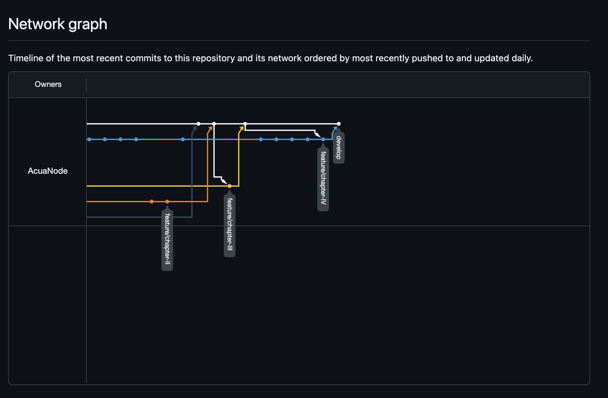

</div>

<div style="page-break-after: always;"></div>


# Contenido

- [Student Outcome](#student-outcome)

### Capítulo I: Introducción
- [1.1. Startup Profile](#11-startup-profile)
  - [1.1.1. Descripción de la Startup](#111-descripción-de-la-startup)
  - [1.1.2. Perfiles de integrantes del equipo](#112-perfiles-de-integrantes-del-equipo)
- [1.2. Solution Profile](#12-solution-profile)
  - [1.2.1. Antecedentes y problemática](#121-antecedentes-y-problemática)
  - [1.2.2. Lean UX Process](#122-lean-ux-process)
    - [1.2.2.1. Lean UX Problem Statements](#1221-lean-ux-problem-statements)
    - [1.2.2.2. Lean UX Assumptions](#1222-lean-ux-assumptions)
    - [1.2.2.3. Lean UX Hypothesis Statements](#1223-lean-ux-hypothesis-statements)
    - [1.2.2.4. Lean UX Canvas](#1224-lean-ux-canvas)
- [1.3. Segmentos objetivo](#13-segmentos-objetivo)

### Capítulo II: Requirements Elicitation & Analysis
- [2.1. Competidores](#21-competidores)
  - [2.1.1. Análisis competitivo](#211-análisis-competitivo)
  - [2.1.2. Estrategias y tácticas frente a competidores](#212-estrategias-y-tácticas-frente-a-competidores)
- [2.2. Entrevistas](#22-entrevistas)
  - [2.2.1. Diseño de entrevistas](#221-diseño-de-entrevistas)
  - [2.2.2. Registro de entrevistas](#222-registro-de-entrevistas)
  - [2.2.3. Análisis de entrevistas](#223-análisis-de-entrevistas)
- [2.3. Needfinding](#23-needfinding)
  - [2.3.1. User Personas](#231-user-personas)
  - [2.3.2. User Task Matrix](#232-user-task-matrix)
  - [2.3.3. Empathy Mapping](#233-empathy-mapping)
  - [2.3.4. As-is Scenario Mapping](#234-as-is-scenario-mapping)
- [2.4. Ubiquitous Language](#24-ubiquitous-language)

### Capítulo III: Requirements Specification
- [3.1. To-Be Scenario Mapping](#31-to-be-scenario-mapping)
- [3.2. User Stories](#32-user-stories)
- [3.3. Impact Mapping](#33-impact-mapping)
- [3.4. Product Backlog](#34-product-backlog)

### Capítulo IV: Strategic-Level Software Design
- [4.1. Strategic-Level Attribute-Driven Design](#41-strategic-level-attribute-driven-design)
  - [4.1.1. Design Purpose](#411-design-purpose)
  - [4.1.2. Attribute-Driven Design Inputs](#412-attribute-driven-design-inputs)
    - [4.1.2.1. Primary Functionality (Primary User Stories)](#4121-primary-functionality-primary-user-stories)
    - [4.1.2.2. Quality Attribute Scenarios](#4122-quality-attribute-scenarios)
    - [4.1.2.3. Constraints](#4123-constraints)
  - [4.1.3. Architectural Drivers Backlog](#413-architectural-drivers-backlog)
  - [4.1.4. Architectural Design Decisions](#414-architectural-design-decisions)
  - [4.1.5. Quality Attribute Scenario Refinements](#415-quality-attribute-scenario-refinements)
- [4.2. Strategic-Level Domain-Driven Design](#42-strategic-level-domain-driven-design)
  - [4.2.1. EventStorming](#421-eventstorming)
  - [4.2.2. Candidate Context Discovery](#422-candidate-context-discovery)
  - [4.2.3. Domain Message Flows Modeling](#423-domain-message-flows-modeling)
  - [4.2.4. Bounded Context Canvases](#424-bounded-context-canvases)
  - [4.2.5. Context Mapping](#425-context-mapping)
- [4.3. Software Architecture](#43-software-architecture)
  - [4.3.1. Software Architecture System Landscape Diagram](#431-software-architecture-system-landscape-diagram)
  - [4.3.2. Software Architecture Context Level Diagrams](#432-software-architecture-context-level-diagrams)
  - [4.3.3. Software Architecture Container Level Diagrams](#433-software-architecture-container-level-diagrams)
  - [4.3.4. Software Architecture Deployment Diagrams](#434-software-architecture-deployment-diagrams)

### Capítulo V: Tactical-Level Software Design
- [5.1. Bounded Context: Telemetry Context](#51-bounded-context-telemetry-context)
  - [5.1.1. Domain Layer](#511-domain-layer)
  - [5.1.2. Interface Layer](#512-interface-layer)
  - [5.1.3. Application Layer](#513-application-layer)
  - [5.1.4. Infrastructure Layer](#514-infrastructure-layer)
  - [5.1.5. Bounded Context Software Architecture Component Level Diagrams](#515-bounded-context-software-architecture-component-level-diagrams)
  - [5.1.6. Bounded Context Software Architecture Code Level Diagrams](#516-bounded-context-software-architecture-code-level-diagrams)
    - [5.1.6.1. Bounded Context Domain Layer Class Diagrams](#5161-bounded-context-domain-layer-class-diagrams)
    - [5.1.6.2. Bounded Context Database Design Diagram](#5162-bounded-context-database-design-diagram)
- [5.2. Bounded Context: Traceability Context](#52-bounded-context-traceability-context)
  - [5.2.1. Domain Layer](#521-domain-layer)
  - [5.2.2. Interface Layer](#522-interface-layer)
  - [5.2.3. Application Layer](#523-application-layer)
  - [5.2.4. Infrastructure Layer](#524-infrastructure-layer)
  - [5.2.5. Bounded Context Software Architecture Component Level Diagrams](#525-bounded-context-software-architecture-component-level-diagrams)
  - [5.2.6. Bounded Context Software Architecture Code Level Diagrams](#526-bounded-context-software-architecture-code-level-diagrams)
    - [5.2.6.1. Bounded Context Domain Layer Class Diagrams](#5261-bounded-context-domain-layer-class-diagrams)
    - [5.2.6.2. Bounded Context Database Design Diagram](#5262-bounded-context-database-design-diagram)
- [5.3. Bounded Context: Equipment Context](#53-bounded-context-equipment-context)
  - [5.3.1. Domain Layer](#531-domain-layer)
  - [5.3.2. Interface Layer](#532-interface-layer)
  - [5.3.3. Application Layer](#533-application-layer)
  - [5.3.4. Infrastructure Layer](#534-infrastructure-layer)
  - [5.3.5. Bounded Context Software Architecture Component Level Diagrams](#535-bounded-context-software-architecture-component-level-diagrams)
  - [5.3.6. Bounded Context Software Architecture Code Level Diagrams](#536-bounded-context-software-architecture-code-level-diagrams)
    - [5.3.6.1. Bounded Context Domain Layer Class Diagrams](#5361-bounded-context-domain-layer-class-diagrams)
    - [5.3.6.2. Bounded Context Database Design Diagram](#5362-bounded-context-database-design-diagram)
- [5.4. Bounded Context: IAM Context](#54-bounded-context-iam-context)
  - [5.4.1. Domain Layer](#541-domain-layer)
  - [5.4.2. Interface Layer](#542-interface-layer)
  - [5.4.3. Application Layer](#543-application-layer)
  - [5.4.4. Infrastructure Layer](#544-infrastructure-layer)
  - [5.4.5. Bounded Context Software Architecture Component Level Diagrams](#545-bounded-context-software-architecture-component-level-diagrams)
  - [5.4.6. Bounded Context Software Architecture Code Level Diagrams](#546-bounded-context-software-architecture-code-level-diagrams)
    - [5.4.6.1. Bounded Context Domain Layer Class Diagrams](#5461-bounded-context-domain-layer-class-diagrams)
    - [5.4.6.2. Bounded Context Database Design Diagram](#5462-bounded-context-database-design-diagram)
- [5.5. Bounded Context: Notification Context](#55-bounded-context-notification-context)
  - [5.5.1. Domain Layer](#551-domain-layer)
  - [5.5.2. Interface Layer](#552-interface-layer)
  - [5.5.3. Application Layer](#553-application-layer)
  - [5.5.4. Infrastructure Layer](#554-infrastructure-layer)
  - [5.5.5. Bounded Context Software Architecture Component Level Diagrams](#555-bounded-context-software-architecture-component-level-diagrams)
  - [5.5.6. Bounded Context Software Architecture Code Level Diagrams](#556-bounded-context-software-architecture-code-level-diagrams)
    - [5.5.6.1. Bounded Context Domain Layer Class Diagrams](#5561-bounded-context-domain-layer-class-diagrams)
    - [5.5.6.2. Bounded Context Database Design Diagram](#5562-bounded-context-database-design-diagram)
- [5.6. Bounded Context: Payment Context](#56-bounded-context-payment-context)
  - [5.6.1. Domain Layer](#561-domain-layer)
  - [5.6.2. Interface Layer](#562-interface-layer)
  - [5.6.3. Application Layer](#563-application-layer)
  - [5.6.4. Infrastructure Layer](#564-infrastructure-layer)
  - [5.6.5. Bounded Context Software Architecture Component Level Diagrams](#565-bounded-context-software-architecture-component-level-diagrams)
  - [5.6.6. Bounded Context Software Architecture Code Level Diagrams](#566-bounded-context-software-architecture-code-level-diagrams)
    - [5.6.6.1. Bounded Context Domain Layer Class Diagrams](#5661-bounded-context-domain-layer-class-diagrams)
    - [5.6.6.2. Bounded Context Database Design Diagram](#5662-bounded-context-database-design-diagram)

### Capítulo VI: Solution UX Design
- [6.1. Style Guidelines](#61-style-guidelines)
  - [6.1.1. General Style Guidelines](#611-general-style-guidelines)
  - [6.1.2. Web, Mobile & Devices Style Guidelines](#612-web-mobile--devices-style-guidelines)
- [6.2. Information Architecture](#62-information-architecture)
  - [6.2.1. Organization Systems](#621-organization-systems)
  - [6.2.2. Labeling Systems](#622-labeling-systems)
  - [6.2.3. Searching Systems](#623-searching-systems)
  - [6.2.4. SEO Tags, Meta Tags y ASO Elements](#624-seo-tags-meta-tags-y-aso-elements)
  - [6.2.5. Navigation Systems](#625-navigation-systems)
- [6.3. Landing Page UI Design](#63-landing-page-ui-design)
  - [6.3.1. Landing Page Wireframe](#631-landing-page-wireframe)
  - [6.3.2. Landing Page Mock-up](#632-landing-page-mock-up)
- [6.4. Applications UX/UI Design](#64-applications-uxui-design)
  - [6.4.1. Applications Wireframes](#641-applications-wireframes)
  - [6.4.2. Applications Wireflow Diagrams](#642-applications-wireflow-diagrams)
- [Conclusiones](#conclusiones)
- [Bibliografía](#bibliografía)
- [Anexos](#anexos)

<div style="page-break-after: always;"></div>

<div style="page-break-after: always;"></div>

# Student Outcome

El curso contribuye al cumplimiento del Student Outcome ABET:

**ABET – EAC - Student Outcome 3**

**Criterio:** *Capacidad de comunicarse efectivamente con un rango de audiencias.*

En el siguiente cuadro se describe las acciones realizadas y enunciados de conclusiones por parte del grupo, que permiten sustentar el haber alcanzado el logro del ABET – EAC - Student Outcome 3.

| Criterio específico | Acciones realizadas | Conclusiones |
| :--- | :--- | :--- |
| **Comunica oralmente sus ideas y/o resultados con objetividad a público de diferentes especialidades y niveles jerárquicos, en el marco del desarrollo de un proyecto en ingeniería.** | **TB1**<br><br>**Escobar Palomino, Sebastian Matias**<br>Explicó oralmente al equipo y al docente el diseño de las entrevistas, los perfiles de usuario y el modelado de flujos de dominio, y sustentó el contexto Equipment, ajustando el lenguaje técnico a cada oyente.<br><br>**Bendezu Navarro, Rúbens Fitzgerald**<br>Presentó el Startup y Solution Profile, los segmentos objetivo y los competidores, y explicó el Context Mapping y el contexto Payment al equipo y al docente, adaptando el nivel de detalle a cada oyente.<br><br>**Choquehuanca Nuñez, Luciana Carolina**<br>Explicó el Product Backlog, las historias de usuario y el EventStorming, y justificó los límites del contexto Telemetry ante el equipo y el docente.<br><br>**Cruz Ibarra, Victor Andres**<br>Presentó la arquitectura de la solución (diagramas de contexto, contenedores y despliegue), la organización del repositorio y el contexto IAM, apoyándose en diagramas.<br><br>**Peralta Chipa, Ronald Joel**<br>Presentó los objetivos SMART, los Bounded Context Canvases y la organización del informe, y explicó al equipo cómo se documenta el Student Outcome.<br><br><br>**TP1**<br><br>**Escobar Palomino, Sebastian Matias**<br>Preparó el guion para explicar la arquitectura C4 y el diseño táctico de los seis contextos (clases y base de datos) a audiencias técnicas y no técnicas.<br><br>**Bendezu Navarro, Rúbens Fitzgerald**<br>Preparó un guion de sustentación apoyado en la landing, las pantallas y los wireflows para explicar el diseño a piscicultores, administradores, compradores y al equipo técnico. El material distingue acciones de campo, decisiones de negocio y estados del certificado.<br><br>**Choquehuanca Nuñez, Luciana Carolina**<br>Preparó la exposición de las entrevistas del Segmento 3, las User Personas y los escenarios, para transmitir la voz del comprador de supermercado al equipo técnico.<br><br>**Cruz Ibarra, Victor Andres**<br>Preparó la sustentación del diseño estratégico: requisitos priorizados, atributos de calidad, EventStorming y mapa de contextos con Traceability, y la explicación de la verificación por QR para un público no técnico.<br><br>**Peralta Chipa, Ronald Joel**<br>Preparó la exposición del modelo de negocio, el análisis competitivo y el Impact Mapping, y de cómo YakuTrace se conecta con los objetivos de la startup. | **TB1**<br>El equipo aprendió a explicar decisiones técnicas (arquitectura, contextos y requisitos) a oyentes con distinto nivel de detalle, apoyándose en diagramas y en ejemplos del dominio acuícola. Se comprobó que presentar primero el problema del piscicultor y después la solución facilita la comprensión del público.<br><br>**TP1**<br>Con YakuTrace la audiencia se amplió a piscicultores, administradores y compradores de supermercado, por lo que el equipo preparó mensajes distintos para cada uno y los apoyó con la landing, las pantallas y los wireflows. |
| **Comunica en forma escrita ideas y/o resultados con objetividad a público de diferentes especialidades y niveles jerárquicos, en el marco del desarrollo de un proyecto en ingeniería.** | **TB1**<br><br>**Escobar Palomino, Sebastian Matias**<br>Redactó el diseño y análisis de entrevistas, las User Personas, la Task Matrix, el Journey Mapping, el Empathy Mapping, el Domain Message Flow y el contexto Equipment.<br><br>**Bendezu Navarro, Rúbens Fitzgerald**<br>Redactó el Startup y Solution Profile, los segmentos objetivo, los competidores, el Ubiquitous Language, el Impact Mapping, el Context Mapping y el contexto Payment.<br><br>**Choquehuanca Nuñez, Luciana Carolina**<br>Redactó las User Stories, el Product Backlog, la documentación del EventStorming, el Candidate Context Discovery y el contexto Telemetry.<br><br>**Cruz Ibarra, Victor Andres**<br>Redactó los diagramas de arquitectura (contexto, contenedores y despliegue), configuró el repositorio y redactó el contexto IAM.<br><br>**Peralta Chipa, Ronald Joel**<br>Redactó el registro de versiones, los Collaboration Insights, el Student Outcome, los objetivos SMART, los Bounded Context Canvases y el contexto Notification.<br><br><br>**TP1**<br><br>**Escobar Palomino, Sebastian Matias**<br>Redactó y revisó los diagramas C4 coherentes con el monolito modular, el Ubiquitous Language en inglés, el diseño táctico de los seis contextos (capas, clases y base de datos), la bibliografía y los anexos.<br><br>**Bendezu Navarro, Rúbens Fitzgerald**<br>Documentó y revisó el capítulo VI: guía visual, arquitectura de información, landing desktop/móvil, pantallas principales, variantes responsive, estados alternativos y wireflows. Redibujó la interfaz en español y relacionó los recorridos con las historias de usuario. Incorporó fuentes editables, imágenes y controles de calidad que permiten al equipo reproducir y revisar el diseño.<br><br>**Choquehuanca Nuñez, Luciana Carolina**<br>Redactó el diseño y el análisis de las entrevistas del Segmento 3, las User Personas, el Empathy Mapping y los escenarios As-is y To-Be con el comprador de supermercado.<br><br>**Cruz Ibarra, Victor Andres**<br>Redactó las User Stories en Gherkin sin referencias a la interfaz, el Product Backlog, el ADD completo (QAS, constraints, drivers, decisiones y refinamientos), el EventStorming, los canvases y el Context Map con Traceability.<br><br>**Peralta Chipa, Ronald Joel**<br>Redactó la estructura del informe, el registro de versiones, los Collaboration Insights y el Student Outcome, además del Startup Profile, el Lean UX, los competidores y el Impact Mapping con objetivos SMART. | **TB1**<br>El informe de TB1 documentó de forma ordenada el problema, los requisitos y la arquitectura mediante tablas, diagramas y plantillas comunes, y el trabajo por capítulos en GitHub permitió que cada integrante comunicara por escrito su parte de manera coherente.<br><br>**TP1**<br>En TP1 el informe incorporó el segmento de compradores y la trazabilidad con blockchain. Para que lo entiendan lectores técnicos y no técnicos, las historias se redactaron en Gherkin sin referencias a la interfaz, el glosario se escribió en inglés con su equivalente en español y los diagramas C4 y UML se hicieron coherentes con la decisión de un monolito modular. Las revisiones cruzadas entre integrantes mejoraron la consistencia del documento. |

<div style="page-break-after: always;"></div>


# Capítulo I: Introducción
## 1.1. Startup Profile
### 1.1.1. Descripción de la Startup

**Verifish** es una startup tecnológica orientada al desarrollo de soluciones de *Smart Farming* y monitoreo ambiental, enfocada principalmente en contribuir a la modernización del sector acuícola. Surge con la finalidad de mejorar la gestión convencional de las piscigranjas mediante la incorporación de tecnologías como el **Internet de las Cosas (IoT)** y la **computación en la nube**, permitiendo una administración más inteligente de los recursos, la protección del entorno y una mayor sostenibilidad económica para los productores.

**YakuControl** (del término quechua *yaku*, que significa “agua”) es una solución tecnológica integral diseñada para facilitar el monitoreo continuo de las principales variables bioquímicas presentes en los estanques de las piscigranjas. A través de sensores especializados, dispositivos IoT y servicios alojados en la nube, la plataforma permite detectar oportunamente cambios en las condiciones del agua que podrían representar un riesgo para los peces. De esta manera, brinda apoyo preventivo a los piscicultores frente a situaciones como variaciones extremas de temperatura, alteraciones químicas o condiciones que puedan ocasionar pérdidas en la producción.

El objetivo de Verifish es facilitar la incorporación de estas tecnologías en el sector acuícola mediante un modelo **Software as a Service (SaaS) B2B**. Este enfoque busca reducir las barreras de acceso tecnológico para las piscigranjas, optimizar el uso de los recursos disponibles y contribuir a mejorar la calidad de la producción. Asimismo, se pretende impulsar una actividad acuícola más eficiente, controlada y sostenible mediante el uso de información obtenida en tiempo real.

La necesidad de este tipo de soluciones se encuentra respaldada por la situación actual de la acuicultura peruana. De acuerdo con la Organización para la Cooperación y el Desarrollo Económicos (OCDE, 2025), la actividad acuícola en el Perú se encuentra expuesta a fluctuaciones y pérdidas de producción relacionadas, entre otros factores, con alteraciones en la calidad del agua y la contaminación de los recursos hídricos.

Asimismo, de los más de 12 700 acuicultores registrados a nivel nacional, una proporción importante pertenece a la categoría de **Acuicultura de Recursos Limitados (AREL)**, sector en el cual todavía existe una baja incorporación de tecnologías orientadas al monitoreo y control de las condiciones productivas (Ministerio de la Producción, 2024).

Este contexto evidencia la existencia de una brecha tecnológica dentro del sector y la necesidad de implementar herramientas que permitan mejorar el control de las piscigranjas. En este escenario, YakuControl busca ofrecer una alternativa accesible que facilite la supervisión de las condiciones del agua y apoye a los productores en la prevención de riesgos asociados a la actividad acuícola.

A partir del trabajo de este ciclo, YakuControl incorpora **YakuTrace**, un módulo de trazabilidad que registra los hitos de cada lote de truchas y resume la calidad del agua medida por los sensores. Con esa información genera un **certificado con código QR** cuyo contenido se protege mediante una huella digital (*hash*) registrada en una blockchain, de modo que un comprador, como un supermercado, pueda verificar que el historial de un lote no fue alterado después de emitido. De esta manera, la plataforma deja de servir únicamente al control operativo de la granja y también ofrece evidencia confiable para la comercialización. YakuTrace se ofrece como un plan adicional (**TRACE**) dentro del modelo SaaS B2B.

* **Misión:** Contribuir a la transformación digital del sector acuícola mediante soluciones IoT de monitoreo y control que prevengan riesgos y mejoren la gestión de las piscigranjas, y mediante una trazabilidad verificable que respalde la calidad registrada de cada lote frente a los compradores, favoreciendo la sostenibilidad y la rentabilidad de los productores.

* **Visión:** Consolidarse hacia el año 2030 como una plataforma referente en monitoreo, analítica y trazabilidad verificable aplicada a la acuicultura en América Latina, integrando software, IoT y tecnologías Web3 para una producción acuícola sostenible y confiable.


<div style="page-break-after: always;"></div>

### 1.1.2. Perfiles de integrantes del equipo

<table border="1">
  <tr>
      <td style="text-align:center;"></td>
      <td><strong>Escobar Palomino, Sebastian Matias - u202125968</strong><br>Mi nombre es Sebastian Matías Escobar Palomino, tengo 22 años y soy estudiante de Ingeniería de Software. Mi objetivo es contribuir de manera activa al trabajo en equipo, cumplir con los plazos establecidos y mantener una comunicación fluida y clara con mis compañeros, aplicando mis conocimientos para cumplir con las responsabilidades asignadas en el proyecto.</td>
  </tr>
  <tr>
      <td style="text-align:center;"></td>
      <td><strong>Bendezu Navarro, Rúbens Fitzgerald - U20231d390</strong><br>Mi nombre es Rúbens Bendezu, tengo 21 años y soy estudiante de la carrera de Ingeniería de Software. Actualmente estoy en séptimo ciclo de la carrera de Ingeniería de Software. Tengo conocimientos en varios lenguajes de programación principalmente en Python y Typescrip, me gusta trabajar en equipo tratando de aportar en lo que pueda y compartiendo mis conocimientos. Me interesa aprender sobre gerencia en proyectos de software.</td>
  </tr>
  <tr>
      <td style="text-align:center;"></td>
      <td><strong>Peralta Chipa, Ronald Joel - U202224619 </strong><br>Mi nombre es Ronald, tengo 23 años y soy una persona comprometida con el orden, con un estilo de liderazgo democrático y una gran capacidad para escuchar y comprender. Disfruto crecer en equipo y aprender constantemente de los demás. Además, tengo interés en la cultura DevSecOps y la gestión de proyectos, lo que me permite tener un enfoque integral orientado a la seguridad, organización y mejora continua.
      </td>
  </tr>
  <tr>
      <td style="text-align:center;"></td>
      <td><strong>Choquehuanca Nuñez, Luciana Carolina - U202319431</strong><br> Estudiante del 7mo ciclo de la carrera de Ingenieria de Software, Tengo experiencia con diferentes lenguajes de programación y desarrollo de aplicaciones web en diversos frameworks ambos en frontend y backend, asimismo considero que cada paso en la universidad contribuye en mi avance como desarollo profesional. Estoy interesado en continuar mi aprendizaje, por lo que estoy dispuesto a participar en la adecuada realizacion de proyectos.</td>
  </tr>
  <tr>
      <td style="text-align:center;"></td>
      <td><strong>Cruz Ibarra, Victor Andres - u202311053</strong><br>Actualmente curso el 8vo ciclo de la carrera de Ingeniería de Software. Me considero una persona responsable con facilidad para adaptarme a distintos entornos y manejar varias tareas a la vez. Tengo conocimientos en desarrollo web y nóvil siguiendo buenas prácticas y arquitecturas bajo metodologías ágiles.</td>
  </tr>
</table>

## 1.2. Solution Profile
### 1.2.1. Antecedentes y problemática

#### Antecedentes

La acuicultura de trucha representa una actividad económica importante en diversas zonas altoandinas del Perú, especialmente en regiones como Junín, Puno, Cusco y Huancavelica. No obstante, los productores se encuentran expuestos de forma constante a episodios de mortalidad masiva asociados a cambios repentinos en la calidad del agua, los cuales muchas veces no son detectados oportunamente y terminan generando pérdidas irreversibles.

Un ejemplo reciente fue reportado por la Agencia Peruana de Noticias Andina (2026), que informó sobre la muerte de miles de truchas en siete piscigranjas ubicadas en el distrito de Pariahuanca, Junín. Según el reporte, el evento habría estado relacionado con una posible contaminación del río Yuracyacu provocada por actividades mineras, afectando peces en distintas etapas de crecimiento.

Actualmente, el control de las condiciones del agua suele realizarse mediante revisiones físicas periódicas. Este procedimiento es principalmente manual y presenta limitaciones en términos de rapidez y precisión, lo que dificulta la detección temprana de variaciones críticas y reduce la capacidad de respuesta de los productores ante situaciones de riesgo.

Paralelamente, los compradores del producto exigen cada vez más información verificable. Ya en 2016 se reportaba que supermercados como Plaza Vea, Wong y Tottus solicitaban a los productores de trucha un producto inocuo y con trazabilidad (Agraria.pe, 2016). En el Perú, Cencosud, propietaria de Wong y Metro, ha implementado una solución de trazabilidad basada en blockchain para productos cárnicos (Computer Weekly, 2021), y a nivel internacional existen casos como el de Carrefour en España, que lanzó una trazabilidad con blockchain para pescado consultable mediante código QR (Ministerio de Agricultura, Pesca y Alimentación, 2019), o el de Walmart, que redujo de siete días a 2,2 segundos el tiempo necesario para rastrear el origen de un producto (Linux Foundation Decentralized Trust, s. f.). La FAO ha analizado cómo la tecnología blockchain puede aplicarse a las cadenas de valor del pescado y en qué casos resulta adecuada (Blaha & Katafono, 2020).

Sin embargo, la literatura advierte que blockchain por sí sola no garantiza que los datos sean correctos: puede conservar de forma inalterable un dato erróneo si este ingresa mal desde el sensor (Powell et al., 2021). Por ello, YakuTrace combina sensores cuyas lecturas se firman en el Edge, resúmenes que informan su cobertura de datos y el anclaje del hash en blockchain, y comunica sus certificados como **registros verificables e inalterados**, no como una garantía absoluta de bienestar animal.

#### Problemática

**Who (¿Quién?)**<br>
La problemática afecta directamente a dos actores fundamentales en el ecosistema acuícola:
- **Administradores de piscigranja**: Profesionales responsables de la planificación estratégica, rentabilidad financiera y toma de decisiones basada en el rendimiento histórico de producción.

- **Piscicultores:** Personal técnico encargado de la supervisión física diaria, el mantenimiento de los estanques y la ejecución de maniobras de emergencia ante variaciones ambientales.

**What (¿Qué?)** <br>
La ausencia de un sistema de monitoreo inteligente impacta a cada perfil de la siguiente manera:

- **Administrador de piscigranja**: La falta de una plataforma centralizada impide visualizar tendencias o calcular costos operativos. Sin datos históricos, no puede optimizar el uso de recursos ni garantizar la escalabilidad del negocio, quedando vulnerable ante pérdidas masivas de inventario.

- **Piscicultor:** Su limitación es la dependencia de la observación, lo que le impide detectar anomalías invisibles a simple vista. Esto los fuerza a actuar de forma reactiva, enfrentando crisis cuando el pez ya muestra signos de estrés, lo que eleva la carga laboral y riesgo de mortalidad por error humano.

**Where (¿Dónde?)** <br>
 Esta problemática se observa en piscigranjas de truchas arcoíris, particularmente en zonas andinas y rurales del Perú alimentadas por ríos.

**When (¿Cuándo?)** <br>
 El problema es una amenaza constante, pero se intensifica de forma crítica durante anomalías climáticas (como mediodías de calor extremo que disminuyen la solubilidad del oxígeno), lluvias intensas que elevan repentinamente la turbidez del agua (lodo), y tras los ciclos de alimentación intensiva, cuando la concentración de desechos altera el equilibrio químico del estanque.

**Why (¿Por qué?)** <br>
 La raíz del problema es la *falta de adopción tecnológica y de sistemas de telemetría en el sector acuícola.* Muchos productores de las categorías de micro y pequeña escala dependen de la simple observación o de mediciones químicas manuales esporádicas. Esto impide contar con un registro histórico, generando ineficiencia operativa que impide reaccionar a los cambios termodinámicos que destruyen el ecosistema.

**How (¿Cómo?)** <br>
 **YakuControl** propone una solución integrando el Internet de las Cosas (IoT) con una arquitectura en la nube. A través de hardware instalado en los estanques (Edge API), el sistema recopila lecturas de temperatura, pH y turbidez en tiempo real, ejecutando algoritmos que determinan la calidad del agua. Simultáneamente, las aplicaciones cliente (Web y Móvil) alertan a los operarios sobre estados críticos y permiten el encendido remoto (o automatizado) de actuadores de emergencia.

**How Much (¿Cuánto?)**<br>
Uno de los principales desafíos en el sector acuícola es la alta vulnerabilidad ante alteraciones ambientales y bioquímicas en el agua, lo que genera mortalidades masivas y pérdida total del capital. 

Según documenta el portal Actualidad Ambiental (2025), el impacto económico de no contar con un monitoreo preventivo es devastador: incidentes recientes en zonas andinas, ocasionados por contaminación o alteraciones en los cauces, han generado la muerte repentina de hasta 200,000 truchas en un solo evento. Este tipo de desastres representa pérdidas de capital superiores a los S/ 300,000 para una sola piscigranja. 

Todo este panorama evidencia la urgencia de digitalizar el control operativo para evitar la quiebra de los productores locales.

<div style="page-break-after: always;"></div>


#### Problemática del comprador de supermercado (5W+2H)

**Who (¿Quién?)**<br>
Los jefes de compras y de aseguramiento de calidad de la categoría de pescados y mariscos de las cadenas de supermercados.

**What (¿Qué?)**<br>
No cuentan con evidencia verificable y no alterable del origen de un lote ni de las condiciones registradas durante su cría; dependen de documentos y declaraciones del proveedor, lo que dificulta decidir compras, atender reclamos y responder ante una auditoría.

**Where (¿Dónde?)**<br>
En supermercados y centros de distribución del país abastecidos por piscigranjas de trucha de zonas altoandinas (Puno, Junín, Pasco, Huancavelica).

**When (¿Cuándo?)**<br>
Al evaluar y recibir proveedores, ante reclamos o devoluciones por calidad o mortandad y durante auditorías de trazabilidad.

**Why (¿Por qué?)**<br>
Los registros de cría suelen llevarse en cuadernos, hojas de cálculo y mensajes (en las entrevistas a administradores, 3 de 3 reciben la información como reportes físicos, fotos de cuadernos o audios de WhatsApp), formatos difíciles de verificar y que pueden modificarse después.

**How (¿Cómo?)**<br>
YakuTrace emite un certificado por lote con código QR. Al escanearlo, el comprador visualiza el historial del lote y el resumen de calidad del agua, y comprueba que el contenido coincide con la huella digital registrada en blockchain.

**How Much (¿Cuánto?)**<br>
En el MVP el comprador verifica sin costo ni cuenta; el costo del certificado lo asume la piscigranja mediante el plan TRACE. En las entrevistas, 2 de 3 compradores señalaron el costo adicional como una preocupación, por lo que el precio del complemento se definirá con las piscigranjas piloto.

### 1.2.2. Lean UX Process
#### 1.2.2.1. Lean UX Problem Statements


**Problem Statement 1 — Administrador de Piscigranja**

El estado actual de la gestión acuícola se ha centrado principalmente en el registro manual de datos y la toma de decisiones basada en la experiencia empírica del productor. Lo que las herramientas existentes no logran abordar es la disponibilidad de datos históricos procesados, tendencias y reportes consolidados que permitan al dueño tomar decisiones preventivas y estratégicas sobre la salud de sus estanques. Considerando la restricción de que los productores evitan realizar grandes inversiones de capital en servidores físicos o licencias costosas, nuestro producto abordará esta brecha mediante un Web Dashboard basado en la nube (modelo SaaS) con visualización de históricos, gráficos de tendencias y un índice global de calidad del agua calculado automáticamente. Nuestro enfoque inicial serán los propietarios y administradores de piscigranjas en el Perú con más de un estanque activo. Sabremos que hemos tenido éxito cuando los dueños reporten una reducción medible en eventos de mortalidad masiva y adopten el dashboard como su herramienta principal de gestión diaria.

**Problem Statement 2 — Piscicultor**

El estado actual del monitoreo de estanques en piscigranjas se ha centrado principalmente en rondas físicas periódicas y observación visual directa por parte del personal de campo. Lo que los métodos y herramientas existentes no logran abordar es la detección temprana y automática de condiciones críticas del agua (pH bajo, turbidez alta, temperatura fuera de rango) durante los largos intervalos entre inspecciones. Asumiendo las restricciones de un entorno rural (conectividad intermitente) y el perfil no técnico de los usuarios, nuestro producto abordará esta brecha mediante una aplicación móvil de interfaz simplificada, conectada a sensores IoT vía Edge API, que emite alertas críticas inmediatas y permite accionar equipos de emergencia de forma remota. Nuestro enfoque inicial serán los operarios y trabajadores de campo de piscigranjas de trucha. Sabremos que hemos tenido éxito cuando los operarios respondan y mitiguen eventos críticos de calidad del agua en menos de 10 minutos desde su detección.


**Problem Statement 3 — Comprador de supermercado**

El estado actual de la compra de trucha fresca a piscigranjas se ha centrado principalmente en documentos y declaraciones del proveedor, y en la confianza construida con cada productor. Lo que los métodos y herramientas existentes no logran abordar es la posibilidad de **verificar de forma rápida y no alterable** el origen de un lote y las condiciones del agua registradas durante su cría, algo que se vuelve crítico ante reclamos, devoluciones o auditorías. Considerando la restricción de que los compradores no desean crear cuentas ni aprender sistemas nuevos para verificar un lote, y que los productores tienen un bajo nivel de digitalización, nuestro producto abordará esta brecha mediante un **certificado con código QR por lote** que abre una página pública de verificación, cuyo contenido está respaldado por una huella digital registrada en blockchain. Nuestro enfoque inicial serán los compradores y responsables de calidad de la categoría de pescados en cadenas de supermercados que se abastecen de trucha de piscigranjas peruanas. Sabremos que hemos tenido éxito cuando los compradores puedan verificar un lote en menos de un minuto desde su celular y, en los lotes piloto, se reduzcan las disputas por calidad o mortandad frente a los proveedores.

#### 1.2.2.2. Lean UX Assumptions


**Business Assumptions**

1. Creemos que los dueños de piscigranjas están dispuestos a pagar una suscripción mensual recurrente si la plataforma demuestra reducir la mortalidad de truchas de forma tangible. Lograr una tasa de conversión del 20% de los clientes piloto al modelo de pago tras demostrar una reducción de al menos 15% en eventos de mortalidad durante el primer trimestre

2. Creemos que el principal riesgo del negocio es la baja digitalización de los productores acuícolas, que puede generar resistencia a la adopción tecnológica. Lograr que el tiempo promedio de adopción/onboarding sea menor a 48 horas mediante interfaces simplificadas

3. Creemos que el modelo SaaS por estanque es más viable financieramente que la venta única de hardware, ya que genera ingresos recurrentes y permite escalar el servicio. Alcanzar el punto de equilibrio operativo al conectar los primeros 50 estanques en los primeros 6 meses

4. Creemos que las integraciones con servicios externos (clima, SMS) incrementan el valor percibido de la suscripción y reducen la tasa de cancelación. Mantener una tasa de retención mensual superior al 90% en cuentas activas

5. Creemos que el mercado peruano de acuicultura de trucha tiene la escala suficiente para sostener el crecimiento de la startup en sus primeros tres años de operación. Capturar el 5% de las piscigranjas formales en la región andina central en los primeros tres años de operación

**User Assumptions**

1. **¿Quiénes son nuestros usuarios?** Dueños y administradores de piscigranjas de trucha, y sus operarios de campo en regiones andinas del Perú. 
2. **¿Dónde encaja nuestro producto en su trabajo o vida?** En la rutina diaria de monitoreo físico de estanques, y como eje central en la toma de decisiones estratégicas sobre la bioseguridad del ecosistema.
3. **¿Qué problemas resuelve nuestro producto?** La detección tardía de condiciones químicas/térmicas mortales en el agua, la dependencia visual empírica y la falta de datos históricos para anticiparse a desastres.
4. **¿Cuándo y cómo usan nuestro producto?** Los operarios lo usan en campo, en tiempo real, a través de la app móvil conectada a los sensores IoT. Los dueños lo consultan desde el Web Dashboard para revisiones periódicas, control de consumo energético y análisis histórico.
5. **¿Qué características son las más importantes?** Ingesta de datos telemétricos sin latencia, cálculo algorítmico del Índice de Calidad del Agua, alertas push críticas, control remoto de actuadores (Airlift/Bombas) y dashboards analíticos.
6. **¿Cómo debe verse y comportarse el producto?** Altamente responsivo, intuitivo y resiliente ante fallos de red. La App móvil debe priorizar Status Cards para acción inmediata; el Web Dashboard debe priorizar la claridad en gráficos.


**Business Assumptions adicionales (YakuTrace)**

6. Creemos que los supermercados valoran, y a mediano plazo exigirán, evidencia de trazabilidad verificable a sus proveedores de trucha, lo que impulsa a las piscigranjas a contratar el plan TRACE. Lograr que al menos 1 supermercado o distribuidor participe en un piloto de verificación durante el semestre.
7. Creemos que la piscigranja pagará un complemento mensual (TRACE) si el certificado le ayuda a vender mejor o a respaldarse ante reclamos. Lograr que el 20% de las piscigranjas piloto active TRACE en el primer trimestre.
8. Creemos que un certificado basado en las lecturas de los propios sensores es más creíble y menos costoso que uno elaborado manualmente. **Riesgo:** blockchain no verifica que el dato del sensor sea correcto; se mitigará con firma de las lecturas en el Edge, indicadores de cobertura de datos y lenguaje que comunique "registro inalterado" y no "garantía de bienestar".

**User Assumptions del comprador de supermercado**

1. **¿Quiénes son nuestros usuarios?** Jefes de compras y de aseguramiento de calidad de pescados y mariscos en cadenas de supermercados; indirectamente, el consumidor final que escanea el QR.
2. **¿Dónde encaja nuestro producto en su trabajo o vida?** En la evaluación y recepción de lotes de trucha, la atención de reclamos y la preparación de auditorías.
3. **¿Qué problemas resuelve nuestro producto?** La falta de evidencia verificable e inalterable del origen y de las condiciones registradas de un lote.
4. **¿Cuándo y cómo usan nuestro producto?** Escanean el QR del lote desde su celular al recibir mercadería o ante un reclamo, sin crear una cuenta.
5. **¿Qué características son las más importantes?** Verificación en segundos, resumen claro de calidad del agua, indicación visible de si el certificado es válido, está alterado o fue revocado, y enlace a la prueba en blockchain.
6. **¿Cómo debe verse y comportarse el producto?** Simple, rápido, legible en celular y con un mensaje de estado inequívoco (verificado / no verificado / revocado).

#### 1.2.2.3. Lean UX Hypothesis Statements


**Hipótesis 1**
Creemos que lograremos **reducir el tiempo de respuesta ante eventos críticos del agua** si los **operarios de campo** pueden **recibir alertas push inmediatas con el tipo de riesgo detectado** mediante la **funcionalidad de notificaciones en tiempo real de la app móvil**.

**Hipótesis 2**
Creemos que lograremos **incrementar la retención de suscriptores** si los **dueños de piscigranja** pueden **visualizar tendencias históricas y comparar el rendimiento entre estanques** mediante el **Web Dashboard con gráficos de análisis de calidad del agua**.

**Hipótesis 3**
Creemos que lograremos **reducir la mortalidad masiva de truchas** si los **operarios** pueden **accionar remotamente motores y bombas de emergencia desde su celular** mediante los **botones de control IoT de la app móvil**.

**Hipótesis 4**
Creemos que lograremos **validar la disposición a pagar del mercado** si los **dueños de piscigranja con más de un estanque** pueden **gestionar todos sus estanques desde una sola plataforma** mediante el **modelo de suscripción mensual por estanque de YakuControl**.

**Hipótesis 5**
Creemos que lograremos **reducir falsos positivos y alarmas innecesarias** si el **sistema** puede **filtrar lecturas de sensores mediante el Índice de Calidad del Agua ponderado** mediante el **algoritmo matemático ejecutado en el Edge API antes de emitir cualquier alerta**.


**Hipótesis 6**
Creemos que lograremos **reducir el tiempo de verificación del origen de un lote** si los **compradores de supermercado** pueden **escanear un código QR y ver el historial verificado del lote** mediante la **página pública de verificación de YakuTrace**.

**Hipótesis 7**
Creemos que lograremos **validar la disposición a pagar por trazabilidad** si las **piscigranjas con más de un estanque** pueden **emitir certificados verificables para sus lotes** mediante el **plan complementario TRACE**.

**Hipótesis 8**
Creemos que lograremos **reducir las disputas por calidad o mortandad entre proveedor y comprador** si ambos pueden **consultar un resumen inalterado de las condiciones del agua durante la cría del lote** mediante el **certificado con anclaje en blockchain**.

#### 1.2.2.4. Lean UX Canvas


<div style="text-align: center; margin-top: 1rem; margin-bottom: 1rem;">

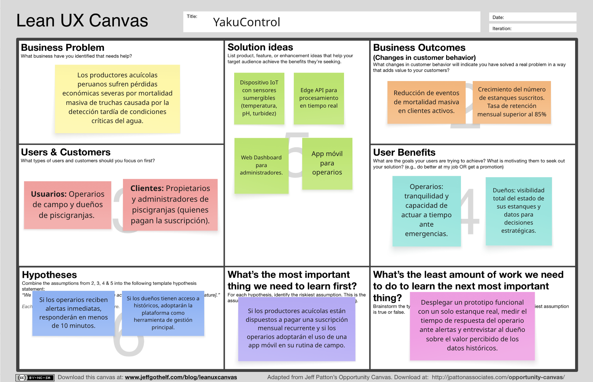

</div>

<div style="page-break-after: always;"></div>

## 1.3. Segmentos objetivo


YakuControl dirige su propuesta de valor a **tres segmentos** de usuarios con roles, responsabilidades y necesidades claramente diferenciados dentro del ecosistema de una piscigranja y de su cadena comercial:

**Segmento 1: Piscicultores**

Son el personal técnico que realiza las rondas físicas diarias entre los estanques. Su principal responsabilidad es mantener las condiciones operativas de los estanques y responder ante cualquier anomalía. Sus características clave son:

- Realizan múltiples rondas al día en instalaciones que pueden abarcar varios estanques dispersos geográficamente.
- Necesitan información rápida y accionable, no reportes complejos.
- Requieren acceso móvil para recibir alertas críticas (pH bajo, turbidez alta, temperatura fuera de rango) en cualquier momento y desde cualquier punto de la piscigranja.
- Necesitan botones de acción rápida para activar equipos de emergencia (bombas de oxigenación, sistemas de recirculación) de forma remota sin desplazarse físicamente hasta el panel de control.
- Su nivel de digitalización puede ser bajo, por lo que la interfaz debe ser intuitiva y de uso inmediato.

**Segmento 2: Administradores de Piscigranja**

Son los propietarios o gestores del negocio, enfocados en la rentabilidad, la prevención de pérdidas y la toma de decisiones estratégicas a largo plazo. Sus características clave son:

- No necesariamente están presentes físicamente en la piscigranja de forma continua.
- Requieren una visión consolidada del estado de todos sus estanques desde un solo lugar.
- Necesitan acceso a reportes históricos, gráficos de tendencias y el índice global de calidad del agua para identificar patrones y anticipar riesgos.
- Valoran la trazabilidad de eventos para tomar decisiones sobre mantenimiento, inversión en equipos o cambios operativos.
- Son los tomadores de decisión de compra: evalúan el costo de la suscripción frente al costo potencial de una mortalidad masiva.

<div style="page-break-after: always;"></div>


**Segmento 3: Compradores de supermercado**

Son los profesionales de compras y de aseguramiento de calidad de la categoría de pescados y mariscos de las cadenas de supermercados. Deciden qué proveedores de trucha incorporan, aceptan o rechazan lotes y responden ante reclamos de clientes y auditorías. No son usuarios operativos de YakuControl: no necesitan una cuenta para verificar un certificado, lo hacen escaneando un código QR. Sus características clave son:

- Operan en el canal moderno peruano, conformado principalmente por tres grupos: Cencosud (Wong y Metro), Supermercados Peruanos (Plaza Vea, Vivanda y Mass) y Tottus. Perú Retail reporta 316 supermercados, de los cuales 165 pertenecen a Supermercados Peruanos, 91 a Cencosud y 60 a Tottus (Perú Retail, 2026).
- Abastecen sus pescaderías con trucha de regiones como Puno, que alcanzó 26 mil toneladas en 2024 y distribuye parte de su producción a supermercados (El Búho, 2025); el Perú exportó trucha por US$ 32,8 millones en 2024 (Agraria.pe, 2025).
- Históricamente han solicitado producto inocuo y con trazabilidad a los proveedores de trucha (Agraria.pe, 2016) y algunos operadores ya han adoptado trazabilidad con blockchain en otras categorías (Computer Weekly, 2021).
- Necesitan verificar rápidamente el origen y las condiciones registradas de un lote sin depender de documentos que puedan modificarse.
- Valoran reducir reclamos y devoluciones y contar con evidencia ágil para auditorías.

En las entrevistas realizadas (sección 2.2.3), los tres participantes tienen entre 25 y 28 años, residen en distritos de Lima (San Luis, San Juan de Lurigancho y Santa Anita), se desempeñan como responsables o encargados de compras de productos frescos y atienden entre una y tres tiendas. Trabajan con computadora o laptop, sistema interno, correo, Excel y WhatsApp, y usan el celular para comunicarse con sus proveedores.

**Consumidor final (visitante).** Es quien escanea el QR del empaque en tienda o en casa. No se modela como segmento formal; sus historias de usuario usan el rol *visitante*.

# Capítulo II: Requirements Elicitation & Analysis
## 2.1. Competidores
### 2.1.1. Análisis competitivo


**¿Por qué llevar a cabo este análisis?**

Identificar las fortalezas y debilidades de las soluciones existentes en el mercado de monitoreo acuícola e IoT de calidad del agua, con el fin de posicionar estratégicamente a YakuControl y definir su ventaja competitiva diferenciadora frente a competidores directos e indirectos.

| | | **Verifish — YakuControl** | **AquaManager** | **Libelium Smart Water** | **Pentair Aquatic Eco-Systems** | **Wholechain** |
| :--- | :--- | :--- | :--- | :--- | :--- | :--- |
| **Perfil** | **Overview** | Startup peruana que desarrolla YakuControl, plataforma IoT integral para monitoreo de calidad del agua en piscigranjas de trucha. Combina hardware propio con sensores sumergibles, procesamiento en la nube y apps móvil y web. Con YakuTrace agrega trazabilidad verificable por lote (certificado con QR anclado en blockchain). | Plataforma holandesa de gestión acuícola basada en software. Permite registrar datos productivos, gestionar stocks, alimentación y salud de los peces. No incluye hardware propio de sensores IoT. | Empresa española especializada en plataformas IoT para monitoreo de calidad del agua. Ofrece kits de sensores inalámbricos para múltiples parámetros hídricos en aplicaciones ambientales, industriales y acuícolas. | División de Pentair especializada en equipos para acuicultura y ecosistemas acuáticos. Ofrece sistemas de recirculación, filtración, aireación y monitoreo de agua para piscigranjas de diversas escalas. | Plataforma de trazabilidad de la cadena de suministro alineada con los estándares GDST y GS1 EPCIS 2.0; permite registrar eventos de la cadena (p. ej. cosecha, envío, procesamiento) y compartirlos con socios como los minoristas. |
| | **Ventaja competitiva** | Solución integral diseñada específicamente para el contexto acuícola peruano, con modelo SaaS accesible, algoritmos de procesamiento en tiempo real (Índice de Calidad del Agua) y control remoto de actuadores desde app móvil. Combina en un solo producto el monitoreo IoT del agua con un certificado verificable que reutiliza esos mismos datos, sin que el productor deba digitarlos otra vez. | Amplia trayectoria en el mercado global de acuicultura; plataforma robusta con módulos de gestión integral del negocio acuícola (producción, salud, inventarios). | Amplio catálogo de sensores de alta precisión; plataforma IoT agnóstica compatible con múltiples protocolos (LoRa, 4G, Wi-Fi); solución modular y escalable para distintos sectores. | Marca consolidada con décadas de experiencia en acuicultura; catálogo completo de hardware para gestión del agua; red global de distribuidores especializados. | Interoperabilidad con estándares de la industria del pescado (GDST/EPCIS) y plantillas de eventos configurables; intercambio de datos con minoristas. |
| **Perfil de Marketing** | **Mercado objetivo** | Piscigranjas de trucha en regiones andinas del Perú (Junín, Puno, Cusco, Huancavelica). Pequeños y medianos productores acuícolas. Compradores de supermercado como verificadores del certificado. | Empresas acuícolas de mediana y gran escala a nivel mundial (salmón, camarones, truchas). Enfocado en Europa y mercados desarrollados. | Gobiernos, empresas de utilities e industrias que requieren monitoreo ambiental de calidad del agua a nivel global. Sector agrícola y acuícola de mediana y gran escala. | Piscigranjas comerciales de mediana y gran escala, acuarios públicos e instalaciones de investigación acuícola a nivel mundial. | Empresas pesqueras y acuícolas, procesadores, distribuidores y minoristas con requisitos de trazabilidad y certificación a nivel global. |
| | **Estrategias de marketing** | Venta directa B2B a piscigranjas; alianzas con proveedores de insumos acuícolas; demostración con maqueta física en ferias del sector peruano; landing page para captación de clientes. Piloto de verificación con un proveedor o supermercado; QR en el empaque como punto de contacto. | Participación en ferias internacionales de acuicultura (Aqua Nor, Aquaculture Europe); marketing de contenidos y demostraciones online; canal de ventas enterprise. | Canal de distribuidores internacionales autorizados; participación en conferencias IoT y medioambientales; documentación técnica extensa y casos de uso publicados. | Catálogos técnicos y venta directa a través de distribuidores especializados en acuicultura; presencia en ferias del sector; alianzas con instituciones de investigación. | Documentación y guías para cumplir el estándar GDST; relación con actores de la cadena (minoristas, certificadoras). *(Según su documentación pública.)* |
| **Perfil de Producto** | **Productos & Servicios** | Dispositivo IoT con sensores de temperatura, pH y turbidez + Edge API de procesamiento + App móvil para operarios + Web Dashboard para administradores. Suscripción mensual por estanque. Plan complementario TRACE: lotes, hitos, resumen de calidad, certificado con QR y verificación pública. | Software SaaS de gestión acuícola (producción, alimentación, salud, inventarios). Requiere integración con sensores de terceros para datos en tiempo real. | Kits de sensores IoT (temperatura, pH, turbidez, oxígeno disuelto, entre otros) + plataforma de visualización en la nube. Venta de hardware con licencia de plataforma. | Equipos físicos de recirculación, aireación, filtración y controladores digitales de parámetros hídricos. Sin plataforma SaaS ni app móvil nativa integrada. | Software de trazabilidad con plantillas de eventos e intercambio EPCIS. Según la información revisada, no incluye sensores ni monitoreo de calidad del agua en el estanque. |
| | **Precios & Costos** | Hardware ~S/ 250–280 (costo del prototipo). Modelo SaaS con suscripción mensual por estanque monitoreado (precio a validar en mercado). Precio del complemento TRACE por definir con las piscigranjas piloto (en las entrevistas, 2 de 3 compradores señalaron el costo como preocupación). | Suscripción mensual de precio elevado orientada a empresas de gran escala. No publicado abiertamente; cotización personalizada según número de módulos. | Hardware de gama alta con costos elevados (kits desde $500–$2,000 USD). Orientado a proyectos industriales y gubernamentales con presupuesto alto. | Equipos de gama media-alta con inversión inicial elevada. Modelo de venta directa de hardware sin suscripción recurrente. | No publicado en las fuentes revisadas; a validar. |
| | **Canales de distribución (Web y/o Móvil)** | App móvil (Android/iOS compilada con Flutter) y Web App. Landing page estática para captación B2B. Página pública de verificación accesible desde el QR. | Exclusivamente Web App. Acceso vía navegador sin app móvil dedicada para campo. | Plataforma web para visualización de datos. Sin app móvil para operarios de campo. Distribución vía resellers. | Catálogo web para consulta técnica. Distribuidores físicos especializados. Sin canal digital de gestión remota. | Plataforma web e integración por API con sistemas de los socios. |
| **Análisis SWOT** | **Fortalezas** | Diseño específico para acuicultura peruana; modelo SaaS escalable; procesamiento edge que filtra falsos positivos; control remoto de actuadores; bajo costo de hardware. La evidencia nace de los sensores propios (menos captura manual). | Plataforma madura con múltiples módulos integrados; reconocimiento global; soporte técnico especializado; amplia base de clientes internacionales. | Alta precisión y confiabilidad de sensores; soporte para múltiples protocolos de conectividad; amplio historial de proyectos exitosos; alta escalabilidad. | Experiencia consolidada en acuicultura; equipos de alta durabilidad; amplio catálogo de soluciones complementarias; marca reconocida globalmente. | Alineación con estándares internacionales; foco en productos del mar; interoperabilidad con minoristas. |
| | **Debilidades** | Startup en etapa temprana sin historial de clientes; dependencia de conectividad Wi-Fi en zonas rurales; equipo pequeño con recursos limitados. Depende de la confiabilidad de los sensores (blockchain no corrige datos erróneos). | No incluye hardware IoT propio; precio elevado inaccesible para pequeños productores; no localizado para el mercado peruano ni andino. | Precio inaccesible para pequeñas piscigranjas; sin app móvil para operarios; sin control remoto de actuadores; plataforma genérica no especializada en acuicultura. | No ofrece plataforma SaaS ni app móvil; sin alertas automáticas en tiempo real; sin procesamiento en la nube; costo inicial elevado sin modelo de suscripción. | Cada actor debe capturar y cargar sus datos, por lo que la calidad depende del dato ingresado; no está localizada al contexto de piscigranjas andinas. |
| | **Oportunidades** | Mercado acuícola peruano en crecimiento con baja digitalización; potencial de expansión a otras especies y países de la región andina. Exigencia creciente de trazabilidad en supermercados (p. ej. Cencosud ya usa blockchain en carnes). | Incorporación de módulos IoT de calidad del agua; expansión en mercados emergentes de Latinoamérica. | Creación de verticales especializadas en acuicultura; expansión en mercados emergentes con soluciones más económicas. | Digitalización de sus equipos existentes con plataforma IoT; expansión en mercados emergentes de Latinoamérica. | Mayor exigencia de trazabilidad por parte de minoristas y reguladores. |
| | **Amenazas** | Posible entrada de competidores internacionales con mayor capital; resistencia a la adopción tecnológica; variabilidad en conectividad de zonas andinas. Plataformas de trazabilidad consolidadas con acuerdos con minoristas. | Startups IoT locales más accesibles y adaptadas al contexto regional que integran hardware y software en una sola solución. | Competidores más económicos con propuestas específicas para acuicultura; startups IoT locales con mejor comprensión del contexto regional. | Startups IoT que ofrecen soluciones completas (hardware + software + app) a menor costo; tendencia del mercado hacia plataformas digitales integradas. | Nuevos entrantes con integración vertical (sensores + trazabilidad) a menor costo. |

<div style="page-break-after: always;"></div>


**Competidores indirectos.** Además de las plataformas de software, hoy el comprador resuelve la verificación con **documentos del proveedor, auditorías presenciales y sellos de certificación** como la Marca de Certificación de SANIPES, que asocia calidad y trazabilidad a los productos acuícolas (Agraria.pe, 2021), o certificaciones de sostenibilidad como la ASC (La Cámara, 2025). YakuTrace no busca sustituirlos: aporta una **evidencia digital complementaria** basada en datos medidos y verificable en segundos. Plataformas de trazabilidad con blockchain como IBM Food Trust se han usado en casos como Nueva Pescanova (World Fishing & Aquaculture, 2021) y en asociaciones noruegas; se mencionan solo como referencia del mercado y no se consideran competidores directos de YakuTrace.

### 2.1.2. Estrategias y tácticas frente a competidores


A partir del análisis competitivo realizado, se identificaron las siguientes estrategias y tácticas que YakuControl adoptará para diferenciarse y ganar participación de mercado frente a sus competidores:

**Estrategia 1: Especialización vertical en el mercado acuícola peruano**

A diferencia de competidores como Libelium o Pentair, que ofrecen soluciones genéricas para múltiples industrias, YakuControl se posiciona como la única plataforma diseñada exclusivamente para piscigranjas de trucha en el contexto andino peruano. Esta especialización permite ofrecer algoritmos calibrados para las condiciones biológicas específicas de la trucha arcoíris (rangos de pH, temperatura y turbidez óptimos), terminología familiar para el productor local y soporte adaptado a las condiciones de conectividad de las regiones andinas.

- **Táctica:** Desarrollar perfiles de alerta predefinidos para trucha arcoíris y documentar casos de uso con piscigranjas reales de Junín y Puno como prueba de concepto.

**Estrategia 2: Accesibilidad económica mediante modelo SaaS por estanque**

Frente a AquaManager y Pentair, cuyos precios están orientados a grandes empresas acuícolas, YakuControl apuesta por un modelo de suscripción mensual de bajo costo por estanque monitoreado. Esto elimina la barrera de la inversión inicial elevada y permite que pequeños y medianos productores accedan a tecnología de monitoreo antes reservada para operaciones industriales.

- **Táctica:** Ofrecer un periodo de prueba gratuito de 30 días por estanque y un plan de onboarding asistido para facilitar la adopción en productores con baja digitalización.

**Estrategia 3: Solución integral hardware + software + app en un solo ecosistema**

La principal debilidad de los competidores identificados es que ninguno ofrece la combinación completa de hardware IoT propio, procesamiento inteligente en la nube y aplicaciones móvil/web en un solo producto. AquaManager no tiene hardware; Libelium no tiene app móvil para operarios; Pentair no tiene plataforma SaaS. YakuControl cubre todo el stack, eliminando la necesidad de integrar soluciones de múltiples proveedores.

- **Táctica:** Enfatizar en el discurso comercial y en la landing page la propuesta de "todo en uno": un solo proveedor, un solo contrato, una sola plataforma para hardware, datos y control remoto.

**Estrategia 4: Ventaja en conectividad de campo mediante app móvil offline-first**

La baja cobertura de internet en zonas rurales andinas es una amenaza real para cualquier solución IoT. A diferencia de los competidores, cuyas plataformas dependen de conexión constante, YakuControl diseña su app móvil con capacidades de operación en condiciones de baja señal, priorizando la recepción de alertas críticas incluso con conectividad intermitente.

- **Táctica:** Implementar caché local en la app Flutter y sincronización diferida con el backend principal para garantizar la funcionalidad básica del operario de campo sin conexión estable.

**Estrategia 5: Construcción de confianza mediante demostración física**

Para superar la resistencia a la adopción tecnológica —una de las principales amenazas identificadas—, YakuControl utilizará su maqueta física con estanque real como herramienta de ventas en ferias y visitas comerciales. Ver el sistema funcionando en tiempo real, con peces reales y actuadores respondiendo a cambios en el agua, genera credibilidad inmediata que ninguna presentación digital puede reemplazar.

- **Táctica:** Participar en ferias agropecuarias y acuícolas regionales (AGROPECUARIA, ferias de PRODUCE) con la maqueta operativa como principal punto de contacto con clientes potenciales.

<div style="page-break-after: always;"></div>


**Estrategia 6: Trazabilidad verificable accesible desde los datos del propio monitoreo**

Las plataformas de trazabilidad existentes están pensadas para consorcios y empresas grandes y exigen que cada actor capture y cargue sus datos manualmente. YakuTrace aprovecha que los sensores de YakuControl ya generan la evidencia: el certificado se construye con los resúmenes de calidad del agua que el sistema calcula, y solo se registra en blockchain la huella digital, lo que mantiene bajo el costo. Para el comprador, la verificación es abierta y no requiere cuenta.

- **Táctica:** Realizar un piloto con una piscigranja y un supermercado o distribuidor para emitir y verificar certificados de un lote real.
- **Táctica:** Colocar el código QR en el empaque o la caja y dirigirlo a una página pública de verificación simple, legible desde el celular.
- **Táctica:** Comunicar el certificado como "registro verificable e inalterado" y mostrar siempre la cobertura de datos, para no sobreprometer sobre el bienestar de los peces.

## 2.2. Entrevistas

### 2.2.1. Diseño de entrevistas


En esta sección se presenta el conjunto de preguntas diseñadas para la recolección de información de los **tres** segmentos objetivo: Piscicultores, operadores de campo encargados del monitoreo y manejo directo de los estanques; Administradores de piscigranja, dueños y responsables de la gestión del negocio acuícola; y Compradores de supermercado, responsables de la compra y el aseguramiento de calidad de la trucha. Las preguntas aplican buenas prácticas de diseño de entrevistas (preguntas abiertas, no inductivas, de lo general a lo específico) y recopilan la información necesaria para construir arquetipos: características demográficas, dispositivos, canales, objetivos y frustraciones.

#### Segmento 1: Piscicultores

**Preguntas generales**

1. ¿En qué distrito o región trabaja actualmente?
2. ¿Ha recibido alguna capacitación técnica en acuicultura o manejo de estanques?
3. ¿Podría describirnos cómo es un día típico de trabajo en la piscigranja? ¿Cuáles son las tareas que realiza con mayor frecuencia?
4. ¿Qué parámetros del agua monitorea actualmente (temperatura, oxígeno disuelto, pH, turbidez)? ¿Con qué frecuencia lo hace?
5. ¿Cómo registra actualmente los datos que recopila durante su jornada? ¿Utiliza algún cuaderno, planilla, aplicación u otro método?
6. ¿Ha tenido situaciones en las que algún parámetro del agua se salió de control? ¿Cómo se enteró y cómo lo manejó?
7. ¿Cuáles son los mayores problemas o dificultades que enfrenta en su trabajo diario con los estanques?

**Preguntas sobre la solución**

8. ¿Utiliza alguna aplicación móvil o sistema digital en su trabajo? Si es así, ¿cuál y para qué?
9. Si tuviera una herramienta que le alertara automáticamente cuando algún parámetro del agua de la piscigranja está fuera del rango normal ¿cómo cree que cambiaría su trabajo?
10. ¿Qué información le gustaría tener disponible de forma rápida y sencilla desde su celular mientras está en campo?
11. ¿Qué es lo más importante para usted en una herramienta de trabajo?

---

#### Segmento 2: Administradores de piscigranja

**Preguntas generales**

1. ¿En qué región o distrito se ubica la piscigranja que administra?
2. ¿Cómo obtiene actualmente la información sobre el estado de los estanques y la producción? ¿Con qué frecuencia la revisa?
3. ¿Por qué medio sus trabajadores le dan la información diaria sobre el estado de sus estanques?
4. ¿Cuáles son los indicadores que considera más importantes para evaluar el desempeño de la piscigranja?
5. ¿Cuáles son los principales problemas que enfrenta al gestionar la operación de la piscigranja?
6. ¿Ha tenido pérdidas económicas por no contar con información oportuna sobre la calidad del agua o la salud de los peces?

**Preguntas sobre la solución**

7. ¿Qué dispositivos y herramientas digitales utiliza actualmente para la gestión del negocio?
8. ¿Qué información priorizaría ver primero en un dashboard con datos en tiempo real de todos sus estanques?
9. ¿Qué tan importante es para usted recibir alertas automáticas ante situaciones críticas en los estanques?
10. ¿Qué características debería tener una solución tecnológica para que la adoptara en su negocio sin dudarlo?
11. ¿Qué tan dispuesto estaría de invertir en una solución que le permita monitorear los parámetros del agua de sus piscigranjas?

<div style="page-break-after: always;"></div>


---

#### Segmento 3: Compradores de supermercado

**Preguntas generales**

1. ¿Cuál es su cargo y qué responsabilidades tiene respecto a la compra de pescados y mariscos?
2. ¿En qué ciudad o distrito trabaja y cuántas tiendas o centros de distribución atiende?
3. ¿Cómo selecciona y evalúa a sus proveedores de trucha? ¿Qué documentos o requisitos les solicita?
4. ¿Cómo verifica hoy el origen y las condiciones de crianza de un lote de trucha?
5. ¿Ha tenido reclamos, devoluciones o rechazos de lotes por calidad o mortandad? ¿Cómo los resolvió y qué evidencia necesitó?
6. ¿Qué información le piden las auditorías o el propio supermercado sobre la trazabilidad de los productos frescos?
7. ¿Qué dispositivos y herramientas usa en su trabajo (computadora, celular, correo, WhatsApp, sistemas internos)?

**Preguntas sobre la solución**

8. ¿Ha utilizado o conoce sistemas de trazabilidad con códigos QR o con tecnología como blockchain? ¿Qué opina?
9. Si cada lote llegara con un código QR que muestre su historial y un resumen de las condiciones del agua durante la crianza, ¿en qué le ayudaría?
10. ¿Qué información le gustaría ver primero al escanearlo? ¿Qué le daría confianza de que esa información no fue modificada?
11. ¿Qué tan importante sería poder verificarlo desde su celular sin crear una cuenta?
12. ¿Qué le haría dudar o no usarlo (costo, confianza, tiempo, integración con sus sistemas)?
13. ¿Preferiría o exigiría a los proveedores que ofrezcan este tipo de certificado? ¿Cambiaría en algo sus decisiones de compra?

**Preguntas complementarias (para el arquetipo):** edad, distrito de residencia, formación, tiempo en el cargo, canales digitales que usa a diario, marcas o fuentes de información que consulta, qué lo frustra más de su trabajo y qué espera lograr.

### 2.2.2. Registro de entrevistas

A continuación se presenta el registro de las entrevistas realizadas a representantes de los tres segmentos objetivo identificados para YakuControl y YakuTrace: Piscicultores, Administradores de piscigranja y Compradores de supermercado.

**Segmento Piscicultores:**

**Entrevistado 1**

| Atributo | Detalle |
|---|---|
| **Nombre** | Martín Salcedo |
| **Edad** | 30 |
| **Sexo** | Masculino |
| **Distrito** | Cieneguilla, Lima |
| **Ocupación** | Piscicultor |
| **Fecha de entrevista** | 14/04/2026  |
| **Timing** |00:00 - 5:06|
| **Video** | [Ver entrevista](https://upcedupe-my.sharepoint.com/:v:/g/personal/u202224135_upc_edu_pe/IQD_n1XULMGfT6r-7wQq0cSKAfO03q99yTZ4waqc5zAL-3Y?nav=eyJyZWZlcnJhbEluZm8iOnsicmVmZXJyYWxBcHAiOiJTdHJlYW1XZWJBcHAiLCJyZWZlcnJhbFZpZXciOiJTaGFyZURpYWxvZy1MaW5rIiwicmVmZXJyYWxBcHBQbGF0Zm9ybSI6IldlYiIsInJlZmVycmFsTW9kZSI6InZpZXcifX0%3D&e=2sdw7s) |
| **Resumen** | Martín trabaja en una piscigranja familiar en Cieneguilla donde se dedica al cultivo de tilapia. Ha recibido capacitaciones básicas en acuicultura, manejo de tilapia y control de agua por parte del Ministerio de la Producción. Su jornada comienza a las 6 am revisando los estanques, limpiando bordes, controlando el nivel del agua y verificando el funcionamiento general de los sistemas. Los parámetros que monitorea con mayor frecuencia son el pH y la temperatura; el oxígeno solo lo mide cuando detecta algo fuera de lo normal, como peces que dejan de comer o suben a la superficie. Registra los datos en un cuaderno o en su celular. Ante situaciones críticas como turbidez o cambios en el nivel del agua, restringe la alimentación y regula el flujo de agua. Señala que el costo de los equipos es un factor limitante importante a considerar. Le gustaría contar con una solución que le brinde información sobre el estado del agua, alertas claras ante anomalías y el ciclo de alimentación de los peces. Su principal criterio para adoptar una herramienta es que sea simple y fácil de usar. |

**Entrevistado 2**
 
| Atributo | Detalle |
|---|---|
| **Nombre** | Gabriel Lázaro Gutiérrez |
| **Edad** | 30 |
| **Sexo** | Masculino |
| **Distrito** | Cascas, La Libertad |
| **Ocupación** | Piscicultor |
| **Fecha de entrevista** | 14/04/2026 |
| **Timing** | 05:07 - 11:16 |
| **Video** | [Ver entrevista](https://upcedupe-my.sharepoint.com/:v:/g/personal/u202224135_upc_edu_pe/IQD_n1XULMGfT6r-7wQq0cSKAfO03q99yTZ4waqc5zAL-3Y?nav=eyJyZWZlcnJhbEluZm8iOnsicmVmZXJyYWxBcHAiOiJTdHJlYW1XZWJBcHAiLCJyZWZlcnJhbFZpZXciOiJTaGFyZURpYWxvZy1MaW5rIiwicmVmZXJyYWxBcHBQbGF0Zm9ybSI6IldlYiIsInJlZmVycmFsTW9kZSI6InZpZXcifX0%3D&e=2sdw7s) |
| **Resumen** | Gabriel aprendió el oficio de forma empírica trabajando en campo. Su rutina diaria incluye revisar los estanques, alimentar los peces, verificar el flujo de agua y realizar limpieza y sedimentación, que considera fundamental. Monitorea principalmente temperatura y en ocasiones oxígeno; no siempre mide pH por falta de equipo. Registra datos en un cuaderno o en Excel. Ha tenido situaciones críticas cuando baja el oxígeno, detectándolo porque los peces suben a la superficie. Menciona el nivel de estrés de las truchas como indicador importante. Considera que una herramienta con alertas le permitiría reaccionar antes y evitar pérdidas. Prioriza que sea simple y fácil de usar, y le gustaría ver datos del agua en tiempo real desde su celular. |
 
**Entrevistado 3**
 
| Atributo | Detalle |
|---|---|
| **Nombre** | Marcelo Pajares Gutiérrez |
| **Edad** | 31 |
| **Sexo** | Masculino |
| **Distrito** | Cascas, La Libertad |
| **Ocupación** | Piscicultor |
| **Fecha de entrevista** | 14/04/2026 |
| **Timing** | 11:17 - 14:16 |
| **Video** | [Ver entrevista](https://upcedupe-my.sharepoint.com/:v:/g/personal/u202224135_upc_edu_pe/IQD_n1XULMGfT6r-7wQq0cSKAfO03q99yTZ4waqc5zAL-3Y?nav=eyJyZWZlcnJhbEluZm8iOnsicmVmZXJyYWxBcHAiOiJTdHJlYW1XZWJBcHAiLCJyZWZlcnJhbFZpZXciOiJTaGFyZURpYWxvZy1MaW5rIiwicmVmZXJyYWxBcHBQbGF0Zm9ybSI6IldlYiIsInJlZmVycmFsTW9kZSI6InZpZXcifX0%3D&e=2sdw7s) |
| **Resumen** | Marcelo aprendió el oficio ayudando a su hermano Gabriel, sin capacitación formal. Sus tareas diarias incluyen alimentación, limpieza de estanques y revisión de peces enfermos o muertos. Monitorea principalmente temperatura y solo revisa otros parámetros cuando hay problemas. No registra datos de forma sistemática, a veces solo lo tiene en mente o lo comenta con su hermano. Ha tenido problemas cuando el agua se ensucia o cambia el clima, causando estrés y mortalidad en los peces. No utiliza ninguna aplicación digital, solo el celular para llamadas. Considera que una herramienta con alertas les avisaría antes de que ocurra algo grave. Prioriza que sea rápida y no complicada, y le gustaría ver alertas, estado de estanques y recomendaciones desde su celular. |
 
---

**Segmento Administradores de piscigranja:** <br>

**Entrevistado 1**

| Atributo | Detalle |
|---|---|
| **Nombre** | Rafael Mendoza |
| **Edad** | 47 |
| **Sexo** | Masculino |
| **Distrito** | Huaraz, Ancash |
| **Ocupación** | Administrador de piscigranja |
| **Fecha de entrevista** | 12/04/2026 |
| **Timing** | 14:17 - 25:40 |
| **Video** | [Ver entrevista](https://upcedupe-my.sharepoint.com/:v:/g/personal/u202224135_upc_edu_pe/IQD_n1XULMGfT6r-7wQq0cSKAfO03q99yTZ4waqc5zAL-3Y?nav=eyJyZWZlcnJhbEluZm8iOnsicmVmZXJyYWxBcHAiOiJTdHJlYW1XZWJBcHAiLCJyZWZlcnJhbFZpZXciOiJTaGFyZURpYWxvZy1MaW5rIiwicmVmZXJyYWxBcHBQbGF0Zm9ybSI6IldlYiIsInJlZmVycmFsTW9kZSI6InZpZXcifX0%3D&e=2sdw7s) |
| **Resumen** | Rafael administra una piscigranja donde produce truchas y paiches para venta directa a mercados, sin procesar ni filetear el producto. Actualmente recibe información del estado de sus estanques a través de reportes físicos entregados por sus trabajadores de campo, con uso mínimo de WhatsApp. Los factores más importantes para su gestión son el volumen y la calidad del agua, especialmente la turbidez y densidad, ya que de estos depende directamente la rentabilidad del negocio. Ha sufrido pérdidas significativas por el Fenómeno del Niño debido a sequías que redujeron el caudal de agua y afectaron la calidad de sus cultivos. Certifica que sus especies estén bien alimentadas, libres de enfermedades y que no representen riesgo para la salud del consumidor. Considera que un software ideal sería aquel que le permita predecir la disponibilidad de agua a futuro, detectar contaminación con químicos y enviarle alertas automáticas. Priorizaría contratar la solución según su costo y el tamaño de su producción, y en una primera instancia le bastaría con monitorear el volumen del agua en tiempo real. |
 
**Entrevistado 2**
 
| Atributo | Detalle |
|---|---|
| **Nombre** | Bruno Marcelo Ontón Morales |
| **Edad** | 45 |
| **Sexo** | Masculino |
| **Distrito** | Concepción, Junín |
| **Ocupación** | Administrador de piscigranja |
| **Fecha de entrevista** | 12/04/2026 |
| **Timing** | 25:41 - 34:38 |
| **Video** | [Ver entrevista](https://upcedupe-my.sharepoint.com/:v:/g/personal/u202224135_upc_edu_pe/IQD_n1XULMGfT6r-7wQq0cSKAfO03q99yTZ4waqc5zAL-3Y?nav=eyJyZWZlcnJhbEluZm8iOnsicmVmZXJyYWxBcHAiOiJTdHJlYW1XZWJBcHAiLCJyZWZlcnJhbFZpZXciOiJTaGFyZURpYWxvZy1MaW5rIiwicmVmZXJyYWxBcHBQbGF0Zm9ybSI6IldlYiIsInJlZmVycmFsTW9kZSI6InZpZXcifX0%3D&e=2sdw7s) |
| **Resumen** | Bruno administra una piscigranja de truchas en Huancayo, cerca de Concepción, Junín. Revisa los parámetros diariamente a las 6 o 7 de la noche en su computadora, recibiendo información a través de fotos de cuadernos o audios de WhatsApp enviados por su personal de campo, lo que genera problemas porque a veces la letra no se entiende. Los indicadores más importantes para él son el nivel de oxígeno y la temperatura. Tuvo una pérdida de aproximadamente 20,000 soles cuando al mediodía, mientras el personal almorzaba, la temperatura subió drásticamente y encontraron peces flotando. Usa Excel y WhatsApp como únicas herramientas. Considera que el costo es el principal factor para adoptar una solución y que esta debe ser fácil de aprender y usar. |
 
**Entrevistado 3**
 
| Atributo | Detalle |
|---|---|
| **Nombre** | Harvey Peña Franco |
| **Edad** | 48 |
| **Sexo** | Masculino |
| **Distrito** | Pampas, Huancavelica |
| **Ocupación** | Administrador de piscigranja |
| **Fecha de entrevista** | 21/04/2026 |
| **Timing** | 34:39 - 40:03 |
| **Video** | [Ver entrevista](https://upcedupe-my.sharepoint.com/:v:/g/personal/u202224135_upc_edu_pe/IQD_n1XULMGfT6r-7wQq0cSKAfO03q99yTZ4waqc5zAL-3Y?nav=eyJyZWZlcnJhbEluZm8iOnsicmVmZXJyYWxBcHAiOiJTdHJlYW1XZWJBcHAiLCJyZWZlcnJhbFZpZXciOiJTaGFyZURpYWxvZy1MaW5rIiwicmVmZXJyYWxBcHBQbGF0Zm9ybSI6IldlYiIsInJlZmVycmFsTW9kZSI6InZpZXcifX0%3D&e=2sdw7s) |
| **Resumen** | Harvey administra una piscigranja en la comunidad campesina de Mantacra, Pampas, Huancavelica. La gestión es empírica y reactiva: la información llega de forma semanal o cuando ocurre mortandad. Los indicadores más importantes para él son la oxigenación, densidad y temperatura del agua. Tiene problemas en invierno con parasitosis y turbidez por lodo proveniente del riachuelo. El personal de campo solo informa cuando la mortandad ya ocurrió. Prefiere el celular como dispositivo principal ya que a veces no cuentan ni con laptop. Está dispuesto a invertir lo necesario en una solución tecnológica si esta le facilita la producción, reduce la mortandad y mejora su rentabilidad. |
 
<div style="page-break-after: always;"></div>

---

**Segmento Compradores de supermercado:** <br>

**Entrevistado 1**

| Atributo | Detalle |
|---|---|
| **Nombre** |Sebastián Silva |
| **Edad** | 25 años |
| **Sexo** | Masculino|
| **Distrito** |  San Luis , Lima|
| **Ocupación / rol** | Responsable de compras de productos frescos |
| **Fecha de entrevista** | 02/10/2026  |
| **Timing** | 0:00 - 06:27 |
| **Video** |[Ver entrevista](https://upcedupe-my.sharepoint.com/:v:/g/personal/u202125968_upc_edu_pe/IQA9ROmstnujQofrMar1TZocAX19lCGhUhsjlgEwvVBcYUk?e=WaITrO&nav=eyJyZWZlcnJhbEluZm8iOnsicmVmZXJyYWxBcHAiOiJTdHJlYW1XZWJBcHAiLCJyZWZlcnJhbFZpZXciOiJTaGFyZURpYWxvZy1MaW5rIiwicmVmZXJyYWxBcHBQbGF0Zm9ybSI6IldlYiIsInJlZmVycmFsTW9kZSI6InZpZXcifX0%3D) |
| **Resumen** | Sebastián coordina la compra de productos frescos para aproximadamente dos tiendas mediante un centro de distribución en Lima. Selecciona proveedores según calidad, precio, capacidad de abastecimiento y cumplimiento de requisitos sanitarios. Verifica los lotes con documentos de transporte, facturas y registros del proveedor, pero no siempre accede a información sobre la crianza. Ante problemas de temperatura o deterioro, revisa fotografías, registros de recepción e inspecciones para determinar rechazos o reposiciones. Utiliza computadora, celular, correo, WhatsApp y sistemas internos. Considera que el QR facilitaría verificar el origen, atender auditorías e investigar reclamos. Prioriza el acceso sin registro y expresa preocupación por datos incorrectos, costos elevados y falta de integración. El certificado podría convertirse en requisito, complementando los controles sanitarios y de calidad. |

**Entrevistado 2**  
| Atributo | Detalle |
|---|---|
| **Nombre** | Fabrisio Belahonia|
| **Edad** | 28 años |
| **Sexo** | Masculino|
| **Distrito** | San Juan de Lurigancho, Lima|
| **Ocupación / rol** | Encargado de compras de productos frescos|
| **Fecha de entrevista** | 02/10/2026 |
| **Timing** | 0:00 - 04:52|
| **Video** |[Ver entrevista](https://upcedupe-my.sharepoint.com/:v:/g/personal/u202125968_upc_edu_pe/IQDtTgNb-r-1QZjs2OEqc9SPATKkPZODEdnLvSA395U4NQU?e=G90GQP&nav=eyJyZWZlcnJhbEluZm8iOnsicmVmZXJyYWxBcHAiOiJTdHJlYW1XZWJBcHAiLCJyZWZlcnJhbFZpZXciOiJTaGFyZURpYWxvZy1MaW5rIiwicmVmZXJyYWxBcHBQbGF0Zm9ybSI6IldlYiIsInJlZmVycmFsTW9kZSI6InZpZXcifX0%3D) |
| **Resumen** |Fabrisio coordina las compras de pescados y mariscos para aproximadamente tres tiendas en Lima. Evalúa calidad, precio, puntualidad y documentación comercial y sanitaria. Actualmente verifica la procedencia mediante documentos del proveedor, sin acceso directo a registros del agua durante la crianza. Ha rechazado productos por calidad insuficiente, utilizando fotografías y temperaturas de recepción para gestionar devoluciones o reposiciones. Trabaja con laptop, correo, Excel, sistema interno y WhatsApp. Considera útil un QR que muestre proveedor, origen, lote, fechas, condiciones del agua y alertas registradas. Valora consultar sin crear una cuenta y conocer quién ingresó los datos y si hubo correcciones. Preferiría proveedores con mejor información, pero comprobaría la utilidad del certificado antes de exigirlo. |

**Entrevistado 3**

| Atributo | Detalle |
|---|---|
| **Nombre** |José Heredia |
| **Edad** | 27 años |
| **Sexo** | Masculino|
| **Distrito** | Santa Anita, Lima |
| **Ocupación / rol** | Encargado de compras de productos frescos de un supermercado |
| **Fecha de entrevista** | 03/10/2026  |
| **Timing** | 0:00 - 05:40 |
| **Video** |[Ver entrevista](https://upcedupe-my.sharepoint.com/:v:/g/personal/u202125968_upc_edu_pe/IQB5NNx403qhSp-_2GQdWJE0AVMY1mmazHAd5L4UclUo17o?e=J76x5g&nav=eyJyZWZlcnJhbEluZm8iOnsicmVmZXJyYWxBcHAiOiJTdHJlYW1XZWJBcHAiLCJyZWZlcnJhbFZpZXciOiJTaGFyZURpYWxvZy1MaW5rIiwicmVmZXJyYWxBcHBQbGF0Zm9ybSI6IldlYiIsInJlZmVycmFsTW9kZSI6InZpZXcifX0%3D) |
| **Resumen** | José se encarga de comprar productos frescos para una tienda de supermercado en Lima. Evalúa precios, calidad, puntualidad y documentación comercial y sanitaria. Verifica el origen de las truchas mediante documentos y consultas al proveedor, sin disponer de información detallada sobre las condiciones de crianza. Ante problemas de frescura, utiliza fotografías y registros del lote para coordinar devoluciones o reemplazos. Trabaja con computadora, celular, sistema interno, correo, WhatsApp y Excel. Considera útil consultar mediante QR la piscigranja, el lote, la fecha de cosecha y las condiciones del agua. Valora el acceso sin cuenta, la rapidez y conocer quién registró o modificó los datos. Preferiría proveedores con información confiable, aunque evaluaría la utilidad del certificado antes de exigirlo. |


### 2.2.3. Análisis de entrevistas

Se entrevistó a un total de nueve participantes (tres por segmento) en diferentes zonas del Perú. Las entrevistas a piscicultores y administradores se realizaron entre el 12 y el 21 de abril de 2026, y las de compradores de supermercado el 2 y 3 de octubre de 2026. El objetivo fue comprender sus contextos operativos y frustraciones actuales y validar hipótesis sobre la propuesta de valor de YakuControl y de YakuTrace.

**Segmento: Piscicultores**

**Total entrevistados:** 3  
**Edades:** 30, 30, 31  
**Distritos:** Cieneguilla (Lima) y Cascas (La Libertad)  
**Instituciones/Empresas:** Piscigranja negocio normal y familiar  
**Fechas:** 14 de abril de 2026  

**Características objetivas**

| Característica objetiva | Resultado (n/N, %) |
| :--- | :---: |
| Aprendieron el oficio de forma empírica o con capacitaciones básicas del Ministerio de la Producción. | **3/3 (100%)** |
| Monitorean principalmente temperatura; el oxígeno y el pH se revisan ante anomalías o cuando tienen equipos disponibles. | **3/3 (100%)** |
| Registran datos manualmente en cuadernos, celular o Excel. | **3/3 (100%)** |
| Detectan problemas mediante el comportamiento visual de los peces, como dejar de comer o subir a la superficie. | **3/3 (100%)** |
| No utilizan aplicaciones digitales especializadas en su trabajo. | **3/3 (100%)** |
| Usan el celular como principal dispositivo de trabajo. | **3/3 (100%)** |
| Consideran la limpieza y sedimentación de estanques una tarea fundamental. | **2/3 (67%)** |

**Características subjetivas**

| Característica subjetiva | Resultado (n/N, %) |
| :--- | :---: |
| Consideran el costo de los equipos un factor limitante para adoptar tecnología. | **3/3 (100%)** |
| Valoran que una herramienta sea simple y fácil de usar por encima de otras características. | **3/3 (100%)** |
| Les gustaría recibir alertas claras y automáticas ante anomalías en el agua. | **3/3 (100%)** |
| Desean consultar el estado del agua en tiempo real desde su celular. | **3/3 (100%)** |
| Están dispuestos a adoptar YakuControl si simplifica su trabajo diario. | **3/3 (100%)** |
| Consideran que las alertas tempranas les permitirían reaccionar antes y evitar pérdidas. | **3/3 (100%)** |
| Desean tener visibilidad del ciclo de alimentación de los peces. | **2/3 (67%)** |

**Segmento: Administradores de piscigranja**

**Total entrevistados:** 3  
**Edades:** 47, 45, 48 años  
**Distritos:** Huaraz (Ancash), Concepción (Junín), Pampas (Huancavelica)  
**Instituciones/Empresas:** Piscigranja de truchas y paiches, Piscigranja de truchas, Piscigranja comunidad campesina Mantacra   
**Fechas:** 12 y 21 de abril de 2026  
 
**Características objetivas**

| Característica objetiva | Resultado (n/N, %) |
| :--- | :---: |
| Reciben información sobre los estanques mediante reportes físicos, fotografías de cuadernos o audios de WhatsApp. | **3/3 (100%)** |
| No cuentan con sistemas digitales especializados para monitorear parámetros del agua. | **3/3 (100%)** |
| Han sufrido pérdidas económicas por factores climáticos o detección tardía de problemas. | **3/3 (100%)** |
| Usan Excel y WhatsApp como únicas herramientas de gestión. | **3/3 (100%)** |
| Realizan venta directa al mercado sin procesamiento del producto. | **2/3 (67%)** |
| Declara certificar la sanidad y procedencia de sus especies para cumplir estándares de calidad. | **1/3 (33%)** |
| La información que reciben del personal de campo llega con retraso o resulta difícil de interpretar. | **3/3 (100%)** |

**Características subjetivas**

| Característica subjetiva | Resultado (n/N, %) |
| :--- | :---: |
| Consideran la temperatura y el oxígeno del agua los factores más críticos del negocio. | **3/3 (100%)** |
| Evalúan contratar una solución tecnológica principalmente según su costo. | **3/3 (100%)** |
| Desean recibir alertas automáticas ante cambios críticos en el agua. | **3/3 (100%)** |
| Valoran monitorear sus estanques de forma remota desde el celular. | **3/3 (100%)** |
| Están dispuestos a invertir en tecnología si reduce la mortandad y mejora la rentabilidad. | **3/3 (100%)** |
| Valoran la posibilidad de predecir la disponibilidad de agua a futuro. | **2/3 (67%)** |
| Priorizarían monitorear el volumen y la temperatura del agua en una primera etapa. | **3/3 (100%)** |

**Segmento: Compradores de supermercado**

**Total entrevistados:** 3  
**Participantes:** Sebastián Silva, Fabrisio Belahonia y José Heredia.  
**Edades:** 25, 28 y 27 años, respectivamente.  
**Distritos de residencia:** San Luis, San Juan de Lurigancho y Santa Anita, Lima.  
**Instituciones/empresas:** Supermercados cuyos nombres no fueron especificados en las entrevistas.  
**Roles:** Responsables o encargados de compras de productos frescos, incluidos pescados y truchas.  
**Cobertura operativa:** Aproximadamente dos tiendas, tres tiendas y una tienda, respectivamente.  
**Fechas:** 2 y 3 de octubre de 2026.

**Características objetivas**

| Característica objetiva | Resultado (n/N, %) |
| :--- | :---: |
| Verifican el origen de los lotes mediante documentos del proveedor, registros de entrega o comprobantes. | **3/3 (100 %)** |
| No disponen de acceso directo y sistemático a registros detallados de las condiciones del agua durante la crianza. | **3/3 (100 %)** |
| Evalúan a los proveedores considerando calidad, precio y cumplimiento de las entregas. | **3/3 (100 %)** |
| Solicitan documentación comercial y sanitaria correspondiente, además de información de procedencia. | **3/3 (100 %)** |
| Reportan problemas de calidad en entregas y describen procedimientos para evaluar rechazos, devoluciones o reposiciones. | **3/3 (100 %)** |
| Utilizan fotografías e identificación o registros del lote como evidencia ante problemas de calidad. | **3/3 (100 %)** |
| Mencionan registros o mediciones de temperatura como evidencia para evaluar productos observados. | **2/3 (67 %)** |
| Deben disponer de información sobre proveedor, origen, lote y fechas para atender auditorías o controles internos. | **3/3 (100 %)** |
| Utilizan computadora o laptop y sistemas internos para gestionar compras y consultar información. | **3/3 (100 %)** |
| Se comunican con proveedores mediante correo electrónico y WhatsApp. | **3/3 (100 %)** |
| Conocen los códigos QR, pero expresan conocimiento limitado o ausencia de experiencia de trabajo con blockchain. | **3/3 (100 %)** |

**Características subjetivas**

| Característica subjetiva | Resultado (n/N, %) |
| :--- | :---: |
| Consideran útil consultar rápidamente el origen y el historial de un lote mediante un código QR. | **3/3 (100 %)** |
| Valoran acceder desde el celular sin crear una cuenta. | **3/3 (100 %)** |
| Valoran evitar la instalación de una aplicación para consultar el lote. | **2/3 (67 %)** |
| Desean visualizar primero la procedencia, la identificación del proveedor o piscigranja, el número de lote y las fechas relevantes. | **3/3 (100 %)** |
| Consideran útil consultar las condiciones del agua durante la crianza para complementar la evaluación del lote. | **3/3 (100 %)** |
| Perciben que el certificado facilitaría investigar reclamos y reunir información sin solicitar documentos por separado. | **3/3 (100 %)** |
| Expresan preocupación por información incompleta, incorrecta, desactualizada o cuya procedencia no pueda verificarse. | **3/3 (100 %)** |
| Consideran que una consulta lenta dificultaría la adopción de la herramienta. | **3/3 (100 %)** |
| Valoran conocer quién registró los datos y si existieron modificaciones o correcciones. | **2/3 (67 %)** |
| Mencionan el costo adicional o elevado como una preocupación para adoptar la solución. | **2/3 (67 %)** |
| Señala la falta de integración con los sistemas actuales como un posible inconveniente. | **1/3 (33 %)** |
| Considerarían el certificado una ventaja al evaluar o seleccionar proveedores. | **3/3 (100 %)** |
| Condicionan su exigencia como requisito a comprobar previamente su utilidad. | **3/3 (100 %)** |

**Conclusión general comparativa**

El análisis de los tres segmentos identifica una necesidad compartida de información oportuna y confiable, aunque su uso cambia según las responsabilidades de cada actor. Los piscicultores requieren conocer el estado de los estanques y recibir alertas comprensibles para responder en campo. Los administradores necesitan consolidar la información operativa, revisar históricos y tomar decisiones sobre la producción. Los compradores de supermercado requieren consultar la procedencia y el historial de los lotes para evaluar entregas, atender reclamos y responder a auditorías.

YakuControl responde a las necesidades de monitoreo y gestión de los dos primeros segmentos, mientras que YakuTrace amplía el uso de esa información hacia la verificación comercial. Las entrevistas del tercer segmento respaldan una consulta mediante QR, accesible desde el celular y sin registro, que priorice la identificación del lote, su origen y las condiciones documentadas durante la crianza.

Los resultados orientan el diseño de la solución, pero todavía no demuestran una reducción de mortalidad, reclamos o tiempos de verificación. Estos efectos deberán evaluarse mediante pruebas y pilotos posteriores con tareas y métricas definidas.

<div style="page-break-after: always;"></div>

## 2.3. Needfinding

El Needfinding permite identificar necesidades reales de los usuarios mediante entrevistas y análisis del contexto. A partir de esta información, se construyeron artefactos clave que ayudaron a comprender mejor sus objetivos, tareas, emociones y frustraciones.

### 2.3.1. User Personas


Los User Personas se construyen a partir del análisis de la información recopilada en entrevistas, representando perfiles clave de los usuarios objetivo. Cada uno integra características demográficas, comportamientos y necesidades, sirviendo como base para orientar el diseño y desarrollo de la solución.

**User persona: Piscicultores**

Representa a los trabajadores encargados del manejo diario de los estanques, enfocados en el monitoreo del agua, alimentación de los peces y detección de problemas operativos.

<p align="center">
  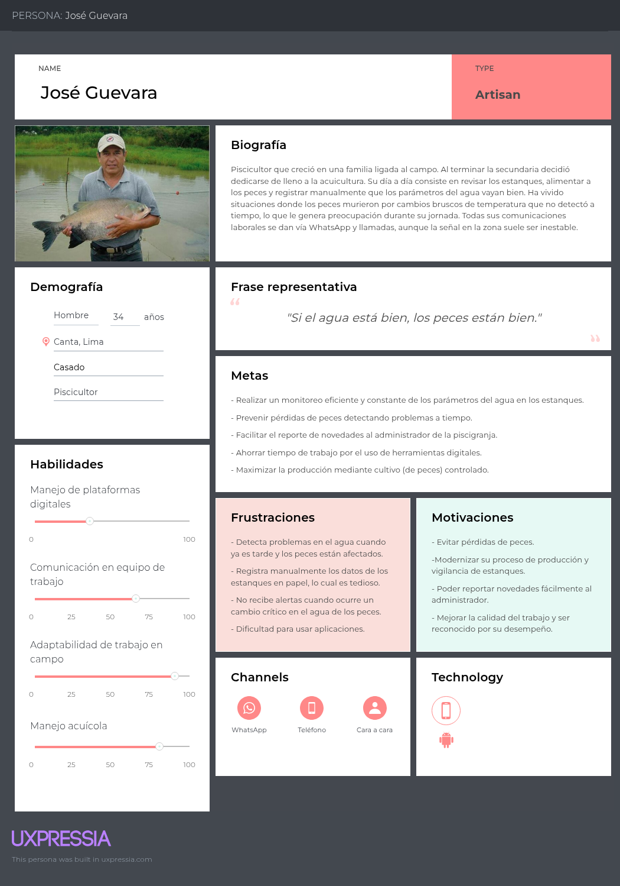
  <br>
  <i>User Persona – Piscicultor</i>
</p>

<div style="page-break-after: always;"></div>

**User persona: Administradores de piscigranjas**

Es la responsable de la gestión y toma de decisiones, quienes supervisan la producción, analizan reportes y coordinan acciones para optimizar el rendimiento de la piscigranja.

<p align="center">
  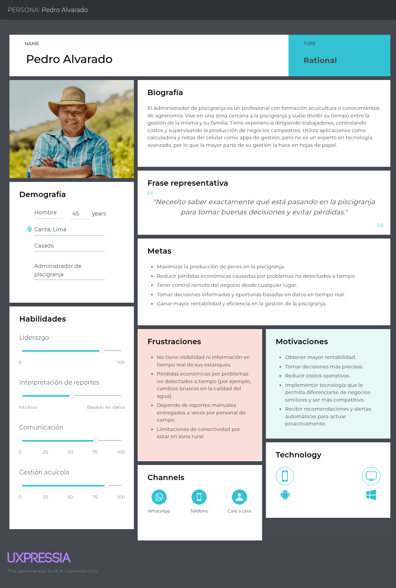
  <br>
  <i>User Persona – Administradores de piscigranjas</i>
</p>

<div style="page-break-after: always;"></div>

**User persona: Comprador de supermercado**

Representa a los responsables de compras de productos frescos que seleccionan proveedores de trucha, coordinan el abastecimiento y revisan la documentación de los lotes, en colaboración con las áreas de recepción y calidad.

<p align="center">
  
  <br>
  <i>User Persona – Comprador de supermercado</i>
</p>

<div style="page-break-after: always;"></div>


### 2.3.2. User Task Matrix


En esta sección se presentan las tareas que los User Persona representativos de cada segmento realizan para cumplir sus metas, **independientemente de la existencia de una solución de software**. Se consideran tres User Persona: José Guevara (piscicultor de campo), Pedro Alvarado (administrador de piscigranja) y Daniel Torres (comprador de supermercado).

**Criterios de clasificación:**

- **Always:** actividad habitual dentro del proceso correspondiente, como revisar documentos durante la recepción de un lote; no significa necesariamente que se realice todos los días.
- **Sometimes:** actividad periódica o condicionada a un evento, como seleccionar un nuevo proveedor, atender una devolución o responder a una auditoría.
- **High:** tarea crítica para la operación, la calidad, la trazabilidad o la toma de decisiones.
- **Medium:** tarea de apoyo que contribuye a la coordinación y eficiencia.
- **—:** tarea que no corresponde a las responsabilidades principales del perfil.

| **Tarea** | **José Guevara (Piscicultor)**<br>Frecuencia | **José**<br>Importancia | **Pedro Alvarado (Administrador)**<br>Frecuencia | **Pedro**<br>Importancia | **Daniel Torres (Comprador de supermercado)**<br>Frecuencia | **Daniel**<br>Importancia |
| :--- | :---: | :---: | :---: | :---: | :---: | :---: |
| Medir manualmente la temperatura del agua en los estanques | Always | High | — | — | — | — |
| Registrar parámetros del agua manualmente | Always | High | — | — | — | — |
| Alimentar a los peces según el horario | Always | High | — | — | — | — |
| Identificar visualmente el comportamiento anormal de los peces | Sometimes | High | — | — | — | — |
| Verificar el volumen y caudal de agua disponible | Always | High | Always | High | — | — |
| Evaluar la turbidez y calidad del agua | Always | High | Always | High | — | — |
| Limpiar y dar mantenimiento a los estanques | Sometimes | Medium | — | — | — | — |
| Reportar y revisar el estado de los estanques mediante documentos físicos o WhatsApp | Sometimes | High | Always | High | — | — |
| Reaccionar ante una emergencia o mortalidad en los estanques | Sometimes | High | Sometimes | High | — | — |
| Coordinar con otros trabajadores de campo | Sometimes | Medium | — | — | — | — |
| Anotar el consumo de alimento por estanque | Always | Medium | — | — | — | — |
| Verificar que los peces estén sanos y sin enfermedades | Always | High | — | — | — | — |
| Decidir sobre cambios en la alimentación o tratamiento sanitario | — | — | Sometimes | High | — | — |
| Controlar los costos operativos y la rentabilidad de la piscigranja | — | — | Always | High | — | — |
| Planificar los ciclos de producción y las fechas de cosecha | — | — | Sometimes | High | — | — |
| Supervisar el desempeño del personal de campo | — | — | Sometimes | High | — | — |
| Evaluar el impacto de factores externos, como sequías o el Fenómeno del Niño | — | — | Sometimes | High | — | — |
| Proyectar la disponibilidad de agua para los próximos meses | — | — | Sometimes | High | — | — |
| Negociar precios y condiciones con compradores o proveedores | — | — | Sometimes | High | Sometimes | High |
| Revisar la procedencia y la documentación sanitaria de los lotes | — | — | Sometimes | High | Always | High |
| Evaluar y seleccionar proveedores de trucha | — | — | — | — | Sometimes | High |
| Solicitar y revisar la documentación comercial y de trazabilidad del proveedor | — | — | — | — | Always | High |
| Coordinar cantidades, fechas y condiciones de entrega | — | — | — | — | Always | High |
| Coordinar con recepción y calidad la evaluación y aceptación o rechazo de los lotes | — | — | — | — | Always | High |
| Registrar o consultar el proveedor, número de lote, fecha de recepción y destino de los productos | — | — | — | — | Always | High |
| Atender reclamos, rechazos o devoluciones por problemas de calidad | — | — | — | — | Sometimes | High |
| Reunir fotografías, documentos de recepción y otras evidencias ante una observación | — | — | — | — | Sometimes | High |
| Responder a auditorías sobre la trazabilidad de productos frescos | — | — | — | — | Sometimes | High |
| Comunicarse con el proveedor para aclarar observaciones y coordinar devoluciones o reposiciones | — | — | — | — | Sometimes | High |

**Sustento de las tareas del comprador**

Las tres entrevistas describen la revisión de documentos del proveedor y la evaluación de calidad, precio y cumplimiento de entregas como parte del proceso habitual de compra. Por ello, la revisión documental y la coordinación del abastecimiento se clasifican como **Always / High**. La selección de nuevos proveedores y la negociación de condiciones se clasifican como **Sometimes / High**, al corresponder a decisiones que se realizan cuando es necesario incorporar o reevaluar proveedores.

La atención de reclamos, la recopilación de evidencias y la coordinación de devoluciones se clasifican como **Sometimes / High**, porque se activan ante problemas de calidad. La comunicación con el proveedor en estos casos tiene importancia alta, ya que permite resolver la observación y acordar una respuesta. Las auditorías también se consideran actividades periódicas de importancia alta por su relación con la trazabilidad.

**Análisis de la matriz**

Las tareas de mayor frecuencia e importancia para José Guevara se concentran en la medición del agua, la alimentación y la revisión de los peces. Para Pedro Alvarado destacan la supervisión de los estanques, la revisión de reportes y el control de costos, actividades que requieren información del personal de campo.

Para Daniel Torres sobresalen la revisión de la procedencia y documentación de los lotes, la coordinación de entregas y la evaluación conjunta con recepción y calidad. Las entrevistas muestran que actualmente estas tareas se apoyan en documentos, sistemas internos y comunicaciones con el proveedor, sin acceso directo y sistemático a las condiciones del agua durante la crianza.

Los tres perfiles necesitan **información confiable y oportuna**, aunque la utilizan con fines distintos: José actúa en campo, Pedro gestiona la producción y Daniel evalúa el abastecimiento y la trazabilidad comercial. Esta relación orienta la propuesta de YakuControl para el monitoreo y la gestión, y de YakuTrace para facilitar la consulta del historial registrado de los lotes, como evidencia complementaria a los controles sanitarios y de calidad.

### 2.3.3. Empathy Mapping


Se elaboraron los Empathy Maps para los tres User Personas identificados. Este proceso permitió comprender mejor lo que dicen, piensan, hacen y sienten en su día a día, identificando sus principales pains y gains para diseñar una solución que realmente responda a las necesidades del sector acuícola peruano.

- Empathy mapping de Administrador de piscigranja


<p align="center">
  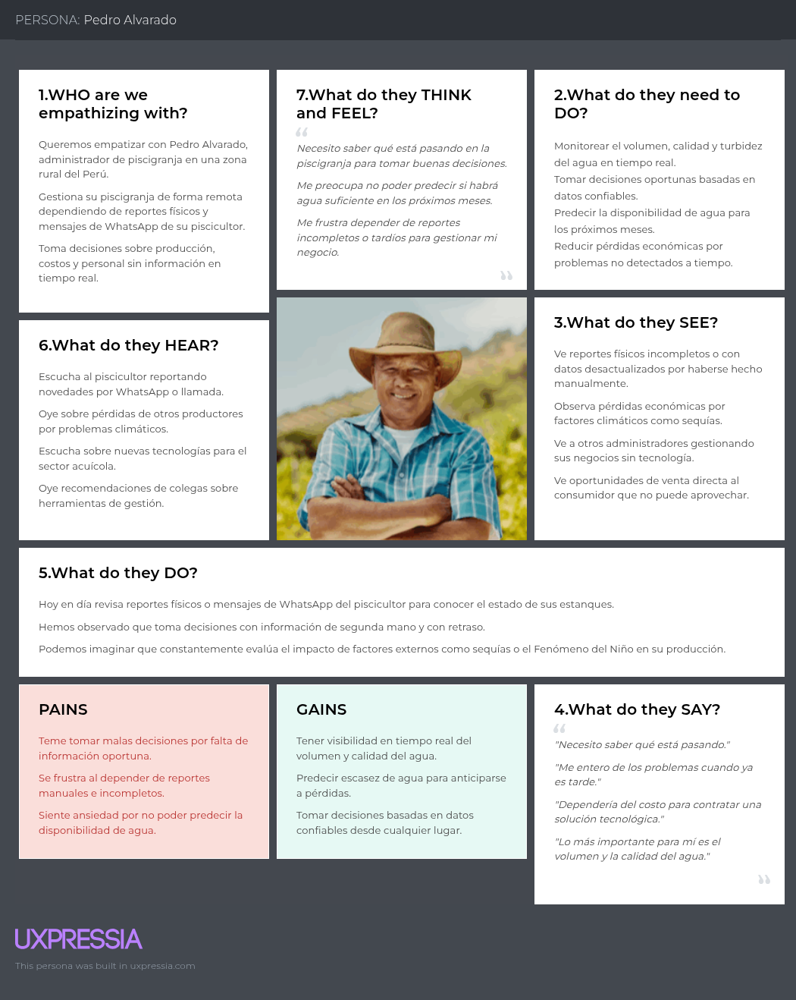
  <br>
  <i>Empathy mapping – Administradores de piscigranjas</i>
</p>

<div style="page-break-after: always;"></div>

- Empathy mapping de Piscicultor

<p align="center">
  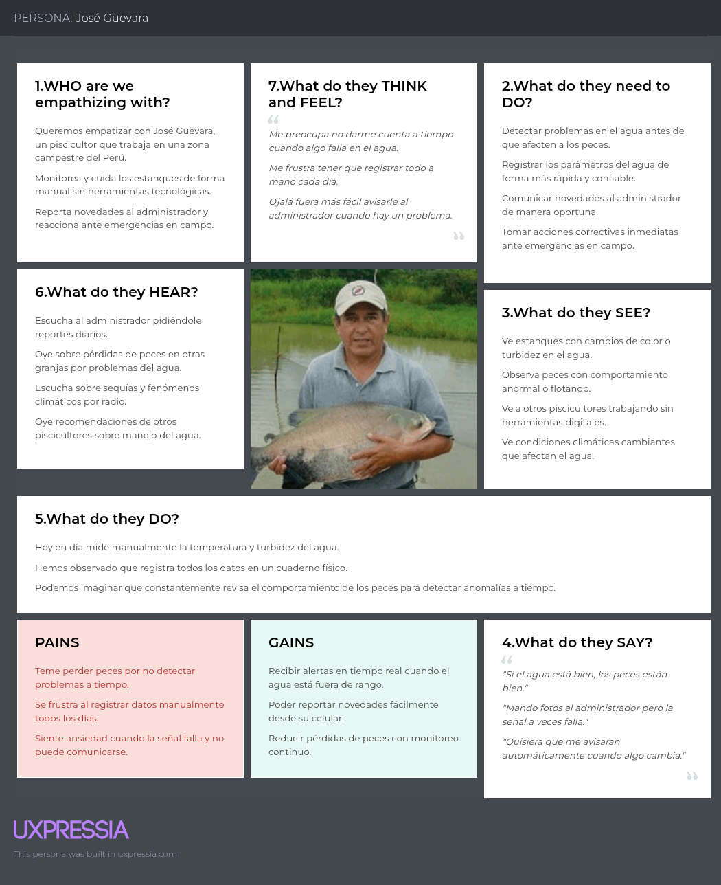
  <br>
  <i>Empathy mapping – Piscicultores</i>
</p>

<div style="page-break-after: always;"></div>

- Empathy mapping de Comprador de supermercado

<p align="center">
  
  <br>
  <i>Empathy mapping – Comprador de supermercado</i>
</p>

<div style="page-break-after: always;"></div>

**Proceso de elaboración.** Para cada User Persona se preparó un tablero en UXPressia con la persona al centro. Cada integrante colocó de forma individual sus observaciones sobre lo que la persona dice, ve, hace y escucha, y cómo se siente y piensa, a partir de las entrevistas y la observación de su contexto. Luego el equipo agrupó las observaciones repetidas e identificó los *pains* (qué le preocupa) y los *gains* (qué puede ayudar a resolver sus problemas y qué lo convencería de que somos la alternativa correcta).


### 2.3.4. As-is Scenario Mapping

El As-is Scenario Mapping representa la experiencia actual de los usuarios para cumplir sus objetivos, antes de utilizar YakuControl o YakuTrace. Se consideran tres User Persona: José Guevara, piscicultor; Pedro Alvarado, administrador de piscigranja; y Daniel Torres, comprador de supermercado.

Los mapas se construyen a partir de las actividades y dificultades descritas en las entrevistas. Cada escenario organiza sus fases como columnas e incluye las filas **Phases, Doing, Thinking y Feeling**, permitiendo relacionar las acciones del usuario con sus preocupaciones y emociones. Las filas Thinking y Feeling representan interpretaciones del equipo y no citas textuales de los participantes.


- As-is Scenario Mapping de Pedro Alvarado


<div style="page-break-after: always;"></div>

- As-is Scenario Mapping de José Guevara


<div style="page-break-after: always;"></div>

- As-is Scenario Mapping de Daniel Torres


<div style="page-break-after: always;"></div>

[Link del Miro](https://miro.com/welcomeonboard/SWQ4UUpYdlFSYTdCNEErcTQ2VzRqNU1BZk54eStDOFR6TnhmRTJCK2FWVWJXQ0ltTmtXYm9RUFJwSHF2eWIvNUxzeERCcXRhM1M3L1pXdE5ERGpqVTNrcUM4YWVONEZMTWZvVWFiVFl3dVdpb3AwTTVQQ2MzbTNxNkdLSWh4WEJBS2NFMDFkcUNFSnM0d3FEN050ekl3PT0hdjE=?share_link_id=826222577249)

**Proceso de elaboración.** Para cada User Persona se construyó un As-is Scenario Map en Miro. Tras la preparación y una lluvia de ideas individual, el equipo revisó las ideas e identificó las **fases** del escenario actual (columnas), las nombró y completó para cada una las filas **Phases, Doing, Thinking y Feeling**. Finalmente se etiquetaron las áreas **positivas** y **negativas** para el usuario y las *blank areas*, es decir, aquello sobre lo que se necesita aprender más. Los mapas parten de los *journey maps* elaborados en la entrega anterior y se rehicieron con el formato del enunciado.

## 2.4. Ubiquitous Language


El Lenguaje Ubicuo (*Ubiquitous Language*) de YakuControl + YakuTrace es el vocabulario compartido del dominio acuícola y comercial que usan el equipo y los expertos del negocio para comunicarse sin ambigüedad. Los términos se presentan en inglés, con su equivalente en español entre paréntesis; las definiciones están en español. Solo se incluyen términos del **dominio**, no términos de ingeniería de software.

### Términos del Dominio

| Term | Definición | Bounded Context |
| :--- | :--- | :--- |
| **Fish Farm** (Piscigranja) | Instalación dedicada a la crianza comercial de truchas en estanques controlados. Es la unidad principal de negocio del cliente. | General |
| **Pond** (Estanque) | Depósito de agua individual dentro de una piscigranja donde se aloja un lote de truchas. Es la unidad mínima de monitoreo. | General |
| **Batch** (Lote) | Conjunto de truchas sembradas juntas en un estanque, que se gestiona como una unidad desde la siembra hasta la cosecha. | Traceability |
| **Rainbow Trout** (Trucha arcoíris, *Oncorhynchus mykiss*) | Especie objetivo. Sus condiciones óptimas (pH 6.5–8.0, temperatura 10–18 °C, turbidez baja) determinan los rangos configurados. | General |
| **Fingerlings** (Alevines) | Truchas jóvenes con las que se inicia un lote. | Traceability |
| **Stocking** (Siembra) | Acto de introducir los alevines en un estanque; inicia el ciclo de un lote. | Traceability |
| **Harvest** (Cosecha) | Extracción de las truchas del estanque al final del ciclo; registra biomasa y mortalidad acumulada. | Traceability |
| **Mortality** (Mortalidad) | Cantidad de peces muertos en un periodo; indicador de riesgo y de desempeño. | General |
| **Fish Farmer** (Piscicultor) | Operario que realiza las rondas de campo, responde ante alertas y acciona equipos. | Identity & Access |
| **Farm Administrator** (Administrador de piscigranja) | Dueño o gestor del negocio; revisa históricos, gestiona estanques, personal, lotes y certificados. | Identity & Access |
| **Field Round** (Ronda de campo) | Recorrido físico periódico del piscicultor entre los estanques para inspeccionar y dar mantenimiento. | General |
| **Sensor** (Sensor) | Equipo que mide una variable del agua (temperatura, pH o turbidez). | Equipment |
| **Actuator** (Actuador) | Equipo que ejecuta una acción en el estanque, como el aireador o el filtro. | Equipment |
| **Equipment Linking** (Vinculación de equipo) | Acto de asociar un sensor o actuador a un estanque; solo lo realiza el administrador. | Equipment |
| **Reading** (Lectura) | Valor puntual de una variable del agua en un momento determinado, asociado a un estanque. | Telemetry |
| **Optimal Range** (Rango óptimo) | Valores mínimo y máximo aceptables de una variable para la especie. | Telemetry |
| **Water Quality Index** (Índice de Calidad del Agua, ICA) | Puntaje global que pondera temperatura, pH y turbidez; determina el estado del estanque. | Telemetry |
| **Critical Threshold** (Umbral crítico) | Valor límite por debajo o por encima del cual las condiciones representan un riesgo para la supervivencia de las truchas. | Telemetry |
| **Pond Status** (Estado del estanque) | Clasificación del riesgo en un momento dado: Normal, Advertencia o Crítico. | Telemetry |
| **False Positive** (Falso positivo) | Lectura anómala que no refleja un riesgo real (interferencia, suciedad o pico transitorio). | Telemetry |
| **Water Quality Summary** (Resumen de calidad del agua) | Síntesis de un periodo (día, semana, mes o ciclo) con promedio, mínimo y máximo del ICA, porcentaje de tiempo en rango, eventos críticos, tiempo de respuesta y cobertura de datos. | Telemetry |
| **Data Coverage** (Cobertura de datos) | Porcentaje de lecturas efectivamente recibidas respecto de las esperadas en un periodo; indica qué tan completo es un resumen. | Telemetry |
| **Critical Alert** (Alerta crítica) | Aviso inmediato generado cuando una lectura supera el umbral crítico. | Notification |
| **Maintenance Alert** (Alerta de mantenimiento) | Aviso al administrador cuando un equipo queda fuera de línea o un estanque no reporta datos. | Notification |
| **Emergency Action** (Acción de emergencia) | Orden remota del piscicultor para activar un actuador ante una condición crítica. | Notification |
| **Alert Response Time** (Tiempo de respuesta a la alerta) | Tiempo transcurrido entre la alerta y la acción del operario. | Notification |
| **Subscription** (Suscripción) | Contrato de acceso al servicio asociado a una piscigranja, con ciclo de vida de prueba, activa, suspendida o cancelada. | Payment |
| **Plan** (Plan) | Nivel de servicio contratado (Básico, Pro o Enterprise) con precio por estanque monitoreado. | Payment |
| **Add-on TRACE** (Complemento TRACE) | Servicio adicional que habilita la emisión de certificados de trazabilidad. | Payment |
| **Invoice** (Factura) | Comprobante de cobro de un ciclo de facturación. | Payment |
| **Billing Period** (Período de facturación) | Rango de fechas de un ciclo de cobro. | Payment |
| **Traceability** (Trazabilidad) | Capacidad de reconstruir el historial de un lote desde la siembra hasta la entrega al comprador. | Traceability |
| **Milestone** (Hito) | Evento relevante del ciclo de un lote: siembra, evento crítico, tratamiento, cambio de alimentación, cierre de resumen, cosecha o despacho. | Traceability |
| **Traceability Certificate** (Certificado de trazabilidad) | Documento verificable de un lote con sus hitos y su resumen de calidad del agua, identificado por un código QR. | Traceability |
| **Public Code** (Código público) | Código no adivinable impreso en el QR que permite consultar un certificado sin exponer identificadores internos. | Traceability |
| **Verification** (Verificación) | Comprobación de que el contenido de un certificado coincide con el registro inalterable emitido; resulta en válido, alterado o revocado. | Traceability |
| **Revocation** (Revocación) | Anulación de un certificado emitido por error; queda registrada y no borra el historial. | Traceability |
| **Supermarket Buyer** (Comprador de supermercado) | Profesional de compras o aseguramiento de calidad que verifica el origen y las condiciones registradas de un lote. | Traceability |

# Capítulo III: Requirements Specification
## 3.1. To-Be Scenario Mapping

Esta sección presenta el escenario futuro de cada User Persona una vez que utiliza YakuControl y YakuTrace. Para cada uno se elaboró un To-Be Scenario Map en Miro/LucidChart con las filas **Phases, Doing, Thinking y Feeling**. El proceso incluyó la preparación, una lluvia de ideas individual, la revisión de las ideas, la identificación y denominación de las fases y la **comparación con el As-is Scenario Map** para identificar qué cambios aporta la solución.

**Cambios principales respecto del escenario actual**

| Persona | Escenario actual (As-is) | Escenario futuro (To-Be) | Cambio que aporta la solución |
| :--- | :--- | :--- | :--- |
| José Guevara (Piscicultor) | Detecta los problemas por el comportamiento de los peces durante sus rondas y registra los datos a mano. | Recibe alertas con el tipo de riesgo y puede activar el aireador o el filtro desde su celular. | Reacciona antes de que el pez muestre signos de estrés y reduce el registro manual. |
| Pedro Alvarado (Administrador) | Recibe reportes físicos, fotos de cuadernos o audios y decide con información tardía. | Consulta un panel con el estado de todos sus estanques, el historial y el resumen de calidad por lote, y emite certificados al cosechar. | Decide con datos en tiempo real y cuenta con evidencia para respaldar sus lotes ante compradores. |
| Daniel Torres (Comprador de supermercado) | Verifica el origen con documentos y declaraciones del proveedor. | Escanea el QR del lote y ve el historial, el resumen de calidad y la verificación de integridad. | Verifica en segundos con evidencia que no puede modificarse después de emitida. |

- To-Be Scenario Map - Piscicultor


**Comparación con el As-is**

La consulta de lecturas complementa la observación durante las rondas y reduce la necesidad de transcribir datos. Las alertas permiten identificar desviaciones de las variables monitoreadas, mientras que el registro de atención facilita comunicar lo ocurrido al administrador.

La solución conserva la inspección física y la intervención del operario. La consulta de datos almacenados no equivale a monitoreo actualizado; la recepción de alertas y el control remoto requieren conectividad. Registrar una alerta como atendida tampoco significa que la condición del agua esté resuelta.

- To-Be Scenario Map - Administrador


**Comparación con el As-is**

El panel reúne información que actualmente llega mediante documentos y mensajes, facilitando la revisión de los estanques y la coordinación con el personal. La gestión de lotes organiza los hitos y los resúmenes del agua para su consulta durante el ciclo.

YakuTrace incorpora un documento con QR y una comprobación de integridad. El administrador debe distinguir un certificado con anclaje pendiente de uno confirmado. El certificado respalda el contenido registrado, pero no garantiza por sí mismo la exactitud de los datos de origen ni la calidad sanitaria del producto.

- To-Be Scenario Map - Comprador de supermercado


**Comparación con el As-is**

La página pública reúne información que actualmente debe solicitarse por separado al proveedor. El acceso sin registro responde a la necesidad de consultar durante la recepción sin añadir pasos innecesarios.

La verificación permite comprobar la integridad del contenido anclado, pero no sustituye la revisión sanitaria ni la inspección del producto. Daniel debe contrastar el QR con la mercancía y sus documentos. Un certificado revocado, pendiente o no verificable requiere aclaración; no determina automáticamente la aceptación o rechazo del lote.

[Link del Miro](https://miro.com/welcomeonboard/SWQ4UUpYdlFSYTdCNEErcTQ2VzRqNU1BZk54eStDOFR6TnhmRTJCK2FWVWJXQ0ltTmtXYm9RUFJwSHF2eWIvNUxzeERCcXRhM1M3L1pXdE5ERGpqVTNrcUM4YWVONEZMTWZvVWFiVFl3dVdpb3AwTTVQQ2MzbTNxNkdLSWh4WEJBS2NFMDFkcUNFSnM0d3FEN050ekl3PT0hdjE=?share_link_id=826222577249)

## 3.2. User Stories


Los requisitos de YakuControl + YakuTrace se organizan en cinco épicas y un conjunto de User Stories y Technical Stories. Las historias de usuario se redactan con el formato *"Como… deseo… para…"* y sus criterios de aceptación siguen la estructura Gherkin (*Given–When–Then*), en tiempo presente, tercera persona y sin referencias a la interfaz. Las historias del sitio estático (Landing Page) usan el rol *visitante*, y las Technical Stories de servicios sin interacción directa con el usuario usan el rol *developer*. La épica **EP05** incorpora la trazabilidad con blockchain.

| Epic / User Story ID | Título | Descripción | Criterios de Aceptación | Relacionado con (Epic ID) |
| :--- | :--- | :--- | :--- | :--- |
| **EP01** | **Presencia Digital e Informativa** | Landing Page y sitio web estático para atracción de clientes, visualización de planes y acceso a la verificación de lotes. | No aplica; se detalla en las historias de la épica. | — |
| **EP02** | **App Móvil (Piscicultor)** | Herramienta de campo para monitoreo en tiempo real, gestión de alertas y control de actuadores. | No aplica; se detalla en las historias de la épica. | — |
| **EP03** | **Web App (Administrador)** | Plataforma de gestión para análisis de datos, administración de personal, estanques y finanzas. | No aplica; se detalla en las historias de la épica. | — |
| **EP04** | **Backend & API (Technical)** | Infraestructura de servicios REST, seguridad, integración con el Edge y servicios de terceros. | No aplica; se detalla en las historias de la épica. | — |
| **EP05** | **Trazabilidad y Verificación (YakuTrace)** | Gestión de lotes, resúmenes de calidad, emisión de certificados con QR, anclaje en blockchain y verificación pública. | No aplica; se detalla en las historias de la épica. | — |
| **US01** | Propuesta de valor | Como visitante, deseo conocer la propuesta de valor de YakuControl para entender qué problema resuelve. | **Escenario 1: Visualización de beneficios**<br>**Given** un visitante accede al sitio<br>**When** consulta la sección principal<br>**Then** el sistema presenta los beneficios clave del producto<br><br>**Escenario 2: Error de carga**<br>**Given** el contenido del sitio no está disponible<br>**When** un visitante accede al sitio<br>**Then** el sistema informa de forma comprensible que el contenido no pudo cargarse | EP01 |
| **US02** | Catálogo de planes | Como visitante, deseo ver los planes y sus precios para evaluar mi presupuesto. | **Escenario 1: Consulta de planes**<br>**Given** un visitante consulta la oferta comercial<br>**When** revisa los planes<br>**Then** el sistema detalla el costo y los beneficios de cada plan, incluido el complemento TRACE<br><br>**Escenario 2: Moneda por ubicación**<br>**Given** el visitante accede desde fuera del Perú<br>**When** consulta los precios<br>**Then** el sistema los presenta en dólares por defecto | EP01 |
| **US03** | Preguntas frecuentes | Como visitante, deseo consultar preguntas frecuentes para resolver mis dudas básicas. | **Escenario 1: Resolución de dudas**<br>**Given** un visitante tiene dudas sobre el producto<br>**When** consulta las preguntas frecuentes<br>**Then** el sistema presenta respuestas a las consultas más comunes<br><br>**Escenario 2: Sin resultados**<br>**Given** el visitante busca un término sin coincidencias<br>**When** realiza la búsqueda<br>**Then** el sistema ofrece un medio de contacto | EP01 |
| **US04** | Formulario de ventas | Como visitante, deseo dejar mis datos de contacto para que un asesor se comunique conmigo. | **Escenario 1: Envío exitoso**<br>**Given** el visitante completó los datos obligatorios<br>**When** envía el formulario<br>**Then** el sistema registra el contacto y confirma el envío<br><br>**Escenario 2: Datos faltantes**<br>**Given** faltan datos obligatorios<br>**When** el visitante intenta enviar el formulario<br>**Then** el sistema indica los datos faltantes y no registra el contacto | EP01 |
| **US18** | Sección YakuTrace para supermercados | Como visitante del segmento supermercado, deseo conocer cómo YakuTrace permite verificar un lote para evaluar su utilidad en mis compras. | **Escenario 1: Conocer la verificación**<br>**Given** un visitante del segmento supermercado consulta la sección de trazabilidad<br>**When** revisa la explicación<br>**Then** el sistema explica cómo se verifica un lote y señala el acceso a la verificación pública<br><br>**Escenario 2: Verificar un lote**<br>**Given** el visitante dispone de un código de lote<br>**When** solicita verificarlo<br>**Then** el sistema lo dirige a la verificación pública del certificado | EP01 |
| **US05** | Autenticación en la app móvil | Como piscicultor, deseo autenticarme para acceder a los estanques que tengo asignados. | **Escenario 1: Acceso correcto**<br>**Given** el piscicultor posee credenciales válidas<br>**When** solicita el acceso<br>**Then** el sistema otorga acceso a sus estanques asignados<br><br>**Escenario 2: Credenciales inválidas**<br>**Given** las credenciales son incorrectas<br>**When** el piscicultor solicita el acceso<br>**Then** el sistema deniega el acceso sin revelar cuál dato es incorrecto | EP02 |
| **US06** | Lectura de sensores | Como piscicultor, deseo consultar el pH, la temperatura y la turbidez actuales de un estanque para evitar rondas físicas innecesarias. | **Escenario 1: Datos en tiempo real**<br>**Given** un estanque asignado tiene sensores activos<br>**When** el piscicultor consulta su estado<br>**Then** el sistema presenta los últimos valores recibidos y el estado del estanque<br><br>**Escenario 2: Sensor sin conexión**<br>**Given** un sensor no envía lecturas<br>**When** el piscicultor consulta el estanque<br>**Then** el sistema presenta el último valor conocido e indica que el sensor está desconectado | EP02 |
| **US07** | Alertas de calidad del agua | Como piscicultor, deseo recibir una alerta cuando el agua está fuera de rango para actuar rápidamente. | **Escenario 1: Alerta crítica**<br>**Given** una lectura fuera del rango óptimo es confirmada como anomalía<br>**When** el sistema la detecta<br>**Then** notifica al piscicultor asignado y al administrador en menos de 10 segundos<br><br>**Escenario 2: Entrega no disponible**<br>**Given** no es posible entregar la notificación push al piscicultor<br>**When** ocurre una alerta crítica<br>**Then** el sistema conserva la alerta como pendiente en el historial y reintenta la entrega<br><br>**Escenario 3: Atención de la alerta**<br>**Given** existe una alerta crítica pendiente<br>**When** el piscicultor registra que la atendió<br>**Then** el sistema marca la alerta como atendida y registra la hora de la atención | EP02 |
| **US08** | Control de aireación | Como piscicultor, deseo activar el aireador de un estanque de forma remota para oxigenar el agua. | **Escenario 1: Activación exitosa**<br>**Given** el aireador está apagado y conectado<br>**When** el piscicultor solicita activarlo<br>**Then** el sistema envía la orden y confirma el estado del equipo<br><br>**Escenario 2: Actuador sin respuesta**<br>**Given** el actuador no responde<br>**When** el piscicultor solicita activarlo<br>**Then** el sistema informa el error de comunicación y registra la acción como fallida | EP02 |
| **US09** | Registro de novedades | Como piscicultor, deseo registrar una novedad sobre un estanque para informar al administrador. | **Escenario 1: Registro de novedad**<br>**Given** el piscicultor redactó una novedad válida<br>**When** la guarda<br>**Then** el sistema la almacena con fecha, hora y autor<br><br>**Escenario 2: Novedad vacía**<br>**Given** la novedad no tiene contenido<br>**When** el piscicultor intenta guardarla<br>**Then** el sistema no la registra | EP02 |
| **US17** | Control de limpieza | Como piscicultor, deseo activar los filtros de limpieza de un estanque para reducir la turbidez. | **Escenario 1: Activación remota**<br>**Given** la turbidez del estanque es alta<br>**When** el piscicultor solicita activar la limpieza<br>**Then** el sistema envía la orden al equipo y confirma su estado<br><br>**Escenario 2: Falla eléctrica**<br>**Given** el equipo no tiene energía<br>**When** el piscicultor solicita activarlo<br>**Then** el sistema informa el error de hardware | EP02 |
| **US10** | Gestión de usuarios | Como administrador, deseo crear cuentas para mis operarios para delegarles el acceso. | **Escenario 1: Invitación enviada**<br>**Given** el administrador ingresó los datos del operario<br>**When** solicita la invitación<br>**Then** el sistema genera un código de registro y lo envía por correo al operario<br><br>**Escenario 2: Correo duplicado**<br>**Given** el correo ya está registrado<br>**When** el administrador intenta crear la cuenta<br>**Then** el sistema indica que el usuario ya existe | EP03 |
| **US11** | Reporte de mortalidad | Como administrador, deseo generar un reporte mensual de bajas para mis registros contables. | **Escenario 1: Reporte generado**<br>**Given** el mes consultado tiene bajas registradas en los lotes<br>**When** el administrador solicita el reporte<br>**Then** el sistema genera el documento con las bajas del periodo por lote<br><br>**Escenario 2: Mes sin bajas**<br>**Given** no hubo bajas en el mes<br>**When** el administrador solicita el reporte<br>**Then** el sistema genera el documento indicando que no hay registros | EP03 |
| **US12** | Historial de tendencias | Como administrador, deseo ver la evolución anual de los parámetros del agua para planificar el siguiente ciclo. | **Escenario 1: Evolución anual**<br>**Given** el administrador seleccionó un periodo anual<br>**When** consulta el historial<br>**Then** el sistema presenta la evolución temporal del parámetro<br><br>**Escenario 2: Consulta extensa**<br>**Given** el periodo contiene un gran volumen de datos<br>**When** el administrador consulta el historial<br>**Then** el sistema presenta la evolución agregada por periodos en lugar de las lecturas individuales | EP03 |
| **US13** | Configuración de umbrales | Como administrador, deseo definir los límites de alerta de un estanque para personalizar el control. | **Escenario 1: Actualización de límites**<br>**Given** el administrador ingresó límites válidos<br>**When** los guarda<br>**Then** el sistema los aplica a las evaluaciones posteriores<br><br>**Escenario 2: Límites inconsistentes**<br>**Given** el mínimo es mayor que el máximo<br>**When** el administrador intenta guardar<br>**Then** el sistema rechaza el cambio e informa la inconsistencia | EP03 |
| **US14** | Pago de suscripción | Como administrador, deseo pagar mi suscripción para mantener el servicio activo. | **Escenario 1: Pago exitoso**<br>**Given** el administrador seleccionó un plan<br>**When** la pasarela confirma el pago<br>**Then** el sistema activa la suscripción<br><br>**Escenario 2: Pago rechazado**<br>**Given** la pasarela rechaza el cobro<br>**When** informa el fallo<br>**Then** el sistema mantiene la suscripción pendiente e informa al administrador que el pago fue rechazado | EP03 |
| **US15** | Registro de estanque | Como administrador, deseo registrar un estanque y vincularle sus equipos para ampliar mi capacidad productiva. | **Escenario 1: Registro correcto**<br>**Given** el administrador ingresó un identificador de hardware nuevo<br>**When** registra el estanque<br>**Then** el sistema lo incorpora al listado de la granja<br><br>**Escenario 2: Hardware duplicado**<br>**Given** el identificador de hardware ya está registrado<br>**When** el administrador intenta vincularlo<br>**Then** el sistema rechaza la acción e informa la duplicidad | EP03 |
| **US16** | Auditoría de respuesta | Como administrador, deseo conocer el tiempo que tarda un operario en atender una alerta para evaluar la respuesta del equipo. | **Escenario 1: Reporte de tiempos**<br>**Given** una alerta fue atendida<br>**When** el administrador revisa el historial<br>**Then** el sistema muestra la hora de la alerta y la hora de la acción<br><br>**Escenario 2: Atención automática**<br>**Given** la alerta fue atendida por el sistema<br>**When** el administrador audita el evento<br>**Then** el sistema indica que fue atendida por el sistema | EP03 |
| **US19** | Activación del complemento TRACE | Como administrador, deseo activar el complemento TRACE para emitir certificados de trazabilidad de mis lotes. | **Escenario 1: Activación**<br>**Given** la suscripción de la granja está activa<br>**When** el administrador contrata el complemento<br>**Then** el sistema habilita la emisión de certificados para la granja<br><br>**Escenario 2: Suscripción inactiva**<br>**Given** la suscripción está suspendida o cancelada<br>**When** el administrador intenta contratarlo<br>**Then** el sistema rechaza la contratación e indica que la suscripción debe estar activa | EP03 |
| **US20** | Registro de lote | Como administrador, deseo registrar un lote con su fecha de siembra, cantidad y origen de alevines para iniciar su trazabilidad. | **Escenario 1: Lote registrado**<br>**Given** el estanque no tiene un lote activo<br>**When** el administrador registra el lote con datos válidos<br>**Then** el sistema crea el lote y registra el hito de siembra<br><br>**Escenario 2: Lote activo existente**<br>**Given** el estanque ya tiene un lote activo<br>**When** el administrador intenta registrar otro<br>**Then** el sistema lo rechaza e informa el motivo | EP05 |
| **US21** | Registro de hitos del lote | Como administrador, deseo registrar tratamientos, cambios de alimentación y bajas por mortalidad de un lote para completar su historial. | **Escenario 1: Hito agregado**<br>**Given** el lote está activo<br>**When** el administrador registra un hito de tratamiento, alimentación o mortalidad con su fecha y descripción (y la cantidad de peces en caso de mortalidad)<br>**Then** el sistema lo agrega a la línea de tiempo del lote<br><br>**Escenario 2: Lote certificado**<br>**Given** el lote ya fue certificado<br>**When** el administrador intenta agregar un hito<br>**Then** el sistema lo rechaza porque el historial está cerrado | EP05 |
| **US22** | Resumen de calidad del agua del lote | Como administrador, deseo ver el resumen de calidad del agua de un lote por día, semana y mes para conocer cómo se comportó durante el ciclo. | **Escenario 1: Resumen del periodo**<br>**Given** el lote tiene lecturas en el periodo<br>**When** el administrador consulta el resumen<br>**Then** el sistema presenta el promedio, mínimo y máximo del índice de calidad, el porcentaje de tiempo en rango, los eventos críticos, el tiempo de respuesta y la cobertura de datos<br><br>**Escenario 2: Cobertura insuficiente**<br>**Given** el periodo no tiene lecturas suficientes<br>**When** el administrador consulta el resumen<br>**Then** el sistema indica que la cobertura de datos es insuficiente | EP05 |
| **US23** | Registro de cosecha | Como administrador, deseo registrar la cosecha de un lote con su biomasa, mortalidad acumulada y temperatura del agua para cerrar el ciclo. | **Escenario 1: Cosecha registrada**<br>**Given** el lote está activo<br>**When** el administrador registra la cosecha con datos completos<br>**Then** el sistema cierra el ciclo y cambia el estado del lote a cosechado<br><br>**Escenario 2: Datos incompletos**<br>**Given** faltan datos de la cosecha<br>**When** el administrador intenta registrarla<br>**Then** el sistema rechaza el registro e indica los datos faltantes | EP05 |
| **US24** | Emisión de certificado con QR | Como administrador, deseo emitir un certificado de trazabilidad con código QR para un lote cosechado para respaldarlo ante mis compradores. | **Escenario 1: Certificado emitido**<br>**Given** el lote está cosechado, la granja tiene TRACE activo y la cobertura de datos es suficiente<br>**When** el administrador solicita el certificado<br>**Then** el sistema lo emite, genera su código QR y registra su huella digital en la blockchain<br><br>**Escenario 2: Requisitos no cumplidos**<br>**Given** la cobertura de datos es insuficiente o existe un evento crítico abierto<br>**When** el administrador solicita el certificado<br>**Then** el sistema lo rechaza e indica el motivo<br><br>**Escenario 3: Red no disponible**<br>**Given** la red blockchain no está disponible<br>**When** el administrador solicita el certificado<br>**Then** el sistema lo emite con anclaje pendiente y lo confirma cuando la red responde | EP05 |
| **US25** | Revocación de certificado | Como administrador, deseo revocar un certificado emitido por error para evitar que se use como evidencia válida. | **Escenario 1: Revocación**<br>**Given** el certificado está emitido<br>**When** el administrador lo revoca indicando el motivo<br>**Then** el sistema lo marca como revocado y registra la revocación<br><br>**Escenario 2: Ya revocado**<br>**Given** el certificado ya está revocado<br>**When** el administrador intenta revocarlo<br>**Then** el sistema indica que ya se encuentra revocado | EP05 |
| **US26** | Verificación de un lote por QR | Como comprador de supermercado, deseo verificar un lote escaneando su código QR para confirmar su origen y las condiciones registradas. | **Escenario 1: Certificado válido**<br>**Given** el código corresponde a un certificado emitido<br>**When** el comprador lo verifica<br>**Then** el sistema presenta el historial del lote, el resumen de calidad y el resultado de la verificación<br><br>**Escenario 2: Contenido alterado**<br>**Given** el contenido almacenado no coincide con el registro inalterable<br>**When** el comprador lo verifica<br>**Then** el sistema informa que el certificado no es válido<br><br>**Escenario 3: Certificado revocado**<br>**Given** el certificado fue revocado<br>**When** el comprador lo verifica<br>**Then** el sistema informa que fue revocado e indica el motivo<br><br>**Escenario 4: Código inexistente**<br>**Given** el código no corresponde a ningún certificado<br>**When** el comprador lo verifica<br>**Then** el sistema informa que el código no es válido | EP05 |
| **US27** | Prueba del registro en blockchain | Como comprador de supermercado, deseo acceder a la prueba del registro en blockchain para confiar en que el certificado no fue modificado. | **Escenario 1: Prueba disponible**<br>**Given** el certificado tiene su huella anclada<br>**When** el comprador solicita la prueba<br>**Then** el sistema muestra la huella digital y el enlace a la transacción en la red<br><br>**Escenario 2: Anclaje pendiente**<br>**Given** el anclaje aún no fue confirmado<br>**When** el comprador solicita la prueba<br>**Then** el sistema indica que el registro está en proceso | EP05 |
| **TS01** | API de ingesta de telemetría | Como developer, deseo un endpoint que reciba las lecturas del Edge para persistir la telemetría. | **Escenario 1: Recepción correcta**<br>**Given** un JSON válido y firmado<br>**When** el Edge envía una lectura<br>**Then** la API responde 201 y persiste la lectura<br><br>**Escenario 2: Parámetros faltantes**<br>**Given** el JSON no contiene todos los parámetros<br>**When** el Edge envía la lectura<br>**Then** la API responde 400<br><br>**Escenario 3: Firma inválida**<br>**Given** la firma de la lectura no es válida<br>**When** el Edge envía la lectura<br>**Then** la API responde 401 y no persiste la lectura | EP04 |
| **TS02** | Seguridad con JWT | Como developer, deseo proteger los endpoints con tokens para evitar accesos no autorizados y aislar los datos de cada granja. | **Escenario 1: Token válido**<br>**Given** una petición con un JWT vigente<br>**When** consulta un recurso de su granja<br>**Then** la API responde 200<br><br>**Escenario 2: No autorizado**<br>**Given** una petición sin token o con token vencido<br>**When** consulta un recurso<br>**Then** la API responde 401<br><br>**Escenario 3: Granja distinta**<br>**Given** un JWT vigente de otra granja<br>**When** consulta un recurso ajeno<br>**Then** la API responde 403 sin revelar información del recurso | EP04 |
| **TS03** | Envío de alertas por push | Como developer, deseo que las anomalías confirmadas disparen notificaciones push para alertar al usuario. | **Escenario 1: Envío inmediato**<br>**Given** una anomalía confirmada<br>**When** el sistema la procesa<br>**Then** envía la notificación al servicio de mensajería push<br><br>**Escenario 2: Reintento**<br>**Given** el servicio de mensajería no responde<br>**When** falla el envío<br>**Then** el sistema encola el mensaje y lo reintenta automáticamente | EP04 |
| **TS04** | Firma de lecturas del Edge | Como developer, deseo que cada lectura enviada por el Edge esté firmada con la clave de la granja para evitar lecturas falsificadas. | **Escenario 1: Firma válida**<br>**Given** una lectura firmada con la clave vigente de la granja<br>**When** llega a la API<br>**Then** la API la acepta<br><br>**Escenario 2: Firma inválida**<br>**Given** una lectura con firma incorrecta<br>**When** llega a la API<br>**Then** la API la rechaza y registra el intento | EP04 |
| **TS05** | Anclaje de hash en el smart contract | Como developer, deseo registrar en el smart contract la huella digital de un hito o certificado para hacerlo verificable. | **Escenario 1: Anclaje correcto**<br>**Given** una huella calculada y la red disponible<br>**When** el sistema la ancla<br>**Then** el contrato la registra y el sistema guarda el hash de transacción y el bloque<br><br>**Escenario 2: Cuenta no autorizada**<br>**Given** una cuenta no autorizada<br>**When** intenta anclar una huella<br>**Then** el contrato rechaza la transacción | EP04 |
| **TS06** | API pública de verificación | Como developer, deseo un endpoint público de verificación por código para que el QR funcione sin autenticación. | **Escenario 1: Código válido**<br>**Given** un código de certificado existente<br>**When** se consulta el endpoint<br>**Then** la API responde 200 con el resultado y el resumen, sin identificadores internos<br><br>**Escenario 2: Código inexistente**<br>**Given** un código que no existe<br>**When** se consulta el endpoint<br>**Then** la API responde 404<br><br>**Escenario 3: Exceso de solicitudes**<br>**Given** un cliente excede el límite de solicitudes<br>**When** consulta el endpoint<br>**Then** la API responde 429 | EP04 |
| **TS07** | Cola de anclajes con reintentos | Como developer, deseo una cola de anclajes pendientes con reintentos para que la caída de la red blockchain no bloquee la emisión de certificados. | **Escenario 1: Red no disponible**<br>**Given** un anclaje pendiente y la red no disponible<br>**When** el sistema reintenta<br>**Then** conserva el anclaje pendiente e incrementa su contador de intentos<br><br>**Escenario 2: Red disponible**<br>**Given** un anclaje pendiente y la red disponible<br>**When** el sistema reintenta<br>**Then** lo confirma y registra el hash de transacción y el bloque | EP04 |
| **TS08** | Cierre de resúmenes de calidad | Como developer, deseo un proceso programado que cierre y agregue los resúmenes de calidad para contar con datos inmutables por periodo. | **Escenario 1: Cierre de periodo**<br>**Given** un periodo vencido con lecturas<br>**When** se ejecuta el proceso de cierre<br>**Then** el sistema genera un resumen cerrado y publica el evento correspondiente<br><br>**Escenario 2: Resumen cerrado**<br>**Given** un resumen ya cerrado<br>**When** se intenta modificarlo<br>**Then** el sistema lo rechaza | EP04 |
| **TS09** | Documentación OpenAPI | Como developer, deseo documentar los endpoints con OpenAPI para facilitar su uso e integración. | **Escenario 1: Documentación disponible**<br>**Given** la API desplegada<br>**When** un developer accede a la documentación<br>**Then** se listan los endpoints con sus parámetros, respuestas y ejemplos | EP04 |

## 3.3. Impact Mapping

En esta sección hemos elaborado nuestro Impact Mapping. Para ello, utilizamos la hipótesis desarrollada durante nuestro proceso de Lean UX. Reemplazamos los segmentos de cliente por los User Personas, los cuales fueron elaborados en las secciones previas, y conectamos las funcionalidades con los objetivos, para que formen parte del Product Backlog.

<div style="text-align: center; margin-top: 1rem; margin-bottom: 1rem;">

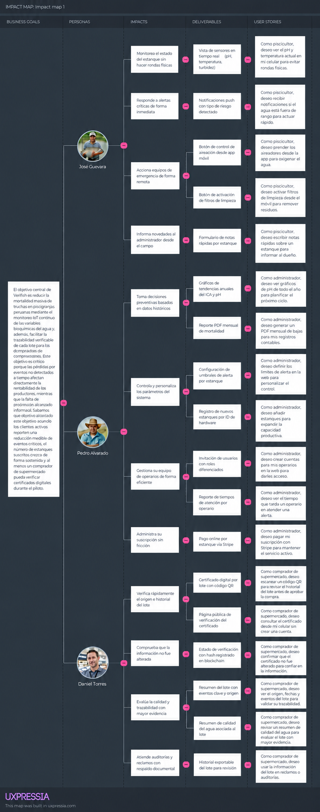

</div>

*El mapa conecta a las personas con los impactos y entregables del producto: el Piscicultor, enfocado en el monitoreo y control operativo en campo; el Administrador, orientado a la gestión estratégica y a la emisión de certificados; y el Comprador de supermercado, que verifica los lotes. Cada impacto se vincula con las User Stories priorizadas en el Product Backlog, como detalla la tabla siguiente.*


**Business Goals (SMART)**

| ID | Business Goal |
| :--- | :--- |
| G1 | Conectar al menos 50 estanques con monitoreo activo en los primeros 6 meses de operación. |
| G2 | Reducir en al menos 15% los eventos de mortalidad masiva en las piscigranjas piloto durante el primer trimestre. |
| G3 | Emitir certificados verificables para el 100% de los lotes cosechados de las piscigranjas piloto durante el primer trimestre del piloto. |
| G4 | Lograr que al menos el 20% de las piscigranjas piloto contrate el complemento TRACE en el primer trimestre. |
| G5 | Lograr que al menos un supermercado o distribuidor verifique certificados de lotes reales en un piloto de 3 meses, con un tiempo de verificación menor a 1 minuto. |

**Mapa de impacto (Goal → Actor → Impact → Deliverable → User Stories)**

| Goal | Actor / Persona | Impact | Deliverable | User Stories |
| :--- | :--- | :--- | :--- | :--- |
| G1 | Pedro Alvarado (Administrador) | Registra todos sus estanques y equipos y contrata el servicio | Registro y vinculación de estanques; suscripción y pago | US15, US10, US14 |
| G1 | José Guevara (Piscicultor) | Usa la app a diario en lugar del registro manual | App móvil con lecturas en tiempo real | US05, US06 |
| G2 | José Guevara (Piscicultor) | Responde a las alertas en menos de 10 minutos | Alertas push y control remoto de aireador y filtros | US07, US08, US17, TS03 |
| G2 | Pedro Alvarado (Administrador) | Ajusta umbrales y supervisa la respuesta del equipo | Configuración de umbrales y auditoría de respuesta | US13, US16 |
| G3 | Pedro Alvarado (Administrador) | Registra lotes e hitos y solicita el certificado al cosechar | Gestión de lotes, resumen de calidad y certificado con QR | US20–US25, TS05, TS07, TS08 |
| G3 | Comprador de supermercado | Verifica los lotes que recibe | Página pública de verificación | US26, US27, TS06 |
| G4 | Pedro Alvarado (Administrador) | Activa el complemento TRACE | Plan complementario TRACE | US19, US14 |
| G5 | Comprador de supermercado | Escanea el QR y confía en el certificado | Verificación pública con prueba en blockchain | US26, US27 |

## 3.4. Product Backlog


El Product Backlog se ordena por **valor para el negocio**. El criterio aplicado fue: (1) presencia digital y Landing Page desde el primer sprint; (2) el valor central de monitoreo (ingesta, lectura y alertas), que reduce la mortalidad; (3) el diferenciador YakuTrace (lotes, resúmenes, certificado, anclaje y verificación); (4) control operativo y monetización; y (5) funciones administrativas y de apoyo. Las historias de seguridad y autenticación no se priorizan al inicio por sí mismas: se ordenan según el valor que habilitan y se ubican justo antes de la primera historia que las necesita. Por esa misma razón de dependencias, TS02 (JWT), US05 (autenticación) y US15 (registro de estanque) preceden a la ingesta y a la lectura de sensores (TS01, TS04, US06); el pago (US14) y el complemento TRACE (US19) preceden a la emisión de certificados (US24); y el registro de la cosecha (US23) precede a su certificado. Las estimaciones usan la escala 1/2/3/5/8 y suman 126 puntos en total.

| # Orden | User Story Id | Título | Descripción | Story Points (1/2/3/5/8) |
| :--- | :--- | :--- | :--- | :--- |
| **1** | **US01** | Propuesta de valor | Como visitante, deseo conocer la propuesta de valor de YakuControl para entender qué problema resuelve. | **2** |
| **2** | **US02** | Catálogo de planes | Como visitante, deseo ver los planes y sus precios para evaluar mi presupuesto. | **2** |
| **3** | **US04** | Formulario de ventas | Como visitante, deseo dejar mis datos de contacto para que un asesor se comunique conmigo. | **3** |
| **4** | **US18** | Sección YakuTrace para supermercados | Como visitante del segmento supermercado, deseo conocer cómo YakuTrace permite verificar un lote para evaluar su utilidad en mis compras. | **3** |
| **5** | **TS02** | Seguridad con JWT | Como developer, deseo proteger los endpoints con tokens para evitar accesos no autorizados y aislar los datos de cada granja. | **5** |
| **6** | **US05** | Autenticación en la app móvil | Como piscicultor, deseo autenticarme para acceder a los estanques que tengo asignados. | **3** |
| **7** | **US15** | Registro de estanque | Como administrador, deseo registrar un estanque y vincularle sus equipos para ampliar mi capacidad productiva. | **3** |
| **8** | **TS01** | API de ingesta de telemetría | Como developer, deseo un endpoint que reciba las lecturas del Edge para persistir la telemetría. | **5** |
| **9** | **TS04** | Firma de lecturas del Edge | Como developer, deseo que cada lectura enviada por el Edge esté firmada con la clave de la granja para evitar lecturas falsificadas. | **3** |
| **10** | **US06** | Lectura de sensores | Como piscicultor, deseo consultar el pH, la temperatura y la turbidez actuales de un estanque para evitar rondas físicas innecesarias. | **3** |
| **11** | **US07** | Alertas de calidad del agua | Como piscicultor, deseo recibir una alerta cuando el agua está fuera de rango para actuar rápidamente. | **5** |
| **12** | **TS03** | Envío de alertas por push | Como developer, deseo que las anomalías confirmadas disparen notificaciones push para alertar al usuario. | **3** |
| **13** | **US08** | Control de aireación | Como piscicultor, deseo activar el aireador de un estanque de forma remota para oxigenar el agua. | **5** |
| **14** | **US20** | Registro de lote | Como administrador, deseo registrar un lote con su fecha de siembra, cantidad y origen de alevines para iniciar su trazabilidad. | **3** |
| **15** | **TS08** | Cierre de resúmenes de calidad | Como developer, deseo un proceso programado que cierre y agregue los resúmenes de calidad para contar con datos inmutables por periodo. | **5** |
| **16** | **US22** | Resumen de calidad del agua del lote | Como administrador, deseo ver el resumen de calidad del agua de un lote por día, semana y mes para conocer cómo se comportó durante el ciclo. | **5** |
| **17** | **US23** | Registro de cosecha | Como administrador, deseo registrar la cosecha de un lote con su biomasa, mortalidad acumulada y temperatura del agua para cerrar el ciclo. | **3** |
| **18** | **US14** | Pago de suscripción | Como administrador, deseo pagar mi suscripción para mantener el servicio activo. | **5** |
| **19** | **US19** | Activación del complemento TRACE | Como administrador, deseo activar el complemento TRACE para emitir certificados de trazabilidad de mis lotes. | **3** |
| **20** | **US24** | Emisión de certificado con QR | Como administrador, deseo emitir un certificado de trazabilidad con código QR para un lote cosechado para respaldarlo ante mis compradores. | **8** |
| **21** | **TS05** | Anclaje de hash en el smart contract | Como developer, deseo registrar en el smart contract la huella digital de un hito o certificado para hacerlo verificable. | **5** |
| **22** | **TS07** | Cola de anclajes con reintentos | Como developer, deseo una cola de anclajes pendientes con reintentos para que la caída de la red blockchain no bloquee la emisión de certificados. | **3** |
| **23** | **US26** | Verificación de un lote por QR | Como comprador de supermercado, deseo verificar un lote escaneando su código QR para confirmar su origen y las condiciones registradas. | **5** |
| **24** | **TS06** | API pública de verificación | Como developer, deseo un endpoint público de verificación por código para que el QR funcione sin autenticación. | **3** |
| **25** | **US27** | Prueba del registro en blockchain | Como comprador de supermercado, deseo acceder a la prueba del registro en blockchain para confiar en que el certificado no fue modificado. | **2** |
| **26** | **US13** | Configuración de umbrales | Como administrador, deseo definir los límites de alerta de un estanque para personalizar el control. | **3** |
| **27** | **US10** | Gestión de usuarios | Como administrador, deseo crear cuentas para mis operarios para delegarles el acceso. | **3** |
| **28** | **US21** | Registro de hitos del lote | Como administrador, deseo registrar tratamientos, cambios de alimentación y bajas por mortalidad de un lote para completar su historial. | **3** |
| **29** | **US17** | Control de limpieza | Como piscicultor, deseo activar los filtros de limpieza de un estanque para reducir la turbidez. | **5** |
| **30** | **US16** | Auditoría de respuesta | Como administrador, deseo conocer el tiempo que tarda un operario en atender una alerta para evaluar la respuesta del equipo. | **2** |
| **31** | **US25** | Revocación de certificado | Como administrador, deseo revocar un certificado emitido por error para evitar que se use como evidencia válida. | **2** |
| **32** | **US12** | Historial de tendencias | Como administrador, deseo ver la evolución anual de los parámetros del agua para planificar el siguiente ciclo. | **5** |
| **33** | **US11** | Reporte de mortalidad | Como administrador, deseo generar un reporte mensual de bajas para mis registros contables. | **3** |
| **34** | **US09** | Registro de novedades | Como piscicultor, deseo registrar una novedad sobre un estanque para informar al administrador. | **2** |
| **35** | **US03** | Preguntas frecuentes | Como visitante, deseo consultar preguntas frecuentes para resolver mis dudas básicas. | **1** |
| **36** | **TS09** | Documentación OpenAPI | Como developer, deseo documentar los endpoints con OpenAPI para facilitar su uso e integración. | **2** |

**Link Trello:** https://trello.com/invite/b/6ac7ef560e7a24aba89be174/ATTI780f9093bca7b5df991145c8fafa33f7BE95751C/yakucontrol-product-backlog

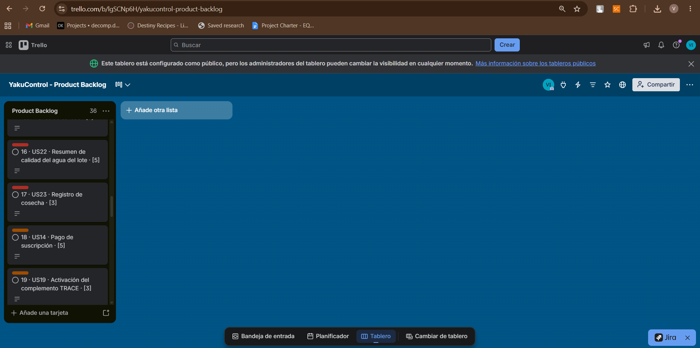

*Tablero de Trello con las 36 tarjetas en el mismo orden y con los mismos puntos de la tabla anterior.*

# Capítulo IV: Strategic-Level Software Design
## 4.1. Strategic-Level Attribute-Driven Design
### 4.1.1. Design Purpose


El presente diseño arquitectónico corresponde a **YakuControl + YakuTrace**, producto de la startup **Verifish**. Es un sistema *greenfield* en su capa de trazabilidad y evolutivo en su capa de monitoreo, cuyo propósito es definir la arquitectura que soportará el MVP descrito en el Product Backlog: la ingesta y validación de telemetría IoT (pH, temperatura y turbidez), la emisión de alertas críticas y el control remoto de actuadores, la gestión de la suscripción SaaS y, como novedad de este ciclo, la **emisión de certificados de trazabilidad verificables mediante blockchain**.

El diseño responde a las necesidades de los tres segmentos objetivo: el **piscicultor**, que necesita reaccionar a tiempo y sin depender de rondas físicas; el **administrador**, que necesita visibilidad, control y evidencia para respaldar sus lotes; y el **comprador de supermercado**, que necesita verificar rápidamente el origen y las condiciones registradas de un lote. Para ello se aplica **Attribute-Driven Design (ADD)** con enfoque *domain-driven*, de modo que las decisiones estructurales respondan a los atributos de calidad críticos del negocio:

- **Disponibilidad y resiliencia operativa:** la pérdida de conectividad en zonas rurales no debe impedir la reacción local ante una anomalía ni la emisión de certificados.
- **Rendimiento en tiempo real:** el tiempo entre una lectura fuera de rango y la alerta determina la mortalidad evitada; la verificación de un QR debe ser inmediata.
- **Integridad y auditabilidad:** un certificado emitido no debe poder alterarse sin que se detecte.
- **Seguridad:** plataforma multi-tenant con roles y pagos recurrentes.
- **Escalabilidad y modificabilidad:** crecimiento de granjas y posibilidad de cambiar proveedores (pasarela de pagos, red blockchain) sin afectar el dominio.

El alcance abarca el hardware Edge, un **backend en monolito modular** organizado en seis Bounded Contexts, las aplicaciones cliente (Web en Angular, móvil en Flutter y Landing Page), un smart contract de registro de huellas y las integraciones con Stripe, Firebase Cloud Messaging, correo, servicios meteorológicos y un proveedor RPC de blockchain. Esta es la base sobre la que se sustentan el diseño táctico y los sprints de implementación.

### 4.1.2. Attribute-Driven Design Inputs
#### 4.1.2.1. Primary Functionality (Primary User Stories)
Del Product Backlog (sección 3.4) se seleccionaron como **funcionalidad primaria** las historias con mayor impacto sobre la arquitectura: aquellas que ejercitan el flujo central de valor (ingesta de telemetría, alertas, control de actuadores), el modelo de negocio (pago y complemento TRACE) y la trazabilidad (emisión de certificados, anclaje, verificación pública y cierre de resúmenes). En conjunto involucran a los seis Bounded Contexts. Por brevedad se muestra el escenario principal de cada historia; el detalle completo está en la sección 3.2.

| Epic / User Story ID | Título | Descripción | Criterios de Aceptación | Relacionado con (Epic ID) |
| :--- | :--- | :--- | :--- | :--- |
| **TS01** | API de ingesta de telemetría | Como developer, deseo un endpoint que reciba las lecturas del Edge para persistir la telemetría. | **Escenario 1: Recepción correcta**<br>**Given** un JSON válido y firmado<br>**When** el Edge envía una lectura<br>**Then** la API responde 201 y persiste la lectura | EP04 |
| **TS04** | Firma de lecturas del Edge | Como developer, deseo que cada lectura enviada por el Edge esté firmada con la clave de la granja para evitar lecturas falsificadas. | **Escenario 1: Firma válida**<br>**Given** una lectura firmada con la clave vigente de la granja<br>**When** llega a la API<br>**Then** la API la acepta | EP04 |
| **US07** | Alertas de calidad del agua | Como piscicultor, deseo recibir una alerta cuando el agua está fuera de rango para actuar rápidamente. | **Escenario 1: Alerta crítica**<br>**Given** una lectura fuera del rango óptimo es confirmada como anomalía<br>**When** el sistema la detecta<br>**Then** notifica al piscicultor asignado y al administrador en menos de 10 segundos | EP02 |
| **TS03** | Envío de alertas por push | Como developer, deseo que las anomalías confirmadas disparen notificaciones push para alertar al usuario. | **Escenario 1: Envío inmediato**<br>**Given** una anomalía confirmada<br>**When** el sistema la procesa<br>**Then** envía la notificación al servicio de mensajería push | EP04 |
| **US08** | Control de aireación | Como piscicultor, deseo activar el aireador de un estanque de forma remota para oxigenar el agua. | **Escenario 1: Activación exitosa**<br>**Given** el aireador está apagado y conectado<br>**When** el piscicultor solicita activarlo<br>**Then** el sistema envía la orden y confirma el estado del equipo | EP02 |
| **US13** | Configuración de umbrales | Como administrador, deseo definir los límites de alerta de un estanque para personalizar el control. | **Escenario 1: Actualización de límites**<br>**Given** el administrador ingresó límites válidos<br>**When** los guarda<br>**Then** el sistema los aplica a las evaluaciones posteriores | EP03 |
| **US14** | Pago de suscripción | Como administrador, deseo pagar mi suscripción para mantener el servicio activo. | **Escenario 1: Pago exitoso**<br>**Given** el administrador seleccionó un plan<br>**When** la pasarela confirma el pago<br>**Then** el sistema activa la suscripción | EP03 |
| **US19** | Activación del complemento TRACE | Como administrador, deseo activar el complemento TRACE para emitir certificados de trazabilidad de mis lotes. | **Escenario 1: Activación**<br>**Given** la suscripción de la granja está activa<br>**When** el administrador contrata el complemento<br>**Then** el sistema habilita la emisión de certificados para la granja | EP03 |
| **US24** | Emisión de certificado con QR | Como administrador, deseo emitir un certificado de trazabilidad con código QR para un lote cosechado para respaldarlo ante mis compradores. | **Escenario 1: Certificado emitido**<br>**Given** el lote está cosechado, la granja tiene TRACE activo y la cobertura de datos es suficiente<br>**When** el administrador solicita el certificado<br>**Then** el sistema lo emite, genera su código QR y registra su huella digital en la blockchain | EP05 |
| **TS05** | Anclaje de hash en el smart contract | Como developer, deseo registrar en el smart contract la huella digital de un hito o certificado para hacerlo verificable. | **Escenario 1: Anclaje correcto**<br>**Given** una huella calculada y la red disponible<br>**When** el sistema la ancla<br>**Then** el contrato la registra y el sistema guarda el hash de transacción y el bloque | EP04 |
| **TS07** | Cola de anclajes con reintentos | Como developer, deseo una cola de anclajes pendientes con reintentos para que la caída de la red blockchain no bloquee la emisión de certificados. | **Escenario 1: Red no disponible**<br>**Given** un anclaje pendiente y la red no disponible<br>**When** el sistema reintenta<br>**Then** conserva el anclaje pendiente e incrementa su contador de intentos | EP04 |
| **US26** | Verificación de un lote por QR | Como comprador de supermercado, deseo verificar un lote escaneando su código QR para confirmar su origen y las condiciones registradas. | **Escenario 1: Certificado válido**<br>**Given** el código corresponde a un certificado emitido<br>**When** el comprador lo verifica<br>**Then** el sistema presenta el historial del lote, el resumen de calidad y el resultado de la verificación | EP05 |
| **TS06** | API pública de verificación | Como developer, deseo un endpoint público de verificación por código para que el QR funcione sin autenticación. | **Escenario 1: Código válido**<br>**Given** un código de certificado existente<br>**When** se consulta el endpoint<br>**Then** la API responde 200 con el resultado y el resumen, sin identificadores internos | EP04 |
| **TS08** | Cierre de resúmenes de calidad | Como developer, deseo un proceso programado que cierre y agregue los resúmenes de calidad para contar con datos inmutables por periodo. | **Escenario 1: Cierre de periodo**<br>**Given** un periodo vencido con lecturas<br>**When** se ejecuta el proceso de cierre<br>**Then** el sistema genera un resumen cerrado y publica el evento correspondiente | EP04 |

#### 4.1.2.2. Quality Attribute Scenarios


Se formalizó la primera versión de los escenarios de atributos de calidad con mayor impacto en la arquitectura: disponibilidad en el borde, rendimiento de alertas, seguridad multi-tenant y, con YakuTrace, integridad de certificados, rendimiento de la verificación, disponibilidad del anclaje y modificabilidad del ledger, además de escalabilidad y usabilidad.

| Atributo | Fuente | Estímulo | Artefacto | Entorno | Respuesta | Medida |
| :--- | :--- | :--- | :--- | :--- | :--- | :--- |
| **QA-01 · Disponibilidad** | Proveedor de internet de la zona rural | Se pierde la conexión entre el Edge/dispositivo y el backend | Dispositivo IoT y Edge API | Operación normal con conectividad intermitente | El dispositivo evalúa localmente los umbrales críticos y activa los actuadores de soporte vital; conserva las lecturas y las sincroniza al recuperar la conexión | 100% de las lecturas críticas accionadas localmente; resincronización en menos de 30 s sin pérdida de datos |
| **QA-02 · Rendimiento (alerta)** | Sensor instalado en el estanque | Se recibe una lectura fuera del rango óptimo | Módulos Telemetry y Notification (eventos de dominio en proceso) | Operación normal con carga habitual | Telemetry valida la anomalía y publica el evento; Notification lo consume y envía la alerta push al piscicultor y al administrador | Alerta entregada en menos de 10 s en el 95% de los casos |
| **QA-03 · Integridad** | Persona con acceso a los datos o error operativo | Se modifica el contenido almacenado de un certificado emitido | Certificado, huella registrada y servicio de verificación | Operación normal | La verificación detecta que la huella no coincide y presenta el certificado como no válido | 100% de las alteraciones detectadas en la verificación |
| **QA-04 · Seguridad** | Usuario autenticado de una granja o agente malicioso | Intenta acceder a datos o endpoints de otra granja, o enviar lecturas falsas | Módulo IAM, filtro JWT y endpoint de ingesta | Operación normal expuesta a internet | El sistema rechaza la petición, no revela información de la granja objetivo y registra el intento | 100% de los accesos cruzados bloqueados; registro del intento en menos de 1 s |
| **QA-05 · Disponibilidad (anclaje)** | Proveedor de red blockchain/RPC | La red no está disponible al emitir un certificado | Cola de anclajes (outbox) y adaptador de ledger | Operación normal con red caída temporalmente | El sistema emite el certificado en estado pendiente, conserva el anclaje en la cola y lo reintenta | 0 certificados perdidos; anclaje confirmado en menos de 10 min tras restablecerse la red |
| **QA-06 · Rendimiento (verificación)** | Comprador de supermercado | Escanea el código QR de un lote | Página pública y API de verificación (Traceability) | Operación normal con red móvil | El sistema recalcula la huella del contenido, la compara con la registrada en blockchain y muestra el resultado | Resultado visible en menos de 3 s en el 95% de las verificaciones |
| **QA-07 · Modificabilidad** | Equipo de desarrollo | Se requiere cambiar la red blockchain o el proveedor RPC | Adaptador de ledger (LedgerPort) | Mantenimiento | Se reemplaza o reconfigura solo el adaptador sin modificar el dominio | Cambio completado en no más de 1 día-persona y sin cambios en el Domain Layer |
| **QA-08 · Escalabilidad** | Expansión comercial | Se incrementa de 10 a 200 piscigranjas activas | Backend (monolito modular) y base de datos | Crecimiento progresivo en 6 meses | Se despliegan réplicas del backend sin estado de sesión (JWT) detrás de un balanceador, se aprovecha la serie temporal para la telemetría y los procesos programados toman un bloqueo en la base de datos para que solo una réplica ejecute cada trabajo | Degradación del tiempo de respuesta de la API menor al 5% al pasar de 10 a 200 granjas, sin trabajos duplicados (cierres, anclajes o envíos) |
| **QA-09 · Usabilidad** | Piscicultor con bajo nivel de digitalización | Necesita activar un aireador tras recibir una alerta | Aplicación móvil | Condiciones de campo bajo presión de tiempo | El usuario ejecuta la acción desde la propia alerta con un control directo | Acción completada en máximo 2 toques; 90% de los usuarios de prueba la ejecutan sin capacitación |

#### 4.1.2.3. Constraints


Las restricciones son condiciones no negociables impuestas por el negocio, el curso o el contexto técnico. Se expresan como Technical Stories para que cada una tenga un criterio de aceptación comprobable. Incluyen el tamaño del equipo (5 integrantes), la tecnología de la Web App (Angular) y las restricciones propias de Web3, internacionalización y servicios de terceros.

| Technical Story ID | Título | Descripción | Criterios de Aceptación | Relacionado con (Epic ID) |
| :--- | :--- | :--- | :--- | :--- |
| **TC01** | Bajo costo de infraestructura | Como equipo, debemos usar servicios cloud accesibles y de bajo costo porque Verifish es una startup en etapa temprana (proyecto académico). | **Escenario 1**<br>**Given** la solución se despliega<br>**When** se evalúan los servicios utilizados<br>**Then** se priorizan planes gratuitos o de bajo costo y no se requieren licencias de alto costo | EP04 |
| **TC02** | Equipo reducido y monolito modular | Como equipo de 5 integrantes, debemos limitar la complejidad operativa, por lo que el backend es un monolito modular organizado por Bounded Contexts. | **Escenario 1**<br>**Given** se define la arquitectura del backend<br>**When** se organiza el código<br>**Then** existe una única unidad desplegable con un módulo por Bounded Context | EP04 |
| **TC03** | Conectividad rural intermitente | Como equipo, debemos asumir conectividad intermitente o inexistente, por lo que la lógica de soporte vital se ejecuta localmente en el borde. | **Escenario 1**<br>**Given** se pierde la conexión con la nube<br>**When** el dispositivo detecta una condición crítica<br>**Then** activa localmente los actuadores sin depender del backend | EP02 |
| **TC04** | Hardware de bajo costo | Como equipo, debemos operar con un microcontrolador Arduino UNO y sensores sumergibles de bajo costo (aprox. S/ 250–280). | **Escenario 1**<br>**Given** se diseña el firmware<br>**When** se asignan responsabilidades entre dispositivo y Edge API<br>**Then** las tareas intensivas se ejecutan en el Edge API y no en el microcontrolador | EP04 |
| **TC05** | Web en Angular y móvil en Flutter | Como equipo, debemos desarrollar la Web App con Angular (Angular Material o PrimeNG) siguiendo Material Design, y la app móvil con Flutter. | **Escenario 1**<br>**Given** se construyen las aplicaciones cliente<br>**When** se revisa la tecnología empleada<br>**Then** la Web App usa Angular y la aplicación móvil usa Flutter | EP02, EP03 |
| **TC06** | Pagos mediante pasarela certificada | Como equipo, debemos delegar el procesamiento de pagos a Stripe sin gestionar datos de tarjetas. | **Escenario 1**<br>**Given** un administrador paga su suscripción<br>**When** se procesa el cobro<br>**Then** el cobro lo realiza la pasarela externa y el sistema no almacena datos de tarjeta | EP03 |
| **TC07** | Calendario académico | Como equipo, debemos trabajar con sprints y fechas de entrega fijas del curso. | **Escenario 1**<br>**Given** se planifica un sprint<br>**When** se estima el alcance<br>**Then** los story points comprometidos no superan la velocidad del equipo y todas las historias comprometidas pueden completarse antes de la fecha de entrega | EP04 |
| **TC08** | Blockchain en red EVM de pruebas con solo hashes | Como equipo, debemos usar blockchain mediante un smart contract en una red EVM de pruebas y registrar únicamente huellas digitales (hashes), nunca datos comerciales. | **Escenario 1**<br>**Given** se ancla un certificado<br>**When** se escribe en la red<br>**Then** solo se registra el hash y el identificador del lote y la red es configurable | EP05 |
| **TC09** | Backend RESTful con Spring Boot y OpenAPI | Como equipo, debemos construir el backend con Spring Boot bajo estilo RESTful y documentarlo con OpenAPI. | **Escenario 1**<br>**Given** se despliega el backend<br>**When** un developer consulta la documentación<br>**Then** se listan los endpoints con sus parámetros y respuestas | EP04 |
| **TC10** | Internacionalización y accesibilidad | Como equipo, debemos soportar internacionalización (en_US y es_419) y accesibilidad (atributos ARIA) en la Landing Page y las Web Apps; el idioma base de la interfaz es el español. | **Escenario 1**<br>**Given** un usuario cambia el idioma<br>**When** se muestra la interfaz<br>**Then** los textos aparecen en el idioma seleccionado y los elementos tienen atributos de accesibilidad | EP01, EP03 |
| **TC11** | Servicios de terceros | Como equipo, debemos integrar servicios externos: Stripe (pagos), Firebase Cloud Messaging (push), servicio de correo y proveedor RPC de blockchain. | **Escenario 1**<br>**Given** se accede a un servicio externo<br>**When** se invoca su API<br>**Then** el acceso se realiza mediante un puerto y un adaptador sin acoplar el dominio | EP04 |
| **TC12** | Landing Page en HTML5, CSS3 y JavaScript | Como equipo, debemos desarrollar la Landing Page con HTML5, CSS3 y JavaScript, con consistencia visual con las aplicaciones. | **Escenario 1**<br>**Given** un visitante usa un llamado a la acción<br>**When** se redirige<br>**Then** llega a la vista correspondiente de la Web App o al sitio de descarga de la app | EP01 |

### 4.1.3. Architectural Drivers Backlog


El Architectural Drivers Backlog consolida los Functional Drivers (sección 4.1.2.1), los Quality Attribute Drivers (4.1.2.2) y todos los Constraints (4.1.2.3). Resultó de un Quality Attribute Workshop en el que el equipo presentó los objetivos de negocio, propuso y consolidó escenarios y los priorizó por **importancia para los stakeholders** y por **impacto en la complejidad técnica de la arquitectura**. Los drivers de importancia alta e impacto alto se ubican primero y concentran las decisiones de la primera iteración.

| Driver ID | Título de Driver | Descripción | Importancia para Stakeholders (High, Medium, Low) | Impacto en Architecture Technical Complexity (High, Medium, Low) |
| :--- | :--- | :--- | :--- | :--- |
| **FD-01** | Flujo telemetría → alerta | Ingesta de lecturas (TS01, TS04), detección de anomalías y alertas push (US07, TS03). | High | High |
| **QA-01** | Disponibilidad en el borde | Operación autónoma del dispositivo y el Edge ante pérdida de conectividad. | High | High |
| **QA-02** | Rendimiento de alertas | Latencia menor a 10 s entre la anomalía y la alerta. | High | High |
| **QA-03** | Integridad de certificados | Detección del 100% de las alteraciones de un certificado emitido. | High | High |
| **QA-04** | Seguridad multi-tenant | Aislamiento de datos entre granjas y autenticación del Edge. | High | High |
| **FD-02** | Emisión de certificado y anclaje | Emitir certificado con QR y anclar su huella (US24, TS05, TS07, TS08). | High | High |
| **TC02** | Monolito modular | Equipo reducido: un único despliegue con módulos por Bounded Context. | High | High |
| **TC03** | Conectividad rural intermitente | Necesidad de Edge Computing. | High | High |
| **TC08** | Blockchain en red EVM de pruebas | Solo hashes on-chain; red configurable. | High | High |
| **FD-03** | Verificación pública por QR | Verificar un lote sin cuenta (US26, US27, TS06). | High | Medium |
| **QA-05** | Disponibilidad del anclaje | La caída de la red blockchain no bloquea la emisión. | High | Medium |
| **QA-06** | Rendimiento de verificación | Resultado de verificación en menos de 3 s. | High | Medium |
| **QA-07** | Modificabilidad del ledger y proveedores | Cambiar red blockchain o pasarela sin tocar el dominio. | Medium | Medium |
| **QA-08** | Escalabilidad | De 10 a 200 granjas con degradación menor al 5%. | Medium | Medium |
| **TC05** | Angular y Flutter | Tecnologías de cliente definidas por el curso y el equipo. | Medium | Medium |
| **TC04** | Hardware de bajo costo | Capacidad limitada del Arduino UNO. | Medium | Medium |
| **FD-04** | Pago y complemento TRACE | US14 y US19 con Stripe. | High | Low |
| **TC06** | Pagos con Stripe | Sin manejo de datos de tarjeta. | Medium | Low |
| **QA-09** | Usabilidad en campo | Acciones críticas en 2 toques. | Medium | Low |
| **TC09 / TC10 / TC11 / TC12** | Estándares del curso | OpenAPI, i18n/a11y, servicios de terceros y Landing en HTML5/CSS3/JS. | Medium | Low |
| **TC01 / TC07** | Costo y calendario | Bajo costo de infraestructura y fechas de entrega fijas. | Medium | Low |

### 4.1.4. Architectural Design Decisions


Las decisiones se tomaron siguiendo los *stages* del **Quality Attribute Workshop**: (1) presentación del QAW y de los objetivos de negocio; (2) presentación del plan arquitectónico; (3) lluvia de ideas de escenarios; (4) consolidación; (5) priorización y (6) refinamiento de los escenarios. El diseño se realizó en tres iteraciones:

- **Iteración 1 — Estructura general:** drivers TC02, QA-08, FD-01, QA-02 y TC03. Se evaluó el estilo arquitectónico y la comunicación entre contextos y se decidió un monolito modular con eventos en proceso y Edge Computing (AD-01 a AD-04).
- **Iteración 2 — Trazabilidad con blockchain:** drivers QA-03, QA-05, QA-06, TC08 y FD-02/FD-03. Se evaluó dónde guardar la evidencia, cómo acceder al ledger y cómo verificar, y se decidió anclar solo hashes con puerto/adaptador y Outbox (AD-08 a AD-11).
- **Iteración 3 — Seguridad, integraciones y despliegue:** drivers QA-04, QA-07, TC05, TC06 y QA-08. Se decidió la firma de lecturas, los adaptadores de terceros, las tecnologías de cliente y el despliegue (AD-05 a AD-07, AD-12 a AD-14).

La **Candidate Pattern Evaluation Matrix** resume los patrones candidatos evaluados por driver (máximo tres) con sus ventajas y desventajas. Las referencias de patrones y tácticas provienen del trabajo previo del equipo (Facade, Observer, Repository, Factory, API Gateway; tácticas de disponibilidad, rendimiento y modificabilidad) y de la guía de trazabilidad de la industria del pescado, que define eventos críticos y datos clave como base de los hitos (Global Dialogue on Seafood Traceability, s. f.).

**Candidate Pattern Evaluation Matrix**

| Driver ID | Título de Driver | Pattern 1 | | Pattern 2 | | Pattern 3 | |
| :--- | :--- | :--- | :--- | :--- | :--- | :--- | :--- |
| | | **Pro** | **Con** | **Pro** | **Con** | **Pro** | **Con** |
| **TC02 / QA-08** | Estilo arquitectónico del backend | **Microservicios**<br>Escalado y despliegue independientes por contexto. | Alta complejidad operativa (red, observabilidad, despliegues) para 5 estudiantes. | **Monolito modular**<br>Un solo despliegue, bajo costo y límites claros por Bounded Context; evolucionable a servicios. | Requiere disciplina para no violar los límites entre módulos. | **Monolito en capas**<br>Muy simple de iniciar. | Pierde la separación por dominio; mayor acoplamiento. |
| **QA-03 / TC08** | Dónde guardar la evidencia | **Datos completos on-chain**<br>Evidencia totalmente pública. | Costo por byte, exposición de datos comerciales y rigidez ante errores. | **Hash on-chain + datos off-chain**<br>Costo mínimo, privacidad y verificación recalculando la huella. | Requiere custodiar bien los datos off-chain y serializar de forma canónica. | **Red permisionada (p. ej. Hyperledger Fabric)**<br>Gobernanza y privacidad entre participantes. | Montaje y operación muy complejos para el alcance del curso. |
| **QA-05 / QA-07** | Acceso al ledger | **Llamada síncrona directa desde el dominio**<br>Implementación simple. | Acopla el dominio a la red; la caída de la red bloquea la emisión. | **Puerto/Adaptador + Outbox con reintentos**<br>Aísla la red; la emisión no depende de su disponibilidad; red configurable. | Agrega una cola y un worker. | **Servicio oráculo externo**<br>Desacopla del backend. | Introduce otro componente y un nuevo punto de falla. |
| **FD-01 / QA-02** | Comunicación entre contextos | **Bus de mensajería (Kafka)**<br>Desacople fuerte y escalado independiente. | Sobredimensionado para un monolito; costo y complejidad operativa. | **Eventos de dominio en proceso**<br>Baja latencia, sin infraestructura adicional, mantiene el desacople lógico. | Si se separa un servicio habrá que externalizar los eventos. | **Solo MQTT**<br>Ya existe entre dispositivo y Edge. | No cubre la comunicación entre módulos del backend. |
| **QA-06 / QA-03** | Verificación pública del certificado | **El servidor recalcula y compara**<br>El comprador no necesita billetera ni conocimientos técnicos; resultado inmediato. | Exige confiar en el servidor para el cálculo (mitigado con el enlace a la prueba on-chain). | **Verificación en el navegador (dApp)**<br>No requiere confiar en el servidor. | Más complejo para un comprador no técnico; depende de librerías web3 en el cliente. | **Ambas**<br>Máxima confianza. | Mayor esfuerzo; se deja como evolución. |

**Decisiones de diseño resultantes**

| ID Decisión | Driver(s) asociado(s) | Decisión | Justificación |
| :--- | :--- | :--- | :--- |
| **AD-01** | QA-01, TC03 | Edge Computing: el dispositivo y el Edge evalúan los umbrales críticos y activan los actuadores sin depender del backend. | La conectividad rural es intermitente y la reacción ante una anomalía no puede esperar. |
| **AD-02** | TC02, QA-08 | Monolito Modular con seis Bounded Contexts (IAM, Equipment, Telemetry, Notification, Payment y Traceability). | Un equipo de 5 estudiantes no puede sostener la complejidad operativa de microservicios; los límites se preservan por módulos. |
| **AD-03** | QA-02, FD-01 | Comunicación entre contextos mediante eventos de dominio en proceso (Spring Events). | Minimiza la latencia y evita que una falla del canal de notificación bloquee la ingesta, sin infraestructura adicional. |
| **AD-04** | QA-04 | IAM como Open Host Service que emite JWT con el identificador de la granja; el resto de contextos lo consume mediante Anti-Corruption Layers. | Aislamiento multi-tenant centralizado y consistente. |
| **AD-05** | QA-07 | Arquitectura hexagonal (puertos y adaptadores) en cada contexto para Stripe, Firebase, correo, Edge y blockchain. | Permite reemplazar un proveedor modificando solo su adaptador. |
| **AD-06** | QA-08, TC01 | Despliegue: backend y base de datos en Microsoft Azure, frontends en hosting estático y Edge API en un PaaS; base PostgreSQL con la extensión TimescaleDB para la telemetría. | Bajo costo y escalado de réplicas del backend. La extensión disponible en Azure Database for PostgreSQL es la edición Apache 2 (hypertables y `time_bucket`, sin compresión nativa ni *continuous aggregates*), suficiente porque los resúmenes se cierran con un proceso programado (TS08) (Timescale, s. f.). |
| **AD-07** | FD-04, TC06 | Delegar los pagos a Stripe mediante un adaptador y webhooks validados criptográficamente. | Evita manejar datos de tarjeta y traslada la resiliencia de cobro a un proveedor especializado. |
| **AD-08** | QA-03, TC08 | Registrar en blockchain solo hashes (SHA-256 del contenido canónico) y mantener los datos completos en PostgreSQL. | Costo mínimo, privacidad comercial y verificación mediante recálculo del hash (ver matriz). |
| **AD-09** | TC08, QA-07 | Smart contract mínimo (registrar y consultar huellas por lote) en una red EVM de pruebas configurable; solo la cuenta del backend puede escribir. | Alcance alcanzable en el curso; la red puede cambiarse por configuración (el estado de las testnets cambia en el tiempo; Beiko, 2025). |
| **AD-10** | QA-05 | Patrón Outbox con worker de reintentos para el anclaje; el worker reclama las filas pendientes con `FOR UPDATE SKIP LOCKED`. | La emisión de certificados no depende de la disponibilidad de la red blockchain y varias réplicas no procesan el mismo anclaje. |
| **AD-11** | QA-06, FD-03 | Verificación pública en el servidor: recalcula el hash, consulta el contrato y muestra el resultado con enlace a la prueba on-chain. | El comprador no necesita billetera ni cuenta. |
| **AD-12** | QA-04 | Firma de cada lectura del Edge con la Farm Key (HMAC) y verificación en el backend. | Mitiga la falsificación de datos de entrada (el problema del "garbage in, garbage out" que blockchain no resuelve; Powell et al., 2021). |
| **AD-13** | TC05 | Web App en Angular (Angular Material/PrimeNG) y app móvil en Flutter. | Cumple las tecnologías exigidas por el curso para web y permite una app móvil multiplataforma. |
| **AD-14** | QA-08, QA-05 | Procesos programados con exclusión mutua: los trabajos periódicos (`QualitySummaryScheduler`, `AnchorOutboxWorker` y `NotificationDeliveryRetryJob`) toman un bloqueo en PostgreSQL (ShedLock o `SKIP LOCKED`) antes de ejecutarse y son idempotentes. | Al escalar a varias réplicas del monolito, evita cierres de resumen, anclajes o envíos duplicados. |

Estas decisiones constituyen la base estructural para refinar los escenarios de calidad (sección 4.1.5) y para el modelado estratégico de Domain-Driven Design (sección 4.2).

### 4.1.5. Quality Attribute Scenario Refinements


Se refinaron los seis escenarios de mayor prioridad al finalizar el Quality Attribute Workshop. Las decisiones principales que resultaron fueron: ejecutar la lógica crítica en el borde (Edge Computing), comunicar los contextos mediante eventos en proceso, anclar solo huellas en blockchain con una cola de reintentos y verificar en el servidor con enlace a la prueba on-chain. Cada escenario se presenta en orden de prioridad.

| **Scenario Refinement for Scenario 1** | | |
| :--- | :--- | :--- |
| **Scenario(s):** | Pérdida de conectividad entre la granja y la nube | |
| **Business Goals:** | G2: reducir la mortalidad masiva en al menos 15% | |
| **Relevant Quality Attributes:** | Availability (QA-01) | |
| **Scenario Components** | **Stimulus:** | Se pierde la conexión con el backend |
| | **Stimulus Source:** | Proveedor de internet de la zona rural |
| | **Environment:** | Operación normal con conectividad intermitente |
| | **Artifact (if Known):** | Dispositivo IoT y Edge API |
| | **Response:** | Evalúa umbrales y activa actuadores localmente; conserva lecturas y las sincroniza después |
| | **Response Measure:** | 100% de lecturas críticas accionadas localmente; resincronización en menos de 30 s sin pérdida |
| **Questions:** | ¿Cuánto tiempo de lecturas puede almacenar el dispositivo? | |
| **Issues:** | Capacidad de memoria del Arduino UNO; el Edge API debe actuar como búfer. | |

| **Scenario Refinement for Scenario 2** | | |
| :--- | :--- | :--- |
| **Scenario(s):** | Alerta ante lectura fuera de rango | |
| **Business Goals:** | G2: reducir en al menos 15% la mortalidad masiva (los piscicultores deben responder a las alertas en menos de 10 minutos) | |
| **Relevant Quality Attributes:** | Performance (QA-02) | |
| **Scenario Components** | **Stimulus:** | Se recibe una lectura fuera del rango óptimo |
| | **Stimulus Source:** | Sensor IoT |
| | **Environment:** | Operación normal con carga habitual |
| | **Artifact (if Known):** | Módulos Telemetry → Notification |
| | **Response:** | Telemetry valida y publica el evento; Notification envía push a piscicultor y administrador |
| | **Response Measure:** | Alerta entregada en menos de 10 s en el 95% de los casos |
| **Questions:** | ¿Cómo se evita la repetición de alertas por la misma condición? | |
| **Issues:** | Dependencia del servicio de push de terceros; se cubre con reintentos. | |

| **Scenario Refinement for Scenario 3** | | |
| :--- | :--- | :--- |
| **Scenario(s):** | Alteración de un certificado emitido | |
| **Business Goals:** | G3 y G5: certificados verificables y confianza del comprador | |
| **Relevant Quality Attributes:** | Integrity (QA-03), Security | |
| **Scenario Components** | **Stimulus:** | Se modifica el contenido almacenado de un certificado |
| | **Stimulus Source:** | Persona con acceso a los datos o error operativo |
| | **Environment:** | Operación normal |
| | **Artifact (if Known):** | Certificado, huella en blockchain y servicio de verificación |
| | **Response:** | La verificación recalcula la huella, detecta la diferencia y presenta el certificado como no válido |
| | **Response Measure:** | 100% de las alteraciones detectadas |
| **Questions:** | ¿Cómo garantizar que la serialización sea idéntica en cada cálculo? | |
| **Issues:** | Se requiere un serializador canónico y pruebas de regresión del hash. | |

| **Scenario Refinement for Scenario 4** | | |
| :--- | :--- | :--- |
| **Scenario(s):** | Anclaje con la red blockchain caída | |
| **Business Goals:** | G3: emitir certificados para el 100% de los lotes piloto | |
| **Relevant Quality Attributes:** | Availability (QA-05), Modifiability (QA-07) | |
| **Scenario Components** | **Stimulus:** | La red no está disponible al emitir un certificado |
| | **Stimulus Source:** | Proveedor RPC/red blockchain |
| | **Environment:** | Operación normal con red caída temporalmente |
| | **Artifact (if Known):** | Cola de anclajes (outbox) y adaptador de ledger |
| | **Response:** | El certificado se emite como pendiente; el worker reintenta y confirma al restablecerse la red |
| | **Response Measure:** | 0 certificados perdidos; confirmación en menos de 10 min tras restablecerse |
| **Questions:** | ¿Qué verá el comprador mientras el anclaje esté pendiente? | |
| **Issues:** | El estado de las testnets cambia: la red debe ser configurable y debe existir un nodo local de respaldo. | |

| **Scenario Refinement for Scenario 5** | | |
| :--- | :--- | :--- |
| **Scenario(s):** | Acceso entre granjas | |
| **Business Goals:** | G1: conectar 50 estanques con monitoreo activo (requiere aislar los datos de cada granja para que los clientes confíen en la plataforma) | |
| **Relevant Quality Attributes:** | Security (QA-04) | |
| **Scenario Components** | **Stimulus:** | Un usuario intenta acceder a datos de otra granja |
| | **Stimulus Source:** | Usuario autenticado de una granja |
| | **Environment:** | Operación normal de la plataforma multi-tenant |
| | **Artifact (if Known):** | Filtro JWT e IAM |
| | **Response:** | Rechaza la petición sin revelar información y registra el intento |
| | **Response Measure:** | 100% de accesos cruzados bloqueados; registro en menos de 1 s |
| **Questions:** | ¿Cómo se rotan las claves de las granjas? | |
| **Issues:** | La Farm Key debe almacenarse solo como hash y rotarse periódicamente. | |

| **Scenario Refinement for Scenario 6** | | |
| :--- | :--- | :--- |
| **Scenario(s):** | Verificación por QR | |
| **Business Goals:** | G5: verificación en menos de 1 minuto | |
| **Relevant Quality Attributes:** | Performance (QA-06), Usability | |
| **Scenario Components** | **Stimulus:** | El comprador escanea el código QR |
| | **Stimulus Source:** | Comprador de supermercado |
| | **Environment:** | Red móvil, operación normal |
| | **Artifact (if Known):** | Página pública y API de verificación |
| | **Response:** | Recalcula la huella, la compara con la registrada y presenta el resultado y el resumen |
| | **Response Measure:** | Resultado visible en menos de 3 s en el 95% de los casos |
| **Questions:** | ¿Se limita la cantidad de consultas por cliente? | |
| **Issues:** | La lectura del contrato depende del proveedor RPC; se puede cachear el resultado confirmado. | |

## 4.2. Strategic-Level Domain-Driven Design
### 4.2.1. EventStorming


En esta sección se detalla la aplicación del EventStorming como herramienta estratégica del Domain-Driven Design (DDD). El objetivo es mapear los eventos de dominio que articulan el ecosistema de **YakuControl**, permitiendo identificar los límites de los futuros Bounded Contexts y las interacciones clave entre los actores. Este enfoque garantiza que la arquitectura de software esté alineada con las reglas de negocio de la acuicultura inteligente y sea capaz de escalar de forma modular.

---

##### Step 1: Domain Events
El proceso inicia con la identificación de los **Domain Events** (post-its naranjas), representados en tiempo pasado. En esta etapa, se vuelcan de manera libre todos los sucesos relevantes en el ecosistema de Verifish, desde la captura de una métrica de PH hasta la confirmación de una suscripción, permitiendo visualizar la magnitud del sistema sin restricciones jerárquicas.

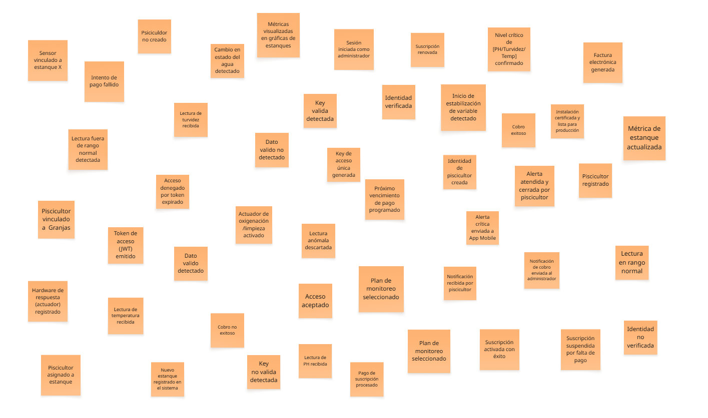

##### Step 2: Timelining
Una vez identificados los eventos, se organizan en una **línea de tiempo lógica** de izquierda a derecha. Esto permite detectar inconsistencias, eventos duplicados o vacíos en el proceso de negocio, asegurando que el flujo desde que un sensor detecta un cambio hasta que el piscicultor es notificado sea coherente y fluido.

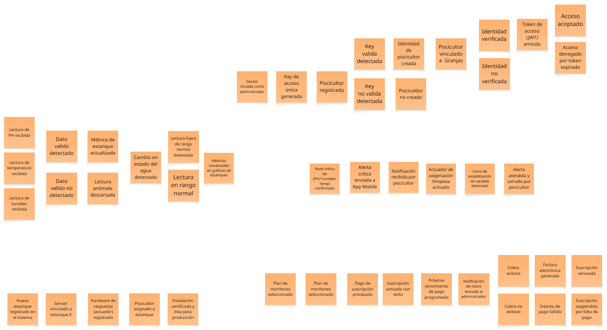

##### Step 3: Pivotal Events & Bounded Contexts Discovery
Se identifican los **Pivotal Events**, sucesos clave que marcan un cambio de fase o responsabilidad (como la emisión de un Token o la generación de una Alerta). Estos puntos de inflexión facilitan la definición de las fronteras de los **Bounded Contexts**, separando responsabilidades como Seguridad (IAM), Monitoreo (Telemetría) y Negocio (Pagos).

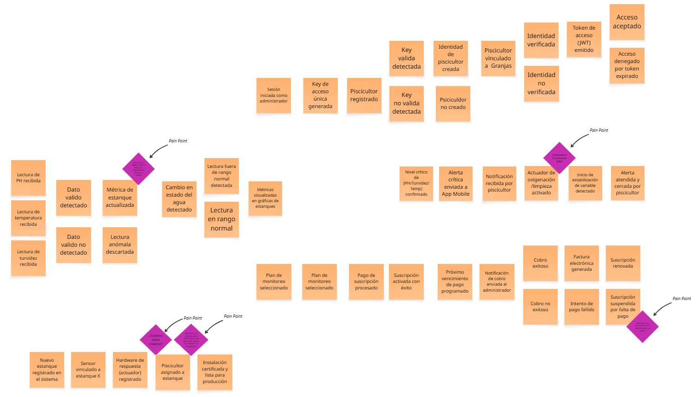

##### Step 4: Commands and Actors
A cada evento se le asocia un **Command** (post-it azul), que representa la intención o acción que lo dispara, y un **Actor** (post-it amarillo pequeño), que identifica quién tiene la responsabilidad de ejecutarlo. En YakuControl, esto clarifica qué acciones realiza el Administrador en la Web frente a las del Piscicultor en la App Mobile.

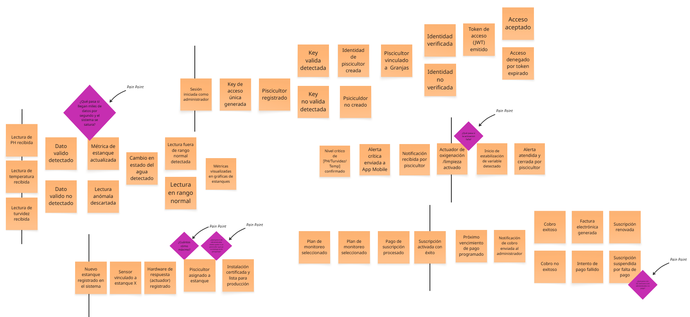

##### Step 5: External Systems
Se integran los **External Systems** (post-its rosas) con los que interactúa la plataforma. Aquí se mapean las dependencias con servicios fuera del control directo de la aplicación, como Pasarelas de Pago (Stripe), servicios de notificaciones (Firebase) o el hardware físico de los actuadores.

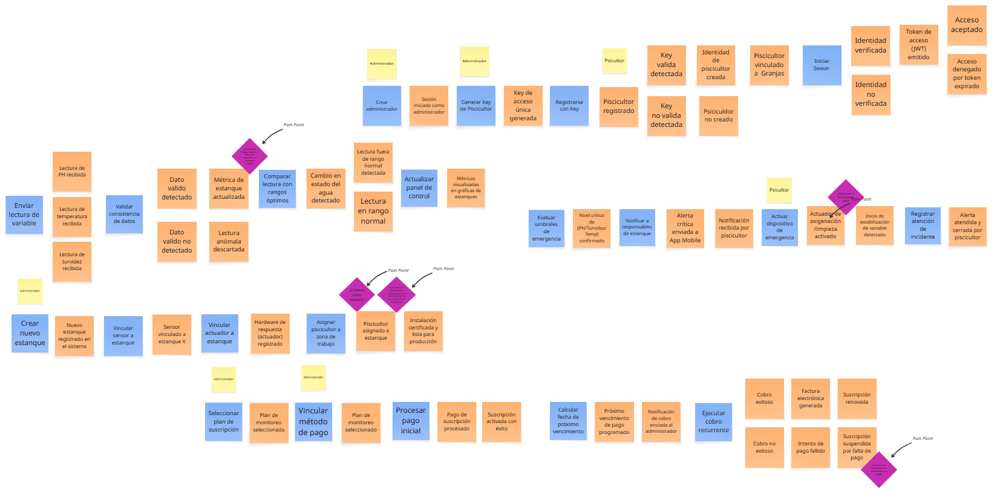

##### Step 6: Aggregates Identification
En este paso se definen los **Aggregates** (post-its amarillos grandes), que funcionan como los núcleos de consistencia del sistema. Son entidades raíz como "Estanque", "Suscripción" o "Usuario", que encapsulan lógica de negocio compleja y aseguran que los comandos solo se ejecuten si cumplen con las reglas del dominio.

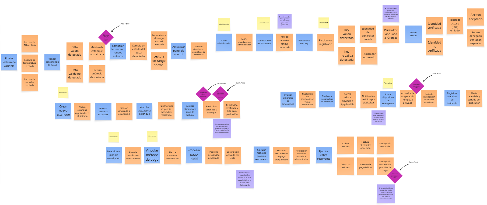

##### Step 7: Policies and Business Rules
Se establecen las **Policies** (post-its lilas), que definen reacciones automáticas bajo la premisa "Siempre que [Evento], entonces [Comando]". Esto es fundamental para la automatización de Verifish, como la regla que activa automáticamente un oxigenador tras detectar una lectura crítica de oxígeno disuelto.

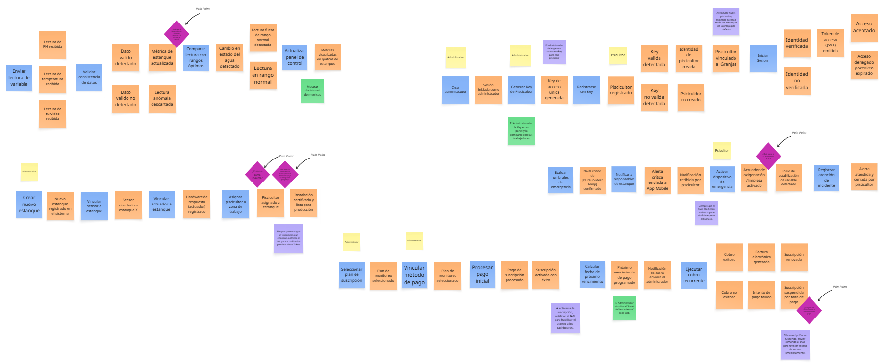

##### Step 8: Read Models (UI/UX)
Se identifican los **Read Models** (post-its verdes), que representan la información optimizada para la vista del usuario. Estos modelos definen qué datos se mostrarán en los dashboards de la aplicación, asegurando que el Piscicultor vea métricas esenciales y el Administrador reportes estadísticos complejos.

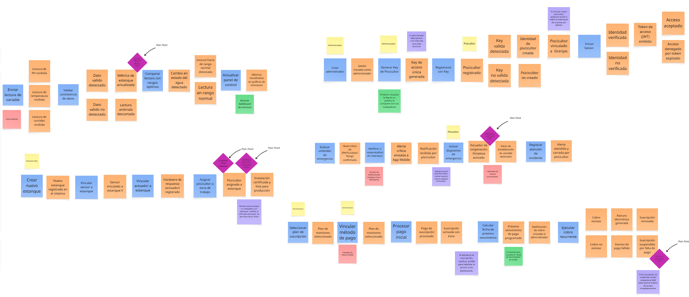

##### Step 9: Pain Points & Hotspots
Se señalan los **Pain Points** (post-its fucsia en diamante), identificando riesgos, dudas o debilidades técnicas. En este proyecto, se destacan retos como la conectividad en zonas rurales y la seguridad de las "Keys de Granja", los cuales se mitigan mediante el uso de arquitecturas **Edge Computing**.

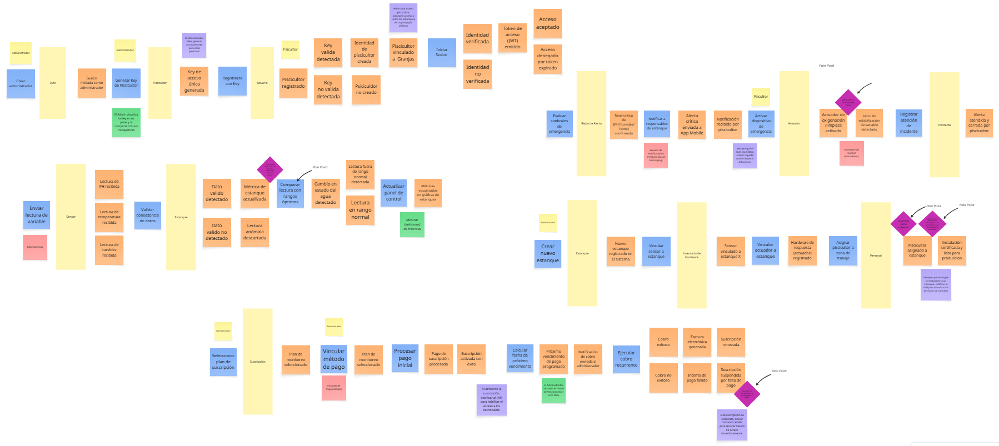

##### Step 10: Final Architecture & Context Mapping
El paso final consiste en consolidar el mapa completo para definir la arquitectura técnica. Se establecen los canales de comunicación entre contextos, asegurando que el **IAM** actúe como guardián transversal mientras que **Telemetry** y **Notification** funcionan como el motor reactivo de la solución inteligente.

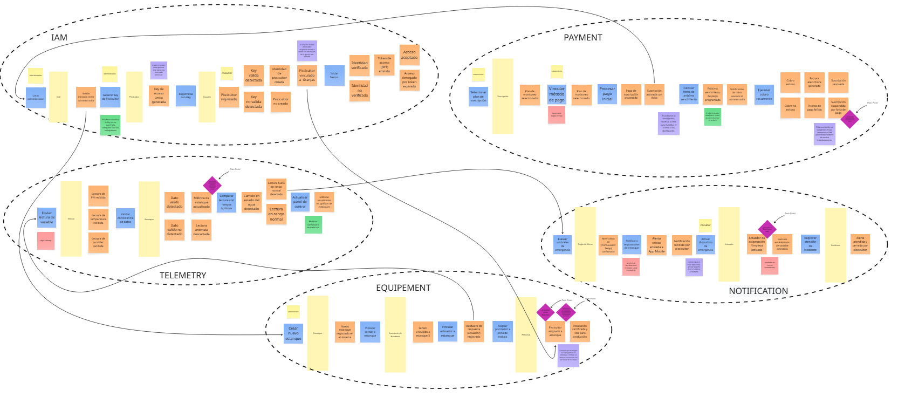

---

**Link Miro:** [Acceso al Tablero de EventStorming - YakuControl](https://miro.com/welcomeonboard/dGFtbnNmZWozeFE1UnJUcWZiY05ISlBxMGZRTFNnWGhKNHU3YkZRTkd1U2tnd3NzZVoybUtQRWRDNDZkdlI0OGFjS2VBTGU3ZWdsRS8wa3RodTl2a2FhcGk0Qm1HdFJkZDVNdTdkQjR5V3hvNXE5MTFDWTJEaFhUNkg2Sm52bXlQdGo1ZEV3bUdPQWRZUHQzSGl6V2NBPT0hdjE=?share_link_id=635140542507)


**Extensión para YakuTrace.** Con la incorporación de la trazabilidad se amplió el EventStorming con una sesión adicional en Miro. Se agregaron los siguientes elementos al flujo (post-its):

| Tipo | Elementos agregados |
| :--- | :--- |
| Domain Events | Batch Registered, Milestone Recorded, Quality Summary Closed, Harvest Registered, Certificate Issued, Hash Anchored, Certificate Verified, Certificate Revoked, TRACE Add-on Activated |
| Commands | Activate TRACE Add-on, Register Batch, Record Milestone, Register Harvest, Issue Certificate, Revoke Certificate, Verify Certificate |
| Actors | Farm Administrator, Supermarket Buyer |
| External Systems | Blockchain Network (smart contract y proveedor RPC) |
| Aggregates | Batch, Traceability Certificate |
| Policies | "Siempre que se activa el complemento TRACE, entonces se habilita la emisión de certificados de la granja"; "Siempre que se cierra un resumen de calidad, entonces se asocia al lote activo"; "Siempre que se emite un certificado, entonces se ancla su huella"; "Siempre que falla el anclaje, entonces se reintenta" |
| Read Models | Línea de tiempo del lote, resultado de verificación |
| Hotspots | Confiabilidad del dato del sensor (garbage in, garbage out); veracidad de los hitos que registra manualmente el administrador; disponibilidad de la red blockchain; estado de las redes de prueba |

Los elementos de la extensión se agruparon en el tablero según los seis contextos delimitados: los eventos de lotes, certificados y anclaje conforman **Traceability**; el cierre de resúmenes de calidad pertenece a **Telemetry**; y la activación del complemento TRACE, a **Payment**. La separación de la verificación pública (consulta sin sesión) respecto de la emisión y revocación (que exigen el rol de administrador) confirmó que ambas operaciones pertenecen al mismo contexto pero con distinto nivel de acceso.

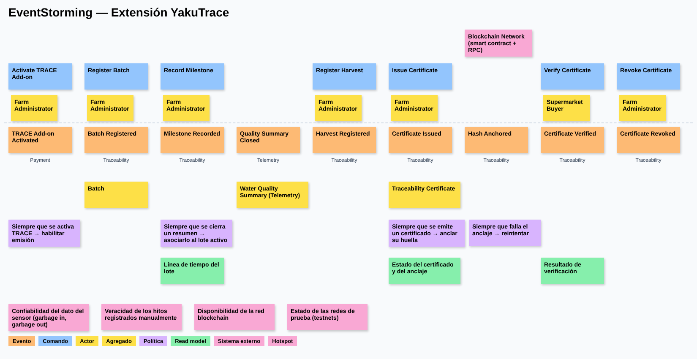

### 4.2.2. Candidate Context Discovery


En esta sección se presenta el proceso seguido por el equipo para la identificación y clasificación de los **Bounded Contexts** candidatos a partir del Event Storming de **YakuControl**. El objetivo fue identificar los límites naturales del dominio IoT, determinar qué partes del sistema constituyen el núcleo estratégico (Core) y cuáles cumplen roles de apoyo, priorizando el diseño en los elementos que garantizan la supervivencia de la producción acuícola.

#### **Preparación de la sesión**
La sesión de Candidate Context Discovery se desarrolló de forma colaborativa con una duración de 1 hora 30 minutos; al incorporar YakuTrace se realizó una segunda sesión breve para ubicar el nuevo contexto de Traceability. Se utilizaron los siguientes insumos:
* La línea de tiempo de eventos organizada cronológicamente.
* Los eventos clave (**Pivotal Events**) como "Lectura fuera de rango detectada", "Token JWT emitido" y, con YakuTrace, "Certificado emitido".
* La lógica de procesamiento **Edge Computing** definida para la resiliencia del sistema.

#### **Técnica aplicada: Start-with-Value**
Se aplicó la técnica **Start-with-Value**, priorizando las partes del dominio que generan el mayor impacto en la reducción de la mortalidad de los peces y la eficiencia operativa. El proceso se organizó en tres pasos:
1.  **Identificación de valor estratégico:** El equipo determinó que la capacidad de reacción autónoma ante anomalías hídricas es el principal diferenciador.
2.  **Agrupación de eventos:** Se consolidaron los clusters de eventos alrededor de los agregados "Estanque", "Sensor" y "Actuador" y, con YakuTrace, "Lote" y "Certificado de trazabilidad".
3.  **Clasificación Estratégica:** Se categorizaron los contextos en **Core**, **Supporting** y **Generic** según su complejidad y diferenciación competitiva.

#### **Candidate Contexts Identificados**

El análisis permitió identificar los siguientes bounded contexts candidatos:

| Candidate Context | Eventos Clave Asociados | Clasificación | Descripción | Justificación |
| :--- | :--- | :--- | :--- | :--- |
| **Identity & Access (IAM)** | Key de granja generada, Piscicultor vinculado, Token JWT emitido. | **Generic** | Gestión de autenticación, roles y seguridad mediante llaves de granja. | Es vital para la seguridad, pero utiliza estándares (JWT) que no diferencian el negocio acuícola. |
| **Telemetry** | Lectura recibida, Dato válido detectado, Métrica de estanque actualizada, Lectura fuera de rango detectada, Resumen de calidad cerrado. | **Core** | Ingesta y validación de datos en tiempo real provenientes de sensores IoT. | Es el origen de toda la inteligencia del sistema; la precisión del dato es crítica. |
| **Notification** | Alerta crítica creada, Alerta enviada, Alerta atendida, Acción de emergencia ejecutada. | **Core** | Entrega de alertas críticas y de mantenimiento por push y correo, ejecución de acciones de emergencia sobre los actuadores y medición del tiempo de respuesta. | Materializa la reacción inmediata: convierte la anomalía detectada por Telemetry en una acción que protege la producción; los umbrales se evalúan en Telemetry y en el Edge, no aquí. |
| **Equipment** | Estanque registrado, Sensor vinculado, Instalación certificada. | **Supporting** | Gestión del inventario físico y mapeo de la planta acuícola. | Apoya la operación permitiendo saber qué hardware está en cada estanque, pero es administrativo. |
| **Payment** | Plan seleccionado, Pago procesado, Suscripción suspendida por mora. | **Generic** | Control del modelo de negocio SaaS y facturación recurrente. | Necesario para la monetización, pero delegable a pasarelas externas como Stripe o Culqi. |
| **Traceability** | Lote registrado, Hito registrado, Resumen de calidad congelado, Certificado emitido, Hash anclado, Certificado verificado, Certificado revocado. | **Core** | Gestión del ciclo de vida del lote y emisión de certificados verificables con anclaje en blockchain. | Es el diferenciador nuevo de YakuTrace: convierte los datos de monitoreo en evidencia verificable para el comprador. |

#### **Clasificación Estratégica**

Como parte del análisis, se distribuyeron los contextos en una matriz de **Diferenciación de Negocio** vs **Complejidad del Modelo**:

* **Core (Alta diferenciación / Alta complejidad):** Telemetry, Notification y Traceability.
* **Supporting (Baja diferenciación / Mediana complejidad):** Equipment.
* **Generic (Baja diferenciación / Baja-Mediana complejidad):** Identity & Access (IAM), Payment.
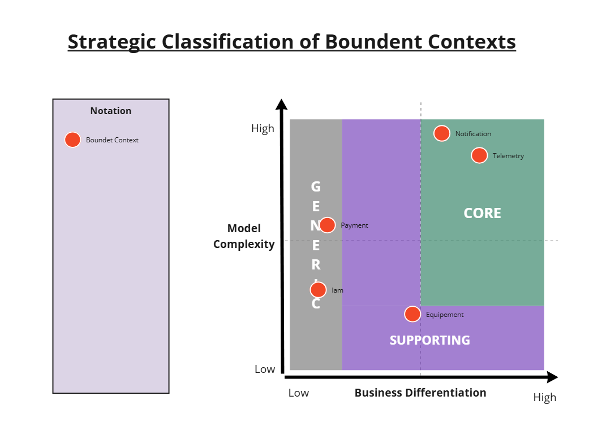
#### **Resultados**

Se definieron **seis bounded contexts candidatos**, clasificados así:

* **3 Core (Dominio Principal):**
    * **Telemetry:** procesa la ingesta de datos, asegura la fidelidad de las métricas y cierra los resúmenes de calidad.
    * **Notification:** ejecuta la respuesta inmediata: alertas, acciones de emergencia sobre actuadores y medición del tiempo de respuesta.
    * **Traceability:** gestiona lotes y emite certificados verificables con anclaje en blockchain.
* **1 Supporting (Soporte Operativo):**
    * **Equipment:** administra la relación física entre estanques, sensores y personal.
* **2 Generic (Sistemas Genéricos):**
    * **Identity & Access (IAM):** seguridad, autenticación y llaves de granja.
    * **Payment:** flujo financiero del modelo SaaS y habilitación del complemento TRACE.

La técnica **Start-with-Value** permitió concentrar la atención del diseño táctico y de la inversión tecnológica en **Telemetría, Automatización y Trazabilidad**, donde reside la propuesta de valor diferenciadora de YakuControl + YakuTrace.

### 4.2.3. Domain Message Flows Modeling


El Domain Storytelling es una técnica visual y colaborativa que facilita la exploración del conocimiento dentro del dominio del negocio, cuyo propósito principal es generar una comprensión común sobre lo que se desarrolla en un proceso específico, involucrando tanto a los expertos del negocio como a los equipos técnicos.

En este sentido, elaboramos los domain storytelling tomando como referencia las interacciones entre los seis bounded contexts de YakuControl + YakuTrace (IAM, Equipment, Telemetry, Notification, Payment y Traceability), con el fin de analizar y comprender de manera más clara la lógica del negocio acuícola.


**Escenario 1:** Registrar administrador y crear piscicultor
**Objetivo:** Registrar un nuevo administrador en el sistema, generar su key de acceso y permitirle crear un piscicultor vinculado a su granja.

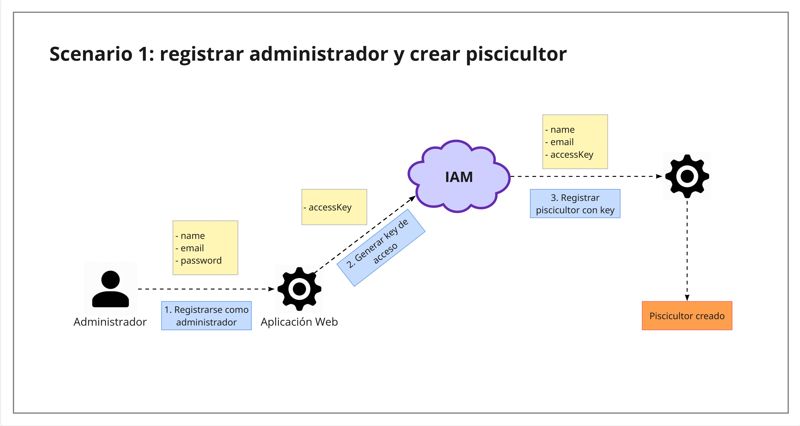

**Escenario 2:** Crear piscigranja y vincular sensores
**Objetivo:** El administrador crea un nuevo estanque en el sistema, vincula los sensores IoT correspondientes e inicia la telemetría para el monitoreo en tiempo real.

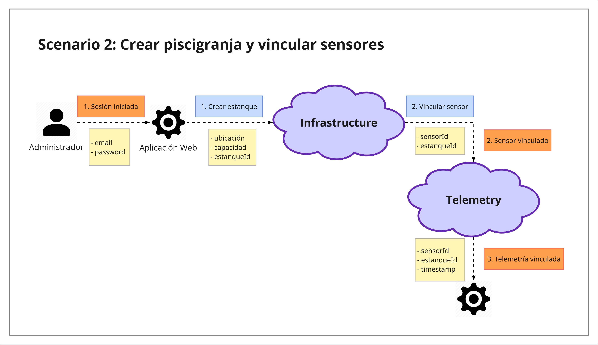

**Escenario 3:** Alertar ante detección de anomalías de los sensores
**Objetivo:** El dispositivo Arduino UNO detecta una anomalía en los parámetros del agua y el sistema genera y envía alertas automáticas al administrador y al piscicultor en tiempo real.

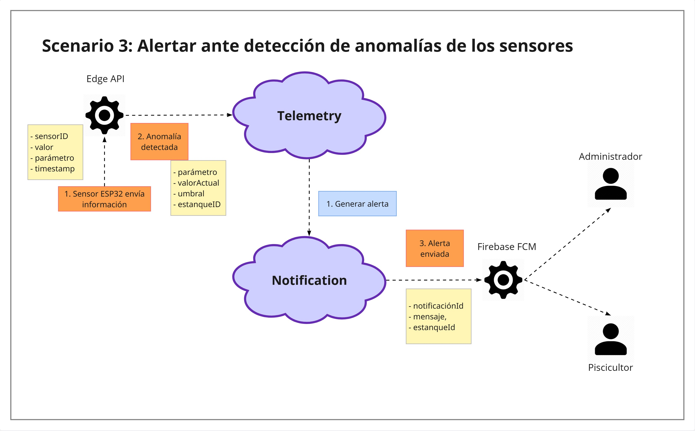

**Escenario 4:** Pagar suscripción
**Objetivo:** El administrador selecciona un plan de suscripción, completa el proceso de pago y el sistema habilita el acceso completo a las funcionalidades de YakuControl.

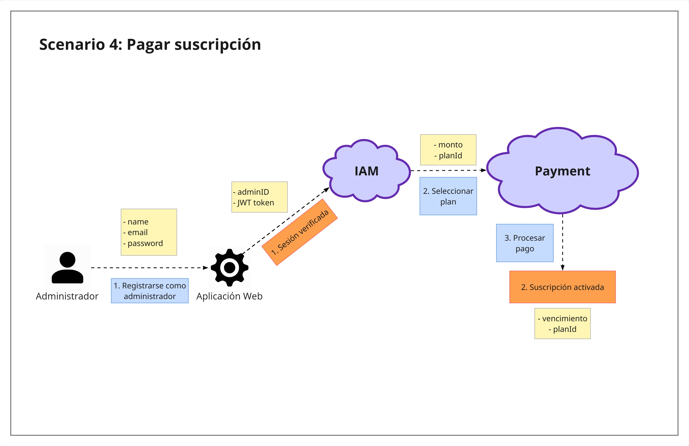


**Escenario 5:** Registrar lote e hitos
**Objetivo:** El administrador registra un lote en un estanque con su siembra, el sistema registra el hito y, durante el ciclo, asocia automáticamente los resúmenes de calidad cerrados y los eventos críticos al lote.

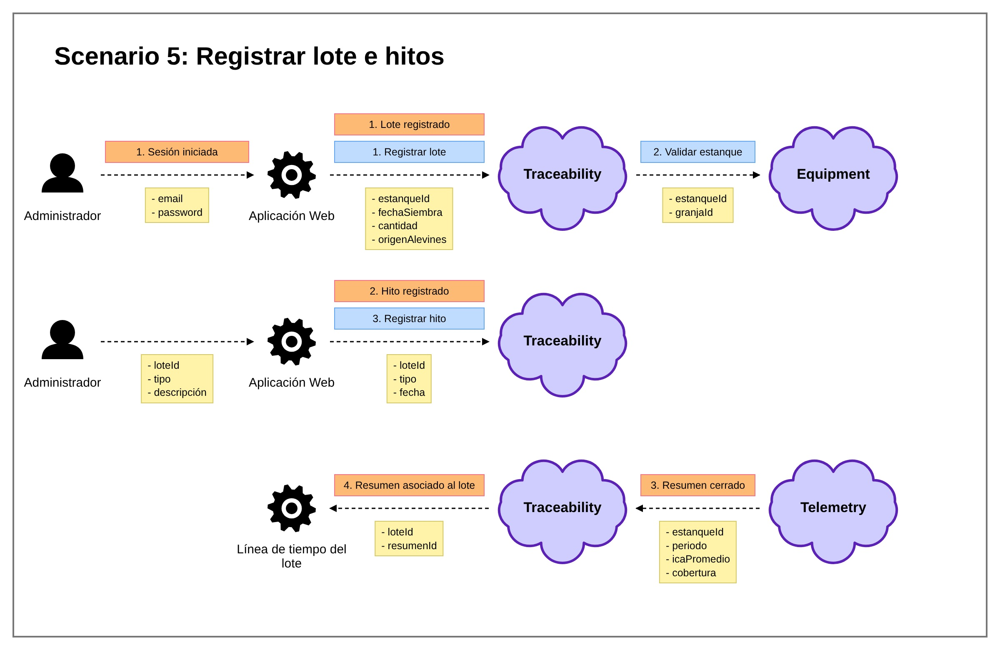

**Secuencia de la historia:**

1. El **Administrador** registra un **Lote** con su fecha de siembra, cantidad y origen de alevines.
2. **Traceability** consulta a **Equipment** la identidad del **Estanque** y verifica que pertenece a la granja y que no tiene otro lote activo.
3. **Traceability** crea el lote y registra el **Hito de siembra**.
4. Durante el ciclo, el **Administrador** registra **Hitos** de tratamiento, alimentación o mortalidad.
5. **Telemetry** cierra el **Resumen de calidad** del periodo y lo publica; **Traceability** lo asocia al lote activo.
6. **Telemetry** informa una lectura fuera de rango; **Traceability** registra un **Hito crítico** en el lote.

**Escenario 6:** Emitir certificado y anclar su huella
**Objetivo:** Al cosechar, el administrador solicita el certificado; Traceability valida los requisitos con Payment (complemento TRACE activo) y Telemetry (resúmenes cerrados), emite el certificado con su código QR y ancla su huella en la blockchain.

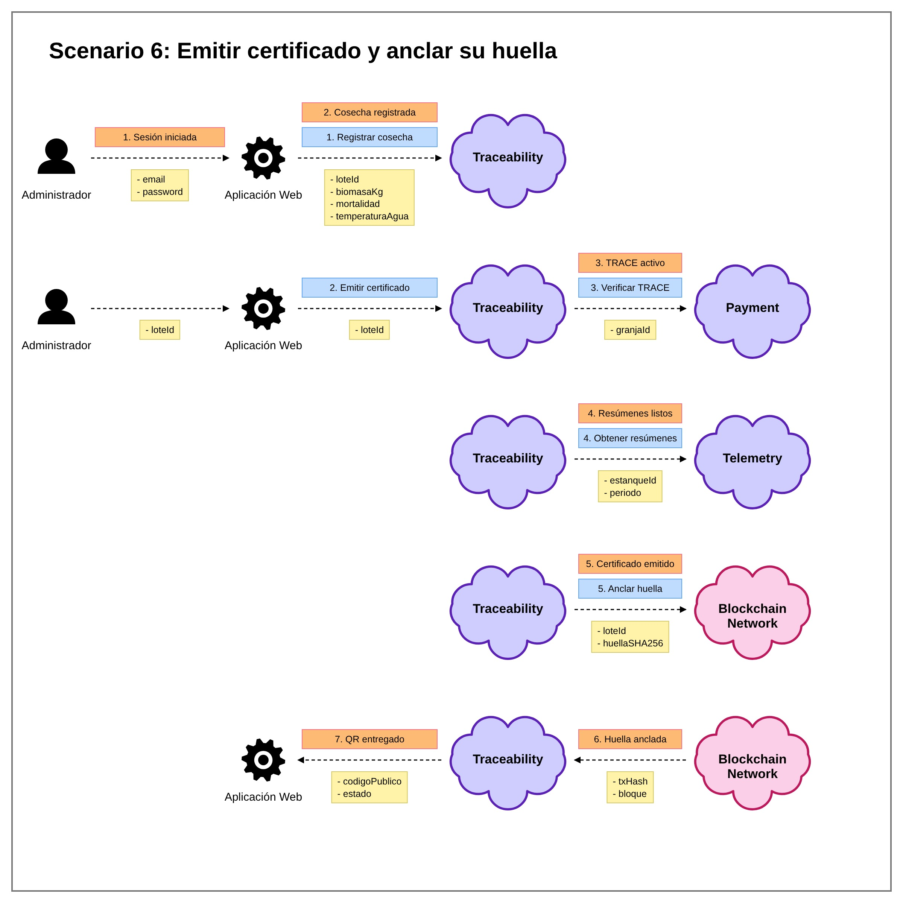

**Secuencia de la historia:**

1. El **Administrador** registra la **Cosecha** del lote (biomasa, mortalidad acumulada y temperatura del agua).
2. El **Administrador** solicita el **Certificado** del lote.
3. **Traceability** verifica con la copia local del permiso de **Payment** que el complemento TRACE está activo.
4. **Traceability** obtiene de **Telemetry** los **Resúmenes de calidad** cerrados y comprueba la cobertura de datos y que no haya eventos críticos abiertos.
5. **Traceability** construye el contenido canónico y calcula la **Huella** (SHA-256).
6. **Traceability** emite el **Certificado** con su código público y su código QR y lo entrega al **Administrador**.
7. **Traceability** encola el **Anclaje** pendiente; un proceso en segundo plano envía la **Huella** al **Smart Contract** de la **Red blockchain**.
8. La **Red blockchain** confirma la transacción y **Traceability** marca el certificado como anclado y avisa al administrador mediante **Notification**.

**Escenario 7:** Verificar un lote mediante el QR
**Objetivo:** El comprador de supermercado escanea el QR; Traceability recalcula la huella, la compara con la registrada en la blockchain y le presenta el resultado junto con el historial y el resumen de calidad.

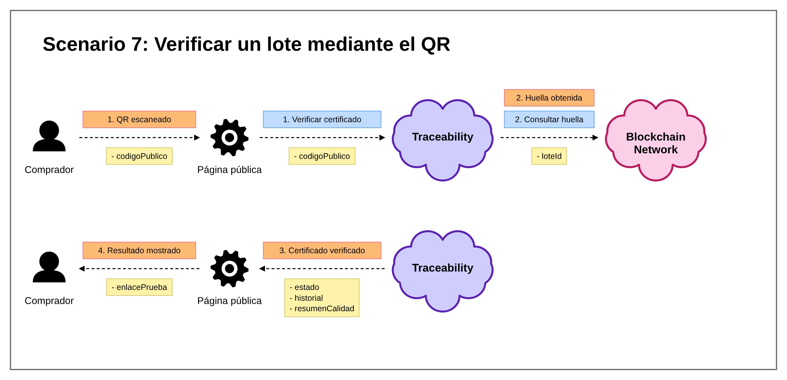

**Secuencia de la historia:**

1. El **Comprador** escanea el **código QR** del lote y abre la **Página pública** de verificación.
2. La **Página pública** solicita la verificación a **Traceability** con el código público.
3. **Traceability** recalcula la **Huella** del contenido almacenado.
4. **Traceability** consulta la **Huella registrada** en el **Smart Contract**.
5. **Traceability** compara ambas huellas y determina si el certificado es válido, alterado o revocado.
6. El **Comprador** recibe el resultado junto con el historial del lote, el resumen de calidad y el enlace a la prueba en la red.


### 4.2.4. Bounded Context Canvases


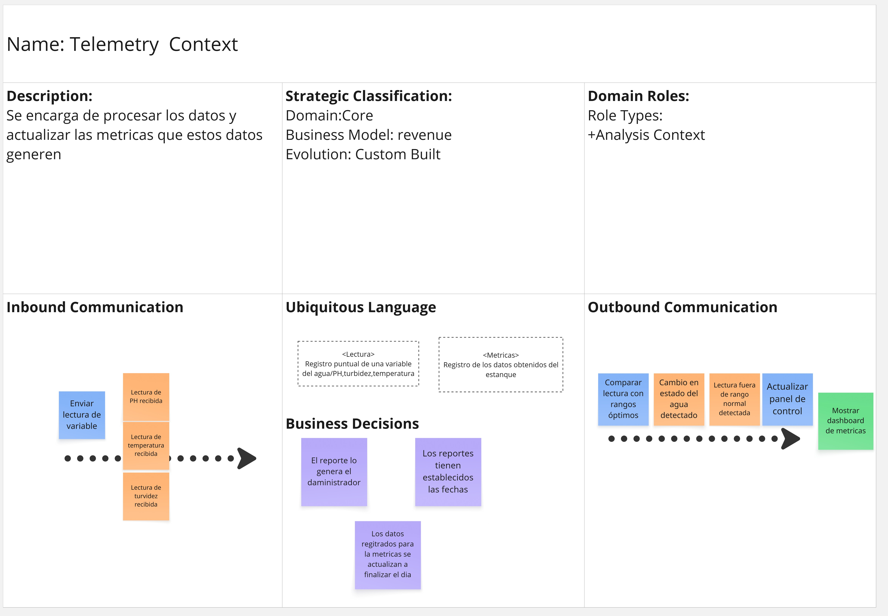

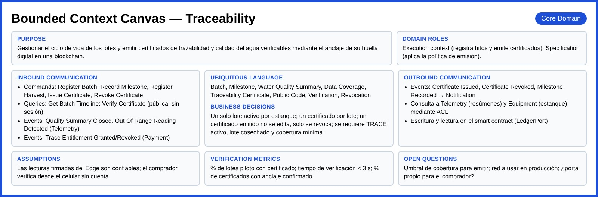

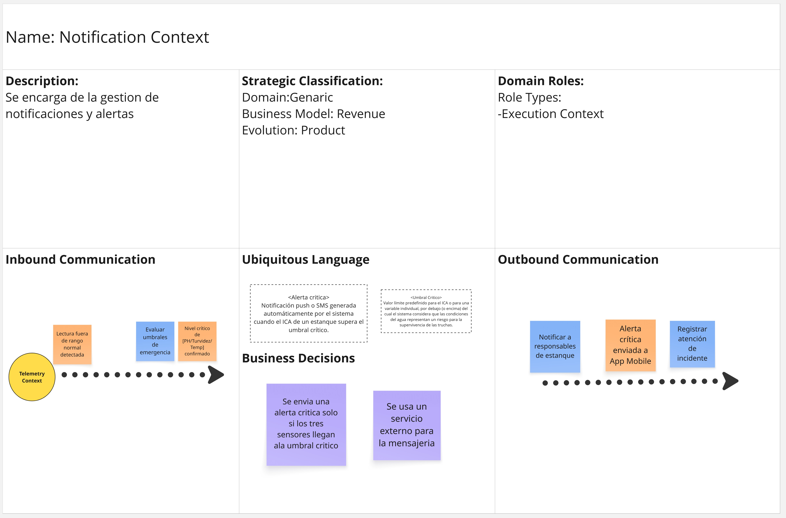

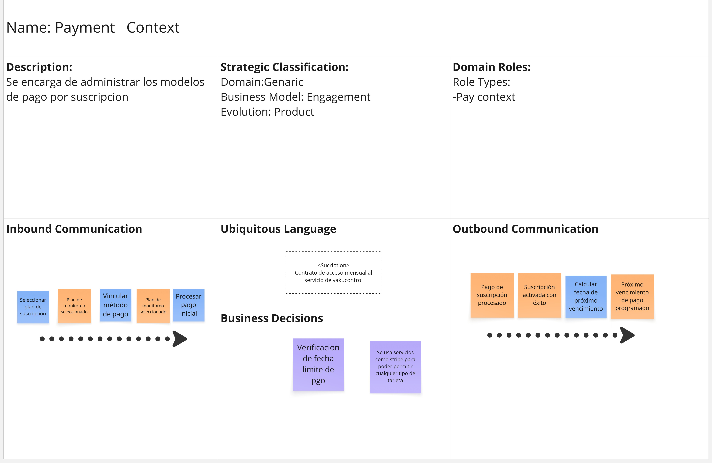

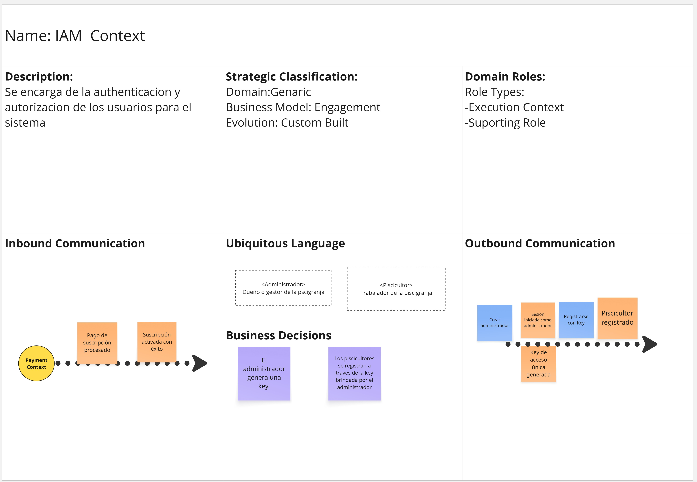

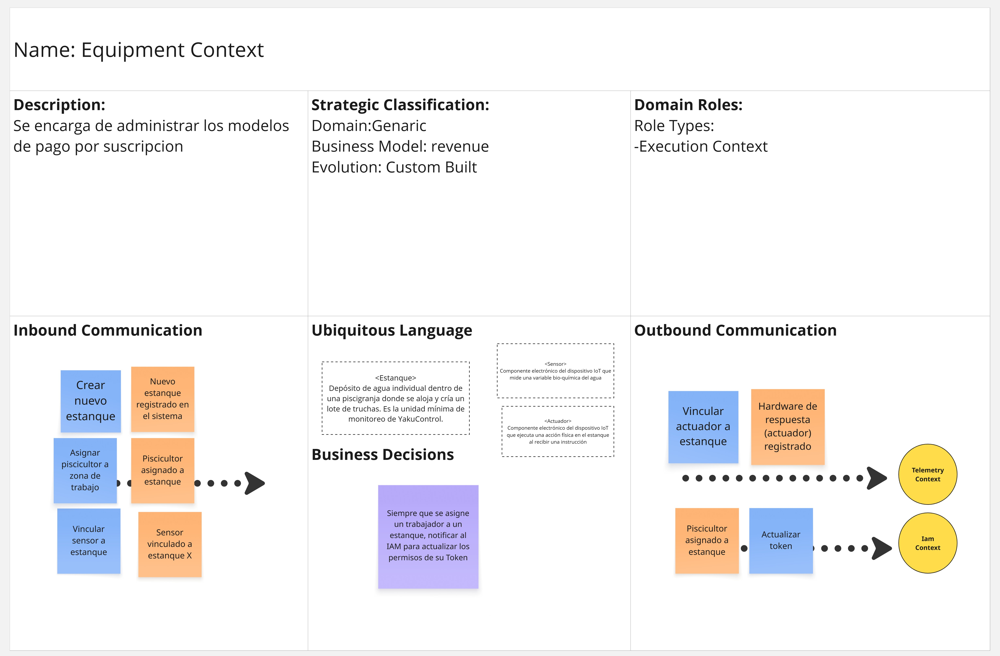

<div style="page-break-after: always;"></div>


**Proceso de elaboración.** Cada Bounded Context Canvas se elaboró de forma iterativa: (1) *Context Overview Definition*, donde se definió el propósito y la clasificación estratégica; (2) *Business Rules Distillation & Ubiquitous Language Capture*, donde se destilaron las reglas y los términos; (3) *Capability Analysis*, donde se identificaron las capacidades; (4) *Capability Layering*, para separar capacidades núcleo de las de soporte; (5) *Dependencies Capture*, con la comunicación entrante y saliente; y (6) *Design Critique*, donde se revisaron las decisiones abiertas. Se priorizó el orden: Telemetry, Traceability, Notification, Equipment, IAM y Payment.

**Bounded Context Canvas — Traceability (detalle)**

| Campo | Contenido |
| :--- | :--- |
| **Name** | Traceability |
| **Purpose** | Gestionar el ciclo de vida de los lotes y emitir certificados de trazabilidad y calidad del agua verificables mediante el anclaje de su huella digital en una blockchain. |
| **Strategic Classification** | Core Domain; modelo en evolución; evolución del producto como diferenciador. |
| **Domain Roles** | Execution context (registra hitos y emite certificados); Specification (aplica la política de emisión). |
| **Inbound Communication** | Commands: Register Batch, Record Milestone, Register Harvest, Issue Certificate, Revoke Certificate. Queries: Get Batch Timeline, Verify Certificate (pública). Events: Quality Summary Closed y Out Of Range Reading Detected (Telemetry); Trace Entitlement Granted/Revoked (Payment). |
| **Outbound Communication** | Events: Certificate Issued, Certificate Revoked, Milestone Recorded. Consulta a Telemetry (resúmenes cerrados) y a Equipment (identidad del estanque) mediante Anti-Corruption Layer. Escritura y lectura en el smart contract mediante el puerto de ledger. |
| **Ubiquitous Language** | Batch, Milestone, Water Quality Summary, Data Coverage, Traceability Certificate, Public Code, Verification, Revocation. |
| **Business Decisions** | Un solo lote activo por estanque; un certificado por lote; un certificado emitido no se edita, solo se revoca; se requiere TRACE activo, lote cosechado y cobertura de datos mínima. |
| **Assumptions** | Las lecturas del Edge firmadas son confiables; los compradores verifican desde el celular sin cuenta. |
| **Verification Metrics** | Porcentaje de lotes piloto con certificado emitido; tiempo de verificación; porcentaje de certificados con anclaje confirmado. |
| **Open Questions** | Umbral de cobertura de datos para emitir; qué red usar en producción; si el comprador necesitará un portal propio. |

Los canvases de **Telemetry** (cierre de resúmenes de calidad), **Payment** (complemento TRACE), **Notification** (acciones de emergencia y tiempo de respuesta), **Equipment** e **IAM** incluyen los mensajes que intercambian con Traceability.

### 4.2.5. Context Mapping


Para elaborar el Context Mapping de YakuControl, el equipo revisó los seis Bounded Context Canvases definidos en la etapa de diseño estratégico: **Identity & Access (IAM)**, **Telemetry**, **Notification**, **Equipment**, **Payment** y **Traceability**. A partir de esta revisión, se analizaron las dependencias entre contextos, las responsabilidades de cada uno y las posibles alternativas de diseño antes de determinar la estructura final de relaciones.

#### Proceso de análisis: preguntas de diseño candidato

**¿Qué pasaría si movemos la lógica de umbrales críticos del Telemetry Context al Notification Context?**
Si el Notification Context asumiera la responsabilidad de decidir cuándo emitir alertas basándose en umbrales, crearía una dependencia directa con los datos de configuración del negocio acuícola. Esto contaminaría al Notification Context con reglas de dominio que no le corresponden, haciéndolo frágil ante cambios en los criterios de calidad del agua. Se descarta esta alternativa: la lógica de validación de métricas y detección de anomalías debe permanecer en el Telemetry Context, que es quien procesa e interpreta los datos de los sensores.

**¿Qué pasaría si descomponemos el Telemetry Context y separamos la ingesta de datos crudos del procesamiento de métricas validadas?**
Podría tener sentido crear un contexto exclusivo de ingesta (Edge) y otro de análisis (Analytics). Sin embargo, dado el tamaño del equipo y la naturaleza del MVP, esta separación generaría overhead de comunicación entre contextos sin beneficio real en esta etapa. Se decide mantener la ingesta, validación y persistencia de métricas en un único Telemetry Context cohesivo, con la posibilidad de descomponerlo en una versión futura del producto.

**¿Qué pasaría si partimos el Identity & Access (IAM) Context en un contexto de Autenticación y otro de Autorización?**
Separar la emisión de tokens JWT de la gestión de roles (ROLE_WORKER, ROLE_ADMIN) y llaves de granja permitiría mayor granularidad. Sin embargo, ambas responsabilidades están fuertemente acopladas en la lógica de acceso de YakuControl (el token lleva el rol embebido). Dividirlos introduciría complejidad innecesaria para el MVP. Se mantiene el IAM Context unificado.

**¿Qué pasaría si unimos el Identity & Access Context con el Payment Context para formar un contexto de "Customer Management"?**
La idea de unir la identidad del usuario con su estado de suscripción podría simplificar la verificación de acceso. Sin embargo, mezclaría responsabilidades de dominio distintas: la identidad es un concepto técnico de seguridad, mientras que la suscripción es un concepto de negocio. Mantenerlos separados permite evolucionarlos de forma independiente. Se descarta la unificación.

**¿Qué pasaría si integramos el Equipment Context dentro del Telemetry Context?**
El Equipment Context gestiona el inventario físico (estanques, sensores, instalaciones), mientras que el Telemetry Context procesa los datos que esos sensores generan. Fusionarlos mezclaría la configuración del hardware con el flujo de datos, violando el principio de responsabilidad única. Se mantienen separados: Equipment provee el contexto físico y Telemetry consume esa información para asociar las métricas al estanque correcto.

**¿Qué pasaría si creamos un Shared Service de notificaciones para centralizar los canales de comunicación del sistema?**
Tanto el Telemetry Context (alertas críticas por anomalías) como el Equipment Context (notificaciones de mantenimiento) podrían necesitar enviar mensajes al usuario. Centralizar esto en el Notification Context como un servicio compartido es la solución adoptada: ambos contextos publican eventos y el Notification Context se encarga del canal de entrega (push mediante Firebase Cloud Messaging y correo), evitando duplicación de integraciones externas.

**¿Qué pasaría si aislamos los core capabilities de monitoreo y movemos la facturación a un contexto genérico externo?**
El core de YakuControl + YakuTrace son los contextos Telemetry, Notification y Traceability. El Payment Context es un dominio genérico de soporte que puede delegarse a pasarelas externas como Stripe o Culqi. Aislarlo como contexto genérico es la decisión correcta: si el proveedor de pagos cambia, solo se afecta el Payment Context sin impacto en el core del negocio acuícola.

---


**¿Qué pasaría si el Lote (Batch) vive dentro del Equipment Context?**
Equipment gestiona la infraestructura física (estanques y equipos). El lote es un concepto de producción y de trazabilidad con su propio ciclo de vida y reglas (hitos, cosecha, certificación). Colocarlo en Equipment mezclaría responsabilidades y haría que Equipment dependiera de reglas comerciales. Se descarta: el lote vive en Traceability, que solo conoce el identificador del estanque.

**¿Qué pasaría si Traceability calcula por sí mismo los resúmenes de calidad?**
Obligaría a Traceability a leer la serie temporal de lecturas y a conocer las reglas de rango y de ICA, duplicando lógica de Telemetry. Se descarta: Telemetry cierra y congela los resúmenes y Traceability los copia como *snapshots* inmutables.

**¿Qué pasaría si Traceability llamara directamente a la blockchain desde el dominio?**
Acoplaría el dominio a una red concreta y haría que su caída bloquee la emisión. Se descarta: se usa un puerto de ledger con adaptador (Anti-Corruption Layer) y una cola de anclajes con reintentos.

#### Relaciones entre Bounded Contexts y patrones DDD aplicados

Tras el análisis de alternativas, se definió el siguiente mapa de relaciones para YakuControl + YakuTrace. En el diagrama, cada flecha va del contexto *upstream* (U) al *downstream* (D) e indica el patrón aplicado.

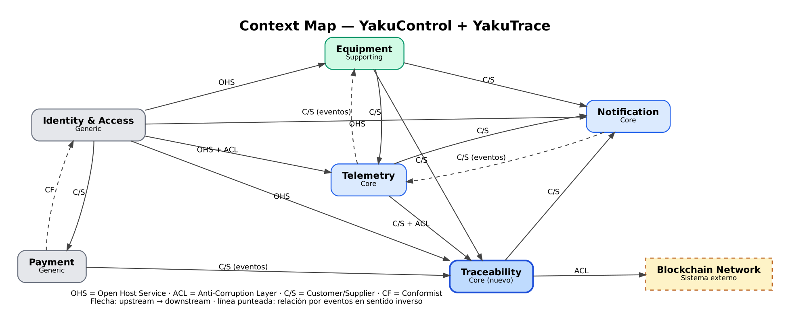

| Contexto Upstream (U) | Contexto Downstream (D) | Patrón de Relación | Descripción |
| :--- | :--- | :--- | :--- |
| **Identity & Access (IAM)** | **Telemetry** | Open Host Service (OHS) + ACL | El IAM Context expone un servicio de validación de tokens JWT y llaves de granja. El Telemetry Context implementa una Anti-Corruption Layer para traducir la identidad del dispositivo sin depender del modelo interno del IAM. |
| **Identity & Access (IAM)** | **Notification** | Open Host Service (OHS) | El IAM Context publica la emisión de invitaciones a operarios (US10) y expone los datos de contacto necesarios para que el Notification Context dirija las alertas al usuario correcto. El Notification Context consume este servicio sin modificar su modelo. |
| **Identity & Access (IAM)** | **Equipment** | Open Host Service (OHS) | El Equipment Context consulta al IAM para verificar que el usuario tiene permisos (ROLE_ADMIN) para registrar o modificar estanques y sensores. |
| **Identity & Access (IAM)** | **Payment** | Customer/Supplier | El Payment Context (cliente) depende del IAM (proveedor) para obtener la identidad del usuario al momento de procesar una suscripción. El IAM tiene influencia sobre el modelo del Payment Context. |
| **Equipment** | **Telemetry** | Customer/Supplier | El Equipment Context (proveedor) mantiene el registro de qué sensor está vinculado a qué estanque. El Telemetry Context (cliente) consume esta información para asociar correctamente cada métrica recibida con su estanque y especie correspondiente. |
| **Telemetry** | **Notification** | Customer/Supplier | El Telemetry Context (proveedor) emite eventos de anomalía cuando una métrica validada supera el umbral crítico del OptimalRange. El Notification Context (cliente) consume estos eventos para disparar alertas push o por correo de forma inmediata. |
| **Equipment** | **Notification** | Customer/Supplier | El Equipment Context (proveedor) publica eventos de mantenimiento cuando un sensor queda fuera de línea o un estanque requiere atención técnica. El Notification Context (cliente) consume estos eventos para alertar al administrador de la piscigranja a través del canal correspondiente. |
| **Notification** | **Telemetry** | Customer/Supplier (eventos) | Notification (proveedor) publica `AlertAttendedEvent` cuando el piscicultor atiende una alerta; Telemetry (cliente) registra el tiempo de respuesta para incluirlo en el resumen de calidad (US16). |
| **Payment** | **Identity & Access (IAM)** | Conformist | Una vez procesado el pago, el Payment Context notifica al IAM el estado activo de la suscripción. El IAM adopta esta información para habilitar o restringir el acceso de la granja a la plataforma, conformándose al modelo del Payment Context sin transformarlo. |
| **Telemetry** | **Traceability** | Customer/Supplier + Anti-Corruption Layer | Telemetry (proveedor) cierra y publica los resúmenes de calidad del agua; Traceability (cliente) los consume mediante una ACL (`TelemetrySummaryPort`) sin depender del modelo interno de Telemetry. |
| **Equipment** | **Traceability** | Customer/Supplier | Equipment (proveedor) mantiene la identidad del estanque; Traceability (cliente) la usa para asociar cada lote a un estanque de una granja. |
| **Payment** | **Traceability** | Customer/Supplier (eventos) | Payment publica la habilitación o retiro del complemento TRACE; Traceability mantiene una copia local del permiso. |
| **Identity & Access (IAM)** | **Traceability** | Open Host Service | IAM provee la autorización (ROLE_ADMIN y granja) para emitir y revocar certificados; la verificación pública no requiere IAM. |
| **Traceability** | **Notification** | Customer/Supplier | Traceability publica la emisión o revocación de certificados; Notification (cliente) avisa al administrador. |
| **Telemetry** | **Equipment** | Customer/Supplier (eventos) | Telemetry publica la pérdida de telemetría; Equipment marca el equipo fuera de línea y publica la alerta de mantenimiento. |
| **Traceability** | **Blockchain Network (externo)** | Anti-Corruption Layer | El puerto `LedgerPort` y su adaptador traducen el modelo del dominio a las llamadas del smart contract, aislando al contexto de la red concreta. |

#### Conclusión del Context Mapping

El mapa de contextos resultante posiciona a **Identity & Access (IAM)** como el contexto genérico que provee autenticación y aislamiento por granja a los demás. **Equipment** define la realidad física de la piscigranja y **Telemetry** la convierte en datos de valor y en resúmenes de calidad cerrados. **Notification** materializa la reacción inmediata ante condiciones críticas (alertas y acciones de emergencia) y **Traceability** convierte esos resúmenes en evidencia verificable para el comprador mediante el anclaje de huellas en una blockchain; junto con Telemetry, ambos conforman el núcleo (Core) de YakuControl + YakuTrace. Finalmente, **Payment** opera como contexto genérico delegado a servicios externos que, además de la suscripción, habilita el complemento TRACE.

Los pares Telemetry–Notification, Telemetry–Equipment y Payment–IAM se relacionan en ambos sentidos, pero cada sentido usa un evento o una consulta distinta, por lo que no existe una dependencia circular de código entre los módulos. Esta organización permite que los cambios en el proveedor de pagos o en la red blockchain no afecten al core de monitoreo y trazabilidad, y que cada módulo evolucione y se pruebe de forma independiente; si en el futuro un contexto debiera escalar por separado, los eventos en proceso pueden externalizarse sin modificar el dominio.

<div style="page-break-after: always;"></div>

## 4.3. Software Architecture
### 4.3.1. Software Architecture System Landscape Diagram
Este nivel ofrece una visión macroscópica del ecosistema de la piscigranja y de su cadena comercial. Muestra la plataforma **YakuControl + YakuTrace** junto a los actores (administrador, piscicultor, comprador de supermercado y consumidor final) y a los sistemas externos con los que interactúa: pasarela de pagos (Stripe), notificaciones push (Firebase), correo, servicios meteorológicos y la red blockchain. Permite comprender los flujos de información del negocio existan o no integraciones directas a nivel de código.

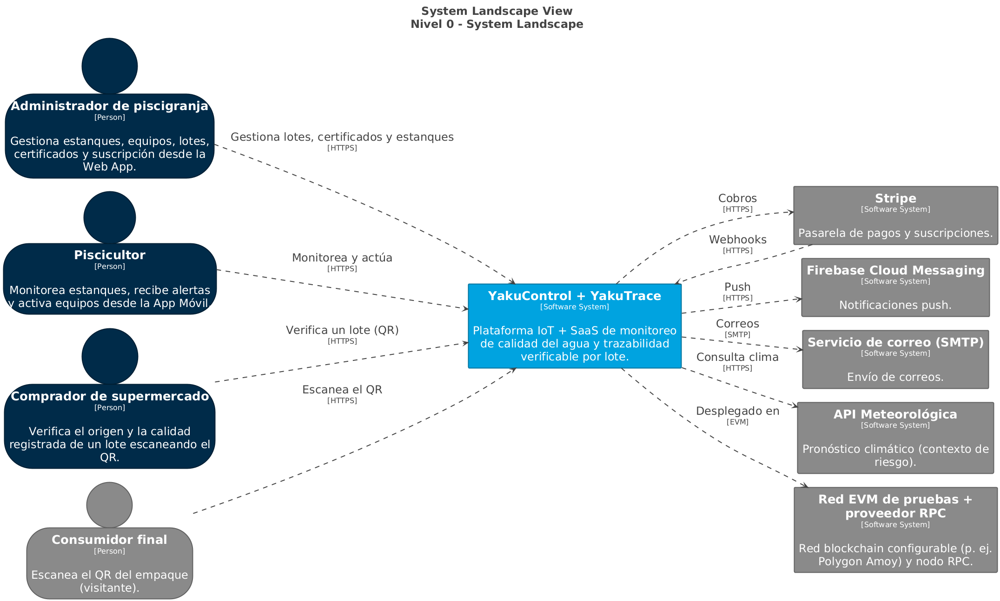

### 4.3.2. Software Architecture Context Level Diagrams
El diagrama de contexto define las fronteras del sistema: un único recuadro central (YakuControl + YakuTrace) rodeado por sus usuarios directos —el administrador, el piscicultor, el comprador de supermercado y el consumidor final— y por los sistemas con los que se integra: Stripe, Firebase Cloud Messaging, el servicio de correo, la API meteorológica y la red blockchain con su proveedor RPC.

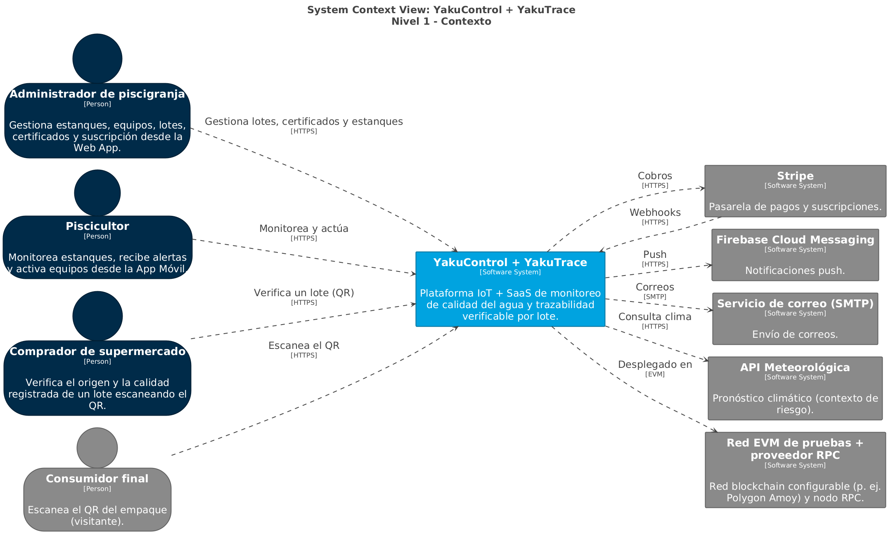

### 4.3.3. Software Architecture Container Level Diagrams

El diagrama de contenedores muestra los elementos de alto nivel de la solución y sus responsabilidades. La arquitectura del backend es un **monolito modular** (Spring Boot) con seis Bounded Contexts, desplegable como una sola unidad. Los contenedores son:

| Contenedor | Tecnología | Responsabilidad |
| :--- | :--- | :--- |
| Landing Page | HTML5, CSS3, JavaScript | Presenta la propuesta de valor, planes y el acceso a la verificación de lotes. |
| Web App | Angular, Angular Material | Panel del administrador y página pública de verificación de certificados. |
| Mobile App | Flutter | App del piscicultor: lecturas, alertas y control de actuadores (offline-first). |
| Backend | Java, Spring Boot | API RESTful con los contextos IAM, Equipment, Telemetry, Notification, Payment y Traceability; eventos de dominio en proceso. |
| Base de datos | PostgreSQL + TimescaleDB (edición Apache 2) | Un esquema por Bounded Context y serie temporal para las lecturas. |
| Edge API | Python, Flask, Mosquitto | Recibe telemetría por MQTT, calcula el ICA, filtra falsos positivos, firma y reenvía las lecturas, y ejecuta órdenes de actuadores. |
| Dispositivo IoT | Arduino UNO (C++) | Sensores y actuadores; evalúa umbrales críticos localmente. |
| Smart Contract | Solidity (EVM) | Registra y consulta huellas de hitos y certificados por lote. |

Los clientes se comunican con el backend por REST/JSON sobre HTTPS; el Edge API envía lecturas firmadas; el backend se comunica con el smart contract mediante JSON-RPC y con los servicios externos mediante sus APIs.

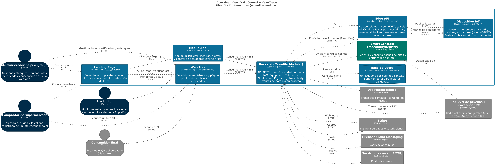

### 4.3.4. Software Architecture Deployment Diagrams
El diagrama de despliegue mapea la arquitectura lógica a la infraestructura. El **nodo IoT** se ubica en la granja con conectividad intermitente; el **Edge API** se ejecuta en un servicio PaaS (Railway); el **backend** y la **base de datos** se despliegan en Microsoft Azure (App Service y Azure Database for PostgreSQL); la **Landing Page** y la **Web App** se distribuyen como contenido estático con CDN; la **app móvil** se instala en el teléfono del piscicultor; y el **smart contract** se despliega en una red EVM de pruebas configurable.

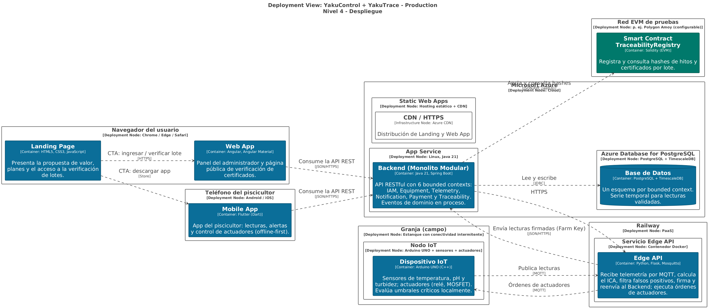

# Capítulo V: Tactical-Level Software Design
En este capítulo se presenta el diseño táctico de YakuControl + YakuTrace. El backend es un **monolito modular** (Spring Boot) en el que cada Bounded Context es un módulo con su propio paquete, su propio esquema de base de datos y cuatro capas: **Domain**, **Interface**, **Application** e **Infrastructure**. Los módulos no se acceden entre sí por sus clases internas: se comunican mediante **eventos de dominio en proceso** (bus interno de Spring) y mediante interfaces explícitas protegidas por una **Anti-Corruption Layer** cuando un contexto consulta a otro. Las integraciones externas (Stripe, Firebase Cloud Messaging, SMTP, Edge API y blockchain) se acceden siempre a través de un **puerto** definido en el contexto y un **adaptador** en la capa de Infrastructure, de modo que el dominio no depende de ningún proveedor.

Convenciones aplicadas en todos los contextos:

- **Domain Layer:** Aggregate Roots, Entities, Value Objects, Factories, Domain Services, Repositories (interfaces) y Domain Events. No depende de Spring ni de JPA.
- **Interface Layer:** Controllers REST, DTOs (*Resources*) y Assemblers (*Transform*). Las operaciones de escritura se convierten en *Commands* y las de lectura en *Queries*.
- **Application Layer:** *Command Handlers*, *Query Handlers* y *Event Handlers* (CQRS). Orquestan el dominio y los puertos; no contienen reglas de negocio.
- **Infrastructure Layer:** implementaciones de repositorios (Spring Data JPA / PostgreSQL), adaptadores a servicios externos y publicación de eventos.
- Todos los identificadores, clases y endpoints están en **inglés**.

Los diagramas de componentes (C4 nivel 3) se elaboraron en **Structurizr**, los diagramas de clases (UML) y de base de datos en **LucidChart/Vertabelo** a partir de los modelos aquí descritos.

## 5.1. Bounded Context: Telemetry Context
El Telemetry Context es el núcleo técnico de YakuControl. Recibe las lecturas que el Edge API ya filtró y firmó, las valida contra el rango óptimo de la especie, las persiste como serie temporal inmutable, detecta lecturas fuera de rango y, desde YakuTrace, **cierra resúmenes de calidad del agua** por día, semana, mes y ciclo, que alimentan los certificados de trazabilidad. El Índice de Calidad del Agua (ICA) lo calcula el Edge API; el backend **no lo recalcula**: solo lo agrega y lo congela.

### 5.1.1. Domain Layer

El dominio de Telemetry aísla las reglas de la acuicultura (rangos óptimos, estados del estanque, cierre de resúmenes) de la tecnología de sensores y de la base de datos. Se usan dos agregados: `MonitoredPond`, que protege la consistencia de las lecturas de un estanque, y `QualitySummary`, que representa un periodo de calidad que, una vez cerrado, es inmutable.

| Clase | Tipo | Propósito y reglas de negocio | Atributos clave | Métodos clave |
| :--- | :--- | :--- | :--- | :--- |
| `MonitoredPond` | Aggregate Root | Estanque monitoreado. Acepta lecturas solo si el estanque tiene rangos configurados y mantiene su estado actual (NORMAL, WARNING, CRITICAL). Se identifica con el `pondId` de Equipment. | `pondId`, `farmId`, `currentStatus`, `ranges` | `acceptReading()`, `configureRange()`, `evaluate()` |
| `ValidatedMetric` | Entity | Punto de dato que superó los filtros; se guarda de forma inmutable. | `metricId`, `variable`, `value`, `icaScore`, `measuredAt` | `isOutOfRange()` |
| `QualitySummary` | Aggregate Root | Resumen de calidad de un periodo (DAY, WEEK, MONTH, CYCLE). **Regla:** un resumen cerrado no se modifica; los resúmenes de semana, mes y ciclo se obtienen agregando los de nivel inferior. | `period`, `avgIca`, `minIca`, `maxIca`, `pctInRange`, `criticalEvents`, `avgResponseMinutes`, `dataCoverage`, `status` | `close()`, `aggregateFrom()`, `isClosed()` |
| `RawReading` | Value Object | Lectura recibida del Edge antes de validar. | `sensorId`, `variable`, `rawValue`, `measuredAt`, `signature` | — |
| `OptimalRange` | Value Object | Límites aceptables de una variable según la especie (p. ej. trucha arcoíris: pH 6.5–8.0, temperatura 10–18 °C). | `min`, `max` | `contains()` |
| `IcaScore`, `Percentage`, `DeviceSignature` | Value Objects | Encapsulan puntaje 0–100, porcentaje 0–100 y firma del dispositivo, evitando valores sin tipo. | `value` | — |
| `WaterVariableType`, `WaterQualityStatus`, `QualityPeriod`, `SummaryStatus` | Enumerations | Variable medida, estado del estanque, periodo del resumen y estado del resumen. | — | — |
| `ValidatedMetricFactory` | Factory | Crea una `ValidatedMetric` a partir de una `RawReading` aplicando el rango del estanque. | — | `fromRawReading()` |
| `QualitySummaryFactory` | Factory | Abre un resumen vacío para un periodo. | — | `open()` |
| `AnomalyDetectionService` | Domain Service | Decide si una métrica es anómala y si es un falso positivo (pico transitorio) mirando lecturas recientes. | — | `isAnomalous()`, `isFalsePositive()` |
| `QualitySummaryCalculator` | Domain Service | Calcula promedio, mínimo, máximo, % de tiempo en rango, eventos críticos y **cobertura de datos** (lecturas recibidas / esperadas). | — | `calculate()` |
| `MonitoredPondRepository`, `ValidatedMetricRepository`, `QualitySummaryRepository` | Repository (interfaces) | Abstraen la persistencia de los agregados y de la serie temporal. | — | `save()`, `findByPondId()`, `findClosedByPond()` |
| `OutOfRangeReadingDetectedEvent`, `QualitySummaryClosedEvent`, `TelemetryLostEvent` | Domain Events | Comunican a otros contextos: alerta (Notification y Traceability), resumen cerrado (Traceability) y pérdida de telemetría (Equipment). | — | — |

### 5.1.2. Interface Layer

La interacción principal es máquina a máquina: el Edge API envía lecturas firmadas por HTTPS (Technical Story TS01). También se exponen los *read models* para el Web Dashboard y la app móvil.

| Clase | Tipo | Propósito |
| :--- | :--- | :--- |
| `TelemetryIngestionController` | Controller | `POST /api/v1/telemetry/readings`. Autentica con Farm Key, verifica la firma y envía un `RegisterRawReadingCommand`. Responde 201, o 400/401 según el caso. |
| `PondMetricsController` | Controller | `GET /api/v1/ponds/{id}/metrics/current` y `/history`. Estado actual e historial de tendencias. |
| `QualitySummaryController` | Controller | `GET /api/v1/ponds/{id}/quality-summaries?period=` para el dashboard y para YakuTrace. |
| `ThresholdsController` | Controller | `PUT /api/v1/ponds/{id}/thresholds` (US13); valida que mínimo < máximo. |
| `RawReadingResource`, `CurrentPondStateResource`, `HistoricalTrendResource`, `QualitySummaryResource`, `UpdateThresholdsResource` | DTO (Resources) | Estructuras de entrada y salida; no exponen el modelo de dominio. |
| `RegisterRawReadingCommandFromResourceAssembler`, `CurrentPondStateResourceFromAggregateAssembler`, `QualitySummaryResourceFromEntityAssembler` | Assemblers | Convierten Resource ↔ Command/Aggregate. |

### 5.1.3. Application Layer

| Clase | Tipo | Capability / flujo que maneja |
| :--- | :--- | :--- |
| `RegisterRawReadingCommandHandler` | Command Handler | Ingesta: crea la métrica con la factory, la guarda, actualiza el estado del estanque y, si es anómala, publica `OutOfRangeReadingDetectedEvent`. |
| `ConfigureThresholdsCommandHandler` | Command Handler | Actualiza los rangos de un estanque (US13). |
| `CloseQualitySummariesCommandHandler` | Command Handler | Cierra los resúmenes diarios vencidos, agrega semanas, meses y ciclos y publica `QualitySummaryClosedEvent` por cada uno. Lo invoca `QualitySummaryScheduler`. |
| `GetCurrentPondStateQueryHandler`, `GetHistoricalTrendQueryHandler`, `GetQualitySummariesQueryHandler` | Query Handlers | Lecturas puras para clientes e integración con Traceability. |
| `EquipmentLinkedEventHandler` | Event Handler | Al vincularse un equipo a un estanque (Equipment), crea el `MonitoredPond` con los rangos por defecto de la especie. |
| `AlertAttendedEventHandler` | Event Handler | Registra el tiempo de respuesta a una alerta (publicado por Notification) para el resumen de calidad (US16). |

### 5.1.4. Infrastructure Layer

| Clase | Implementa / usa | Propósito |
| :--- | :--- | :--- |
| `MonitoredPondRepositoryImpl` | `MonitoredPondRepository` | Spring Data JPA sobre PostgreSQL. |
| `ValidatedMetricRepositoryImpl` | `ValidatedMetricRepository` | Persistencia masiva e inmutable en la tabla `validated_metrics` (hypertable de TimescaleDB). |
| `QualitySummaryRepositoryImpl` | `QualitySummaryRepository` | JPA; garantiza unicidad `(pond, period, period_start)`. |
| `DeviceSignatureVerifier` | Seguridad | Verifica la firma HMAC del Edge con la Farm Key; rechaza lecturas manipuladas. |
| `QualitySummaryScheduler` | Spring `@Scheduled` | Dispara el cierre de resúmenes cada día. |
| `SpringDomainEventPublisher` | `ApplicationEventPublisher` | Publica los Domain Events al bus interno. |
| `FarmKeyClient` (ACL) | Consulta a IAM | Resuelve la granja dueña de una Farm Key sin depender del modelo de IAM. |

### 5.1.5. Bounded Context Software Architecture Component Level Diagrams

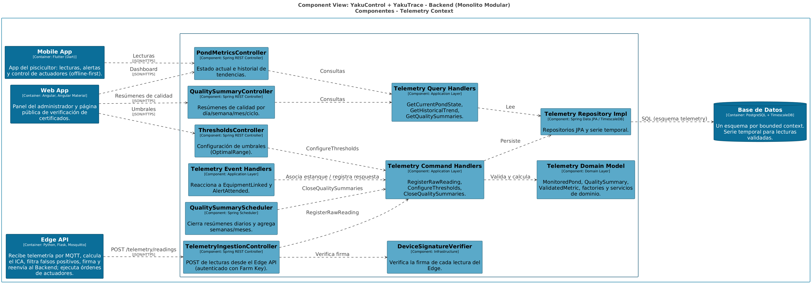

*Figura 5.1.* Component Diagram del Telemetry Context (container Backend). Los controllers reciben tráfico del Edge API, la Web App y la Mobile App; los handlers coordinan el dominio y el repositorio; los eventos salen hacia Notification, Traceability y Equipment.

### 5.1.6. Bounded Context Software Architecture Code Level Diagrams

#### 5.1.6.1. Bounded Context Domain Layer Class Diagrams

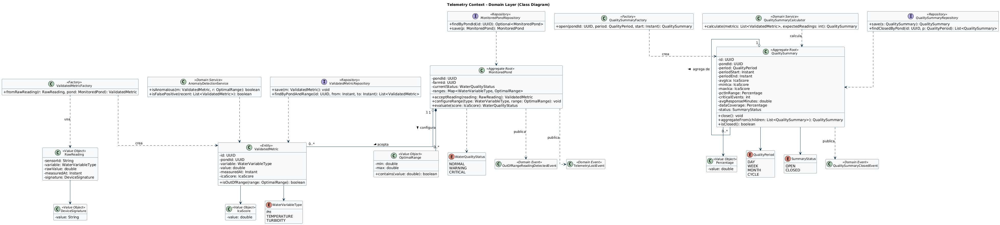

El diagrama muestra los dos agregados, sus entidades y Value Objects, las factories, los servicios de dominio, los repositorios y los eventos, con visibilidad de atributos y métodos, multiplicidad y nombre de las relaciones.

#### 5.1.6.2. Bounded Context Database Design Diagram

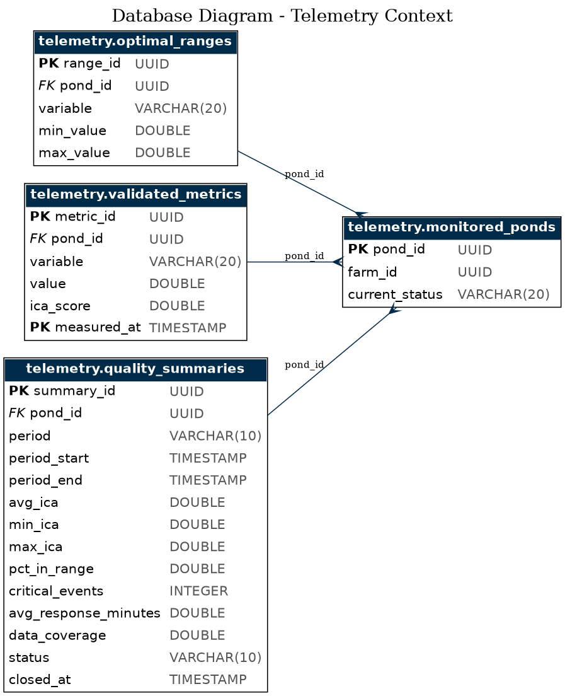

El esquema `telemetry` contiene: `monitored_ponds` (estanque monitoreado y estado), `optimal_ranges` (rango por variable, único por estanque), `validated_metrics` (serie temporal, clave `(metric_id, measured_at)`) y `quality_summaries` (resúmenes por periodo, únicos por estanque-periodo-inicio). Todas las tablas hijas referencian a `monitored_ponds` mediante clave foránea.

## 5.2. Bounded Context: Traceability Context
Traceability es el contexto **core** de YakuTrace. Gestiona el ciclo de vida del **lote** (siembra, hitos, cosecha), congela los resúmenes de calidad del agua que Telemetry cierra y emite el **Certificado de Trazabilidad y Calidad del Agua** con un código QR. Para que el certificado sea verificable, calcula una huella digital (SHA-256) de su contenido canónico y la ancla en un **smart contract** (`TraceabilityRegistry`). En la blockchain solo se guardan hashes; los datos completos permanecen en PostgreSQL. La verificación pública recalcula el hash y lo compara con el registrado. El contexto no afirma que los peces hayan sido "bien cuidados": certifica que **las condiciones medidas fueron registradas sin alteración posterior**.

### 5.2.1. Domain Layer

| Clase | Tipo | Propósito y reglas de negocio | Atributos clave | Métodos clave |
| :--- | :--- | :--- | :--- | :--- |
| `Batch` | Aggregate Root | Lote de truchas sembrado en un estanque. Regla: solo un lote activo por estanque; no se agregan hitos a un lote certificado; la cosecha exige fecha, biomasa, mortalidad acumulada y temperatura al cosechar. | `batchId`, `farmId`, `pondId`, `species`, `sowingDate`, `initialQuantity`, `status`, `harvest` | `registerMilestone()`, `attachSummary()`, `registerHarvest()`, `markCertified()` |
| `Milestone` | Entity | Hito del lote (SOWING, CRITICAL_EVENT, TREATMENT, FEED_CHANGE, QUALITY_SUMMARY, HARVEST, DISPATCH) con el hash de su contenido y su ancla en blockchain. | `type`, `occurredAt`, `payload`, `digest`, `anchor` | `attachAnchor()` |
| `TraceabilityCertificate` | Aggregate Root | Certificado de un lote. Regla: se emite una sola vez por lote; una vez emitido no se edita; solo puede **revocarse** (la revocación también se ancla). Tiene un `publicCode` opaco para el QR. | `certificateId`, `batchId`, `publicCode`, `status`, `contentDigest`, `anchor`, `revocation` | `attachAnchor()`, `revoke()`, `isVerifiable()` |
| `FarmTraceEntitlement` | Entity | Copia local del permiso de la granja para usar TRACE (se mantiene con eventos de Payment). | `farmId`, `active` | `grant()`, `revoke()` |
| `BatchId`, `PublicCode`, `HashDigest` | Value Objects | Identificador del lote, código público no adivinable y huella SHA-256. | `value` / `hex` | `equalsTo()` |
| `WaterQualitySnapshot` | Value Object | Copia congelada de un resumen de Telemetry (promedio, mínimo, máximo del ICA, % de tiempo en rango, eventos críticos, tiempo de respuesta, cobertura de datos). | ver diagrama | — |
| `HarvestData`, `Revocation`, `VerificationResult` | Value Objects | Datos de cosecha, motivo de revocación y resultado de una verificación. | ver diagrama | — |
| `BlockchainAnchor` | Value Object | Prueba de anclaje: red, hash de transacción, bloque, contrato y estado (PENDING, CONFIRMED, FAILED). | `network`, `txHash`, `blockNumber`, `contractAddress`, `status` | — |
| `BatchStatus`, `MilestoneType`, `CertificateStatus`, `AnchorStatus`, `QualityPeriod` | Enumerations | Estados y tipos del contexto. | — | — |
| `BatchFactory` | Factory | Crea un lote validando datos de siembra. | — | `create()` |
| `CertificateFactory` | Factory | Construye el certificado a partir del lote y sus resúmenes: serializa, calcula el hash y genera el `publicCode`. | — | `issueFor()` |
| `CertificateIssuingPolicy` | Domain Service | Verifica la **elegibilidad**: lote cosechado, granja con TRACE activo, sin eventos críticos abiertos y cobertura de datos mínima (umbral configurable, propuesto 90 %). | — | `check()` |
| `CanonicalSerializer` | Domain Service | Serializa el contenido en JSON canónico (orden y formato deterministas), condición para que el hash sea reproducible. | — | `serialize()` |
| `CertificateVerificationService` | Domain Service | Compara el hash recalculado con el registrado en blockchain y decide si el certificado es válido, está alterado o revocado. | — | `verify()` |
| `BatchRepository`, `CertificateRepository`, `FarmTraceEntitlementRepository` | Repository (interfaces) | Persistencia de los agregados. | — | `save()`, `findById()`, `findByPublicCode()`, `findActiveByPond()` |
| `MilestoneRecordedEvent`, `CertificateIssuedEvent`, `CertificateRevokedEvent` | Domain Events | Informan a otros contextos y activan el anclaje. | — | — |

### 5.2.2. Interface Layer 

| Clase | Tipo | Propósito |
| :--- | :--- | :--- |
| `BatchController` | Controller (ROLE_ADMIN) | `POST /api/v1/batches` (registrar lote), `POST /api/v1/batches/{id}/milestones`, `POST /api/v1/batches/{id}/harvest`, `GET /api/v1/batches/{id}/timeline`. |
| `CertificateController` | Controller (ROLE_ADMIN) | `POST /api/v1/batches/{id}/certificate` (emitir), `GET /api/v1/certificates`, `POST /api/v1/certificates/{id}/revoke`. |
| `PublicVerificationController` | Controller (**público**) | `GET /api/v1/public/verify/{publicCode}`. No exige autenticación: es el destino del QR. No expone identificadores internos. |
| `CreateBatchResource`, `RecordMilestoneResource`, `RegisterHarvestResource`, `RevokeCertificateResource` | DTO de entrada | Datos de siembra, hito, cosecha y revocación. |
| `BatchResource`, `MilestoneResource`, `CertificateResource`, `VerificationResultResource` | DTO de salida | Respuestas; la verificación incluye estado ✓/✗, resumen, hitos y enlace a la prueba en blockchain. |
| `CreateBatchCommandFromResourceAssembler`, `BatchResourceFromEntityAssembler`, `VerificationResultResourceFromResultAssembler` | Assemblers | Conversión Resource ↔ Command/Entity. |

### 5.2.3. Application Layer

| Clase | Tipo | Capability / flujo |
| :--- | :--- | :--- |
| `RegisterBatchCommandHandler` | Command Handler | Registra el lote y su hito de siembra (SOWING). |
| `RecordMilestoneCommandHandler` | Command Handler | Agrega un hito, calcula su hash y encola su anclaje. |
| `RegisterHarvestCommandHandler` | Command Handler | Registra la cosecha y cierra el ciclo (solicita el resumen CYCLE a Telemetry). |
| `IssueCertificateCommandHandler` | Command Handler | Valida con `CertificateIssuingPolicy`, congela los resúmenes (vía `TelemetrySummaryPort`), crea el certificado con la factory, genera el QR (`QrCodePort`), guarda y **encola el anclaje en la tabla outbox** en la misma transacción. |
| `RevokeCertificateCommandHandler` | Command Handler | Revoca un certificado y encola el anclaje de la revocación. |
| `ConfirmAnchorCommandHandler` | Command Handler | Marca un anclaje como CONFIRMED con tx hash y bloque, o lo reintenta (invocado por el worker). |
| `GetBatchTimelineQueryHandler`, `ListBatchesQueryHandler`, `ListCertificatesQueryHandler` | Query Handlers | Consultas del administrador. |
| `VerifyCertificateQueryHandler` | Query Handler | Obtiene el certificado por código público, recalcula el hash, lee el hash registrado vía `LedgerPort` y devuelve el `VerificationResult`. |
| `QualitySummaryClosedEventHandler` | Event Handler | Asocia el resumen cerrado al lote activo del estanque y registra un hito `QUALITY_SUMMARY`. |
| `OutOfRangeReadingDetectedEventHandler` | Event Handler | Registra un hito `CRITICAL_EVENT` en el lote activo. |
| `TraceEntitlementGrantedEventHandler`, `TraceEntitlementRevokedEventHandler` | Event Handlers | Actualizan `FarmTraceEntitlement` cuando Payment activa o retira el add-on TRACE. |
| `LedgerPort`, `TelemetrySummaryPort`, `QrCodePort` | Puertos (interfaces) | Definen lo que el contexto necesita de la blockchain, de Telemetry y del generador de QR; los adaptadores viven en Infrastructure. |

### 5.2.4. Infrastructure Layer

| Clase | Implementa / usa | Propósito |
| :--- | :--- | :--- |
| `BatchRepositoryImpl`, `CertificateRepositoryImpl`, `FarmTraceEntitlementRepositoryImpl` | Repositorios del dominio | Spring Data JPA / PostgreSQL (esquema `traceability`). |
| `AnchorOutboxRepositoryImpl` | Outbox | Tabla `anchor_outbox`: hashes pendientes, confirmados o fallidos con sus intentos. |
| `AnchorOutboxWorker` | Spring `@Scheduled` | Toma anclajes PENDING, los envía al ledger con reintentos y llama a `ConfirmAnchorCommandHandler`. Si la red no responde, el sistema sigue operando (el anclaje queda pendiente). |
| `EvmLedgerAdapter` | `LedgerPort` | Cliente web3j: llama `anchor()` y `history()` del contrato `TraceabilityRegistry` en la red EVM configurada. **La red es configuración**, no código. |
| `TelemetrySummaryAdapter` | `TelemetrySummaryPort` (ACL) | Obtiene los resúmenes cerrados desde Telemetry sin depender de su modelo interno. |
| `ZxingQrCodeGenerator` | `QrCodePort` | Genera el QR con la URL pública de verificación. |
| `Sha256DigestCalculator` | Hashing | Calcula SHA-256 del JSON canónico. |
| `SigningKeyProvider` | Seguridad | Carga la clave que firma las transacciones desde un *secret manager* o variable de entorno; nunca desde el repositorio. |

**Smart contract `TraceabilityRegistry` (componente externo, Solidity):** expone `anchor(batchId, kind, digest)` (solo la cuenta autorizada del backend puede escribir), `history(batchId)` (lectura pública) y emite el evento `Anchored`. No almacena datos comerciales.

### 5.2.5. Bounded Context Software Architecture Component Level Diagrams

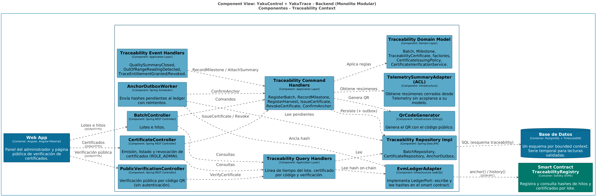

*Figura 5.2.* Component Diagram del Traceability Context. Se aprecian los tres controllers (el público sin autenticación), los handlers, el worker de outbox y los adaptadores hacia el smart contract, Telemetry (ACL) y la base de datos.

### 5.2.6. Bounded Context Software Architecture Code Level Diagrams

#### 5.2.6.1. Bounded Context Domain Layer Class Diagrams

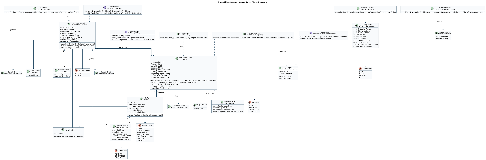

El diagrama muestra los agregados `Batch` (con sus `Milestone`) y `TraceabilityCertificate`, los Value Objects de hash, código público y ancla, las factories, las políticas y servicios de dominio, los repositorios y los eventos.

#### 5.2.6.2. Bounded Context Database Design Diagram

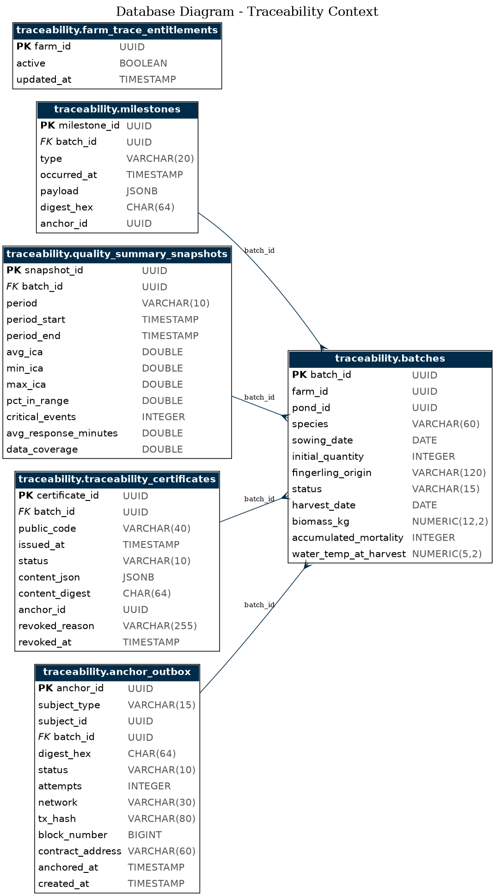

El esquema `traceability` contiene: `batches` (lote y datos de cosecha), `milestones` (hitos con hash y referencia a su ancla), `quality_summary_snapshots` (resúmenes congelados por lote), `traceability_certificates` (contenido canónico en JSONB, hash, código público y estado), `anchor_outbox` (cola de anclajes con red, tx hash, bloque y reintentos) y `farm_trace_entitlements` (permiso TRACE por granja). Las columnas `anchor_id` de hitos y certificados referencian lógicamente a `anchor_outbox`.


## 5.3. Bounded Context: Equipment Context
Equipment gestiona la **realidad física** de la piscigranja: estanques, equipos (sensores y actuadores), la vinculación entre ambos y el historial de piscicultores asignados. Es un contexto de soporte: no procesa datos de los sensores, solo sabe qué hardware está en qué estanque.

### 5.3.1. Domain Layer
| Clase | Tipo | Propósito y reglas de negocio | Atributos clave | Métodos clave |
| :--- | :--- | :--- | :--- | :--- |
| `Pond` | Aggregate Root | Estanque de crianza. Regla: el nombre es único dentro de la granja; solo un piscicultor responsable a la vez (la asignación anterior se cierra). | `pondId`, `farmId`, `name`, `capacityLiters`, `status`, `certifiedForProduction`, `assignedFarmerId` | `assignFishFarmer()`, `certifyForProduction()`, `deactivate()` |
| `PondAssignment` | Entity (de `Pond`) | Historial de asignaciones de piscicultores. | `farmerId`, `assignedAt`, `unassignedAt` | `close()` |
| `Equipment` | Aggregate Root | Dispositivo físico. Regla: el `hardwareId` es único (US15); solo un equipo AVAILABLE puede vincularse. | `hardwareId`, `type`, `status`, `pondId` | `linkToPond()`, `unlink()`, `markOffline()`, `markOnline()` |
| `PondName`, `HardwareId` | Value Objects | Nombre válido y código físico del dispositivo. | `value` | — |
| `PondStatus`, `EquipmentType`, `EquipmentStatus` | Enumerations | ACTIVE/INACTIVE/FULL; SENSOR/ACTUATOR; AVAILABLE/LINKED/OFFLINE. | — | — |
| `PondFactory`, `EquipmentFactory` | Factories | Crean estanques y equipos validando invariantes. | — | `create()`, `register()` |
| `EquipmentLinkingService` | Domain Service | Reglas de vinculación que involucran a ambos agregados y la unicidad del hardware. | — | `canLink()`, `ensureHardwareIsUnique()` |
| `PondRepository`, `EquipmentRepository` | Repository (interfaces) | Persistencia. | — | `findById()`, `findByFarm()`, `findByPond()` |
| `PondRegisteredEvent`, `EquipmentLinkedEvent`, `FishFarmerAssignedEvent`, `EquipmentWentOfflineEvent` | Domain Events | Consumidos por Telemetry, IAM y Notification. | — | — |

### 5.3.2. Interface Layer
| Clase | Tipo | Propósito |
| :--- | :--- | :--- |
| `PondController` | Controller | Alta de estanques, consulta por granja, asignación de piscicultor y certificación para producción. |
| `EquipmentController` | Controller | Registro de dispositivos y vinculación a un estanque. |
| `CreatePondResource`, `PondResource`, `RegisterEquipmentResource`, `LinkEquipmentResource`, `EquipmentResource`, `AssignFishFarmerResource` | DTO | Entradas y salidas de los endpoints. |
| `CreatePondCommandFromResourceAssembler`, `PondResourceFromEntityAssembler`, `RegisterEquipmentCommandFromResourceAssembler`, `EquipmentResourceFromEntityAssembler` | Assemblers | Conversión Resource ↔ Command/Entity. |

### 5.3.3. Application Layer

| Clase | Tipo | Capability / flujo |
| :--- | :--- | :--- |
| `RegisterPondCommandHandler`, `AssignFishFarmerCommandHandler`, `CertifyPondCommandHandler` | Command Handlers | Gestión de estanques; la asignación publica `FishFarmerAssignedEvent`. |
| `RegisterEquipmentCommandHandler`, `LinkEquipmentToPondCommandHandler` | Command Handlers | Alta y vinculación de hardware; la vinculación publica `EquipmentLinkedEvent`. |
| `GetPondByIdQueryHandler`, `GetPondsByFarmQueryHandler`, `GetEquipmentByPondQueryHandler`, `GetAssignmentHistoryQueryHandler` | Query Handlers | Consultas de lectura. |
| `TelemetryLostEventHandler` | Event Handler | Cuando Telemetry detecta ausencia de lecturas, marca el equipo OFFLINE y publica `EquipmentWentOfflineEvent` (alerta de mantenimiento). |

### 5.3.4. Infrastructure Layer

| Clase | Implementa / usa | Propósito |
| :--- | :--- | :--- |
| `PondRepositoryImpl`, `EquipmentRepositoryImpl` | Repositorios | Spring Data JPA / PostgreSQL (esquema `equipment`); `PondRepositoryImpl` mapea también `PondAssignment`. |
| `SpringDomainEventPublisher` | Eventos | Publica `FishFarmerAssignedEvent` para que IAM actualice permisos y `EquipmentLinkedEvent` para Telemetry. |

### 5.3.5. Bounded Context Software Architecture Component Level Diagrams

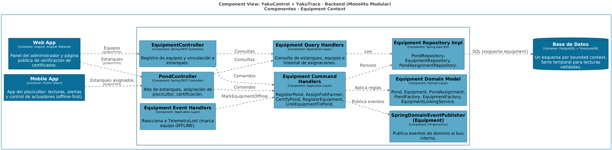

### 5.3.6. Bounded Context Software Architecture Code Level Diagrams

#### 5.3.6.1. Bounded Context Domain Layer Class Diagrams

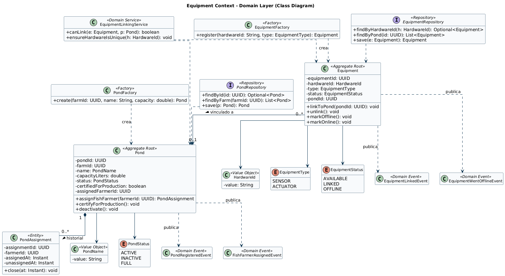

#### 5.3.6.2. Bounded Context Database Design Diagram

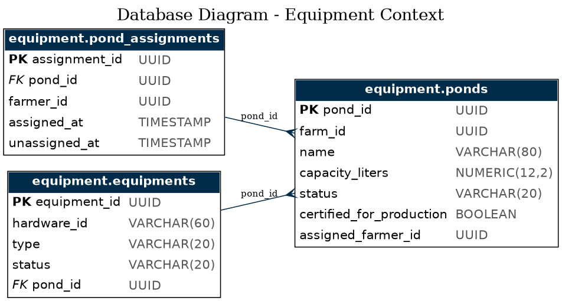

El esquema `equipment` define `ponds` (único por granja y nombre), `pond_assignments` (historial, FK a `ponds`) y `equipments` (con `hardware_id` único y FK opcional al estanque al que está vinculado).

## 5.4. Bounded Context: IAM Context

IAM gestiona identidades, roles y acceso. Es un contexto genérico que otros contextos consumen como **Open Host Service**: emite y valida JWT con el identificador de la granja (aislamiento multi-tenant) y administra la **Farm Key** con la que el Edge API se autentica. La **verificación pública del QR no requiere sesión**; en cambio, emitir o revocar certificados exige `ROLE_ADMIN` de la granja dueña del lote.

### 5.4.1. Domain Layer

| Clase | Tipo | Propósito y reglas de negocio | Atributos clave | Métodos clave |
| :--- | :--- | :--- | :--- | :--- |
| `User` | Aggregate Root | Usuario del sistema (administrador o piscicultor). Regla: email único; un piscicultor solo se registra con un `PondToken` válido. | `userId`, `farmId`, `email`, `role`, `status` | `updateProfile()`, `changePassword()`, `deactivate()`, `canAccess()` |
| `PondToken` | Entity | Código de un solo uso generado por el administrador para registrar piscicultores. | `code`, `farmId`, `expiresAt`, `used` | `consume()`, `isValid()` |
| `FarmKey` | Entity | Credencial del dispositivo/Edge de una granja. Se almacena solo su hash. | `farmId`, `secretHash`, `active` | `rotate()`, `deactivate()` |
| `Email`, `PasswordHash` | Value Objects | Validan formato y evitan manejar contraseñas en texto plano. | `value` | — |
| `Role`, `UserStatus` | Enumerations | ROLE_ADMIN/ROLE_WORKER; ACTIVE/SUSPENDED/INACTIVE. | — | — |
| `UserFactory` | Factory | Crea administradores y piscicultores aplicando las reglas de registro. | — | `createAdmin()`, `createWorker()` |
| `AccessPolicyService` | Domain Service | Decide si un usuario puede gestionar una granja o emitir certificados. | — | `canManageFarm()`, `canIssueCertificates()` |
| `UserRepository`, `PondTokenRepository`, `FarmKeyRepository` | Repository (interfaces) | Persistencia. | — | `findByEmail()`, `findByCode()`, `findActiveByFarm()` |
| `UserRegisteredEvent`, `FarmKeyGeneratedEvent` | Domain Events | Informan altas y rotación de claves. | — | — |

### 5.4.2. Interface Layer

| Clase | Tipo | Propósito |
| :--- | :--- | :--- |
| `UserController` | Controller | Sign-in, sign-up (con o sin `PondToken`), perfil y listado de personal. |
| `FarmKeyController` | Controller | Genera y rota la Farm Key (solo ROLE_ADMIN). |
| `SignInResource`, `SignUpResource`, `UpdateUserProfileResource`, `UserResource`, `AuthenticationResponseResource`, `FarmKeyResource` | DTO | Entradas/salidas; la respuesta de autenticación contiene el JWT. |
| `SignInCommandFromResourceAssembler`, `SignUpCommandFromResourceAssembler`, `UserResourceFromEntityAssembler` | Assemblers | Conversión Resource ↔ Command/Entity. |

### 5.4.3. Application Layer

| Clase | Tipo | Capability / flujo |
| :--- | :--- | :--- |
| `SignInCommandHandler`, `SignUpCommandHandler`, `UpdateUserProfileCommandHandler`, `GenerateFarmKeyCommandHandler` | Command Handlers | Autenticación, registro, perfil y credencial del Edge. |
| `GetUserProfileQueryHandler`, `ListFarmUsersQueryHandler` | Query Handlers | Lectura de perfiles y personal. |
| `FishFarmerAssignedEventHandler` | Event Handler | Actualiza los estanques accesibles del piscicultor cuando Equipment lo asigna. |
| `SubscriptionStatusChangedEventHandler` | Event Handler | Restringe o habilita el acceso de la granja según el estado de su suscripción (Payment → IAM, *Conformist*). |

### 5.4.4. Infrastructure Layer

| Clase | Implementa / usa | Propósito |
| :--- | :--- | :--- |
| `UserRepositoryImpl`, `PondTokenRepositoryImpl`, `FarmKeyRepositoryImpl` | Repositorios | Spring Data JPA / PostgreSQL (esquema `iam`). |
| `JwtTokenProvider` | Seguridad | Genera, firma y valida JWT con `farmId` y rol embebidos. |
| `JwtAuthenticationFilter` | Spring Security | Autentica cada request y aplica el aislamiento por granja. |
| `BCryptPasswordHasher` | `PasswordEncoder` | Hash de contraseñas. |

### 5.4.5. Bounded Context Software Architecture Component Level Diagrams

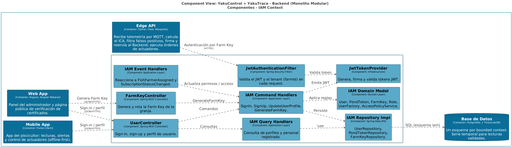

### 5.4.6. Bounded Context Software Architecture Code Level Diagrams

#### 5.4.6.1. Bounded Context Domain Layer Class Diagrams

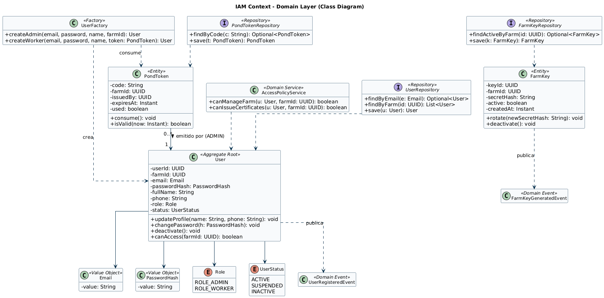

#### 5.4.6.2. Bounded Context Database Design Diagram

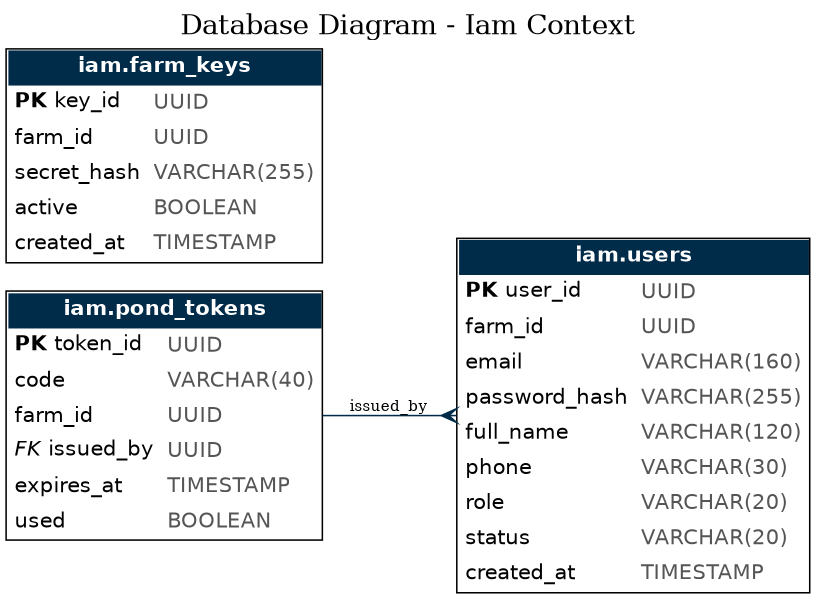

El esquema `iam` contiene `users` (email único, rol validado), `pond_tokens` (código único, FK al administrador que lo emitió) y `farm_keys` (hash de la credencial por granja).

## 5.5. Bounded Context: Notification Context
Notification es el contexto reactivo de YakuControl: convierte eventos del dominio (lectura fuera de rango, equipo fuera de línea, certificado emitido) en **alertas** entregadas por push (Firebase Cloud Messaging) y correo (SMTP), y ejecuta **acciones de emergencia** sobre los actuadores (aireador, filtros) a través del Edge API. También registra cuándo un operario atendió una alerta, dato que alimenta el tiempo de respuesta de los resúmenes de calidad.

### 5.5.1. Domain Layer

| Clase | Tipo | Propósito y reglas de negocio | Atributos clave | Métodos clave |
| :--- | :--- | :--- | :--- | :--- |
| `Notification` | Aggregate Root | Alerta o aviso dirigido a un destinatario. Regla: una alerta crítica no se descarta hasta ser atendida. | `recipientId`, `type`, `severity`, `status`, `createdAt`, `attendedAt` | `markAsRead()`, `acknowledge()`, `responseTimeMinutes()` |
| `SensorData` | Entity | Instantánea de los valores que originaron la alerta. | `temperature`, `ph`, `turbidity`, `hardwareStatus` | — |
| `Recipient` | Entity | Persona que recibe (piscicultor o administrador) y sus canales. | `role`, `contact` | `prefersChannel()` |
| `EmergencyAction` | Entity | Orden remota sobre un actuador y su resultado. | `actuatorHardwareId`, `command`, `result` | `markExecuted()`, `markFailed()` |
| `ContactInfo`, `HardwareStatus` | Value Objects | Datos de contacto y estado de bomba/conexión. | — | — |
| `NotificationType`, `Severity`, `NotificationStatus`, `RecipientRole`, `DeliveryChannel`, `ActuatorCommand`, `ActionResult` | Enumerations | Tipos y estados del contexto. | — | — |
| `NotificationFactory` | Factory | Construye alertas críticas y de mantenimiento a partir de eventos. | — | `criticalAlert()`, `maintenanceAlert()` |
| `RecipientResolutionService` | Domain Service | Determina quién debe recibir cada tipo de alerta (piscicultor asignado y administrador). | — | `resolveForPond()` |
| `NotificationPolicy` | Domain Service | Evita alertas repetidas en una ventana corta y elige canales. | — | `shouldSend()`, `channelsFor()` |
| `NotificationRepository`, `RecipientRepository` | Repository (interfaces) | Persistencia. | — | `save()`, `findByRecipient()` |
| `AlertAttendedEvent` | Domain Event | Telemetry lo consume para el tiempo de respuesta. | — | — |

### 5.5.2. Interface Layer

| Clase | Tipo | Propósito |
| :--- | :--- | :--- |
| `NotificationController` | Controller | Listado/filtros de notificaciones y marcar como leída o atendida. |
| `EmergencyActionController` | Controller | `POST /api/v1/ponds/{id}/actuators/{hardwareId}/commands` (US08, US17). |
| `NotificationResource`, `SensorDataResource`, `ActivateActuatorResource`, `EmergencyActionResource` | DTO | Entradas/salidas. |
| `NotificationResourceFromEntityAssembler`, `ActivateActuatorCommandFromResourceAssembler` | Assemblers | Conversión Resource ↔ Command/Entity. |

### 5.5.3. Application Layer

| Clase | Tipo | Capability / flujo |
| :--- | :--- | :--- |
| `CreateNotificationCommandHandler` | Command Handler | Resuelve destinatarios, aplica la política, crea la notificación y la entrega por los canales (push/correo); registra los intentos. |
| `MarkNotificationAsReadCommandHandler`, `AcknowledgeAlertCommandHandler` | Command Handlers | Lectura y atención de alertas; esta última publica `AlertAttendedEvent`. |
| `ActivateActuatorCommandHandler` | Command Handler | Valida y envía la orden al actuador por `ActuatorGateway`; guarda el resultado. |
| `GetNotificationHistoryQueryHandler` | Query Handler | Historial de alertas por usuario o estanque. |
| `OutOfRangeReadingDetectedEventHandler` | Event Handler | Telemetry → crea alerta crítica. |
| `EquipmentWentOfflineEventHandler` | Event Handler | Equipment → alerta de mantenimiento al administrador. |
| `CertificateIssuedEventHandler` | Event Handler | Traceability → aviso informativo al administrador (opcional). |
| `PondTokenIssuedEventHandler` | Event Handler | IAM → correo de invitación con el código de registro (US10). |

### 5.5.4. Infrastructure Layer

| Clase | Implementa / usa | Propósito |
| :--- | :--- | :--- |
| `NotificationRepositoryImpl`, `RecipientRepositoryImpl` | Repositorios | Spring Data JPA / PostgreSQL (esquema `notification`). |
| `FirebaseCloudMessagingAdapter` | `PushGateway` | Envío de push; ante fallo se encola reintento (TS03). |
| `SmtpEmailGatewayAdapter` | `EmailGateway` | Envío de correos. |
| `EdgeApiActuatorAdapter` | `ActuatorGateway` | Llamada HTTPS al Edge API, que publica la orden por MQTT al dispositivo. |
| `NotificationDeliveryRetryJob` | `@Scheduled` | Reintenta entregas fallidas registradas en `notification_deliveries`. |
| `RecipientDirectoryClient` (ACL) | Consulta a IAM | Obtiene datos de contacto sin acoplarse al modelo de IAM. |

### 5.5.5. Bounded Context Software Architecture Component Level Diagrams


### 5.5.6. Bounded Context Software Architecture Code Level Diagrams

#### 5.5.6.1. Bounded Context Domain Layer Class Diagrams


#### 5.5.6.2. Bounded Context Database Design Diagram


El esquema `notification` contiene `recipients`, `notifications` (FK al destinatario), `sensor_data` (uno por notificación), `emergency_actions` (órdenes a actuadores) y `notification_deliveries` (intentos por canal para los reintentos).

## 5.6. Bounded Context: Payment Context
Payment gestiona el modelo SaaS: suscripciones por granja, facturación recurrente mediante Stripe y, desde YakuTrace, el **add-on TRACE** que habilita la emisión de certificados. Es un contexto genérico: delega el cobro a Stripe a través de un adaptador y notifica a IAM (acceso) y a Traceability (permiso TRACE) mediante eventos.

### 5.6.1. Domain Layer

| Clase | Tipo | Propósito y reglas de negocio | Atributos clave | Métodos clave |
| :--- | :--- | :--- | :--- | :--- |
| `Subscription` | Aggregate Root | Contrato de una granja. Regla: ninguna transición de estado ocurre fuera de sus invariantes (p. ej. no se activa una suscripción cancelada); el add-on TRACE solo puede activarse con la suscripción ACTIVE. | `farmId`, `plan`, `status`, `pondCount`, `period` | `activate()`, `suspend()`, `cancel()`, `renew()`, `activateAddOn()`, `deactivateAddOn()` |
| `Invoice` | Entity | Comprobante de cobro con su ciclo PENDING → PAID/FAILED. | `amount`, `status`, `externalChargeRef` | `markPaid()`, `markFailed()` |
| `SubscriptionAddOn` | Entity | Servicio adicional contratado (TRACE) con su precio mensual. | `type`, `active`, `monthlyPrice` | — |
| `Money`, `BillingPeriod` | Value Objects | Monto con moneda (PEN/USD) y rango de fechas del ciclo. | — | `plus()`, `times()`, `isExpired()` |
| `SubscriptionPlan`, `SubscriptionStatus`, `InvoiceStatus`, `AddOnType` | Enumerations | BASIC/PRO/ENTERPRISE; TRIAL/ACTIVE/SUSPENDED/CANCELLED; PENDING/PAID/FAILED; TRACE. | — | — |
| `SubscriptionFactory` | Factory | Inicia una suscripción en periodo de prueba. | — | `startTrial()` |
| `BillingCalculationService` | Domain Service | Calcula el monto: precio del plan × estanques + add-ons activos. | — | `calculate()` |
| `SubscriptionRepository`, `InvoiceRepository` | Repository (interfaces) | Persistencia. | — | `findByFarm()`, `save()` |
| `SubscriptionStatusChangedEvent`, `TraceEntitlementGrantedEvent`, `TraceEntitlementRevokedEvent` | Domain Events | Consumidos por IAM y Traceability. | — | — |

### 5.6.2. Interface Layer

| Clase | Tipo | Propósito |
| :--- | :--- | :--- |
| `SubscriptionController` | Controller | Iniciar suscripción, consultar estado, historial de facturas y activar/desactivar el add-on TRACE. |
| `StripeWebhookController` | Controller | Recibe los webhooks de Stripe, valida su firma y los traduce a eventos internos. |
| `CreateSubscriptionResource`, `SubscriptionResource`, `InvoiceResource`, `CheckoutSessionResource`, `ActivateAddOnResource` | DTO | Entradas/salidas. |
| `CreateSubscriptionCommandFromResourceAssembler`, `SubscriptionResourceFromEntityAssembler`, `InvoiceResourceFromEntityAssembler` | Assemblers | Conversión Resource ↔ Command/Entity. |

### 5.6.3. Application Layer

| Clase | Tipo | Capability / flujo |
| :--- | :--- | :--- |
| `CreateSubscriptionCommandHandler`, `ActivateSubscriptionCommandHandler`, `SuspendSubscriptionCommandHandler`, `CancelSubscriptionCommandHandler` | Command Handlers | Ciclo de vida del contrato; cada cambio publica `SubscriptionStatusChangedEvent`. |
| `ActivateTraceAddOnCommandHandler` | Command Handler | Activa TRACE y publica `TraceEntitlementGrantedEvent`. |
| `GetSubscriptionQueryHandler`, `ListInvoicesQueryHandler` | Query Handlers | Estado e historial. |
| `PaymentConfirmedHandler`, `PaymentFailedHandler` | Event Handlers | Traducen `StripePaymentConfirmed/Failed` en comandos de activación o suspensión. |

### 5.6.4. Infrastructure Layer

| Clase | Implementa / usa | Propósito |
| :--- | :--- | :--- |
| `SubscriptionRepositoryImpl`, `InvoiceRepositoryImpl` | Repositorios | Spring Data JPA / PostgreSQL (esquema `payment`). |
| `StripePaymentGatewayAdapter` | `PaymentGateway` | Crea sesiones de Checkout y consulta cargos. Cambiar de proveedor (p. ej. Culqi) solo exige reemplazar este adaptador. |
| `StripeWebhookValidator` | Seguridad | Verifica la firma `Stripe-Signature` de cada webhook. |

### 5.6.5. Bounded Context Software Architecture Component Level Diagrams


### 5.6.6. Bounded Context Software Architecture Code Level Diagrams

#### 5.6.6.1. Bounded Context Domain Layer Class Diagrams


#### 5.6.6.2. Bounded Context Database Design Diagram


El esquema `payment` contiene `subscriptions` (una por granja), `invoices` (historial de cobros, FK a la suscripción) y `subscription_addons` (add-ons por suscripción, únicos por tipo).

# Capítulo VI: Solution UX Design

El capítulo presenta la propuesta UX/UI de YakuControl + YakuTrace para visitantes, administradores, piscicultores y compradores. Las vistas se documentan con fuentes editables HTML/CSS y capturas PNG. Los valores y estados de las pantallas son ilustrativos; no constituyen evidencia de una implementación o validación con usuarios.


 
## 6.1. Style Guidelines

Los lineamientos de esta sección aseguran coherencia visual e identidad unificada en todos los componentes y vistas de YakuControl.

### 6.1.1. General Style Guidelines


La guía de estilos establece las bases de diseño para la plataforma YakuControl, asegurando una experiencia de usuario coherente, funcional y visualmente alineada con su propósito. En esta sección se detallan los colores, tipografías, iconografía y demás elementos visuales que conforman la identidad de la marca.

---
#### Color

Los colores desempeñan un papel fundamental en la percepción que los usuarios tienen de YakuControl. En una plataforma de monitoreo acuícola, el color no solo cumple una función estética, sino también informativa y operativa. Los usuarios deben distinguir de un vistazo entre estados normales, advertencias y alertas críticas. Por ello, la paleta fue seleccionada considerando tanto la psicología del color como la teoría del color.


 
La psicología del color estudia cómo los colores influyen en las percepciones y comportamientos humanos. Para YakuControl:
 
- El azul marino oscuro evoca profundidad, confianza tecnológica y autoridad.
- El azul cian eléctrico conecta con tecnología de punta, fluidez y datos en movimiento.
- El turquesa evoca directamente el agua limpia y los ecosistemas acuáticos saludables.
- El blanco neutro aporta limpieza y espacio visual, esencial en dashboards de alta densidad.
Para la armonía cromática se escogió un esquema de colores análogos, todos pertenecientes a la familia cromática del agua. Este esquema proporciona cohesión visual, jerarquía clara mediante la progresión de oscuro a luminoso, y legibilidad óptima en vistas de monitoreo con múltiples indicadores simultáneos.
 
Los colores fueron seleccionados siguiendo los lineamientos de Material Design de Google, adaptados a las necesidades de la plataforma. Además, los color tokens definen la asignación funcional de cada tono dentro del sistema de diseño, garantizando consistencia en todos los componentes y estados de la plataforma:


 
| Rol | Nombre | Hex | Uso |
|-----|--------|-----|-----|
| **Primario** | Navy Deep | `#002B49` | Barra de navegación, encabezados, botones de acción principal. Transmite confianza y autoridad tecnológica. |
| **Secundario** | Cyan Electric | `#00A3E0` | Elementos interactivos secundarios, indicadores activos, gráficas en tiempo real. |
| **Terciario** | Aqua Fresh | `#00E0D1` | Acentos, estados activos y badges de estado óptimo. Evoca agua limpia y ecosistemas saludables. |
| **Neutro** | Off White | `#F8FAFC` | Fondo base de la interfaz. Reduce fatiga visual en sesiones prolongadas. |
| **Información** | Blue 500 | `#2196F3` | Mensajes informativos, tooltips y enlaces contextuales. |
| **Éxito** | Green 600 | `#43A047` | Parámetros dentro del rango óptimo y estados saludables de estanques. |
| **Advertencia** | Amber 700 | `#F9A825` | Parámetros cercanos a límites críticos que requieren atención próxima. |
| **Error** | Red 600 | `#E53935` | Fallos del sistema y parámetros en nivel crítico que requieren intervención inmediata. |

---
#### Tipografía

La tipografía de YakuControl equilibra legibilidad técnica con una personalidad moderna y accesible. Se utilizan dos familias tipográficas con roles diferenciados, ambas disponibles en Google Fonts.
 
**Títulos y Encabezados: Inter**
 
Inter es la fuente principal de YakuControl, utilizada tanto para encabezados como para cuerpo de texto. Diseñada específicamente para interfaces digitales, ofrece alta legibilidad a cualquier tamaño, espaciado optimizado para pantallas y una amplia gama de pesos. Su geometría limpia transmite precisión y modernidad, valores centrales de la plataforma.
 
```
Inter Bold (700)      → Heading 1, Heading 2
Inter SemiBold (600)  → Heading 3, Heading 4, Heading 5, Heading 6
Inter Medium (500)    → Etiquetas, valores de parámetros
Inter Regular (400)   → Body 1, Body 2, Caption
Inter Light (300)     → Texto secundario, placeholders
```
 
La escala tipográfica para encabezados sigue una progresión proporcional con line-height de 1.1x el tamaño de fuente:


 
| Nivel | Tamaño | Line Height |
|-------|--------|-------------|
| Heading 1 | 56px | 61.6px |
| Heading 2 | 48px | 52.8px |
| Heading 3 | 40px | 44px |
| Heading 4 | 32px | 35.2px |
| Heading 5 | 24px | 26.4px |
| Heading 6 | 20px | 22px |
 
Para el cuerpo de texto, el line-height es de 1.5x el tamaño de fuente:


 
| Nivel | Tamaño | Line Height |
|-------|--------|-------------|
| Body 1 | 16px | 24px |
| Body 2 | 14px | 21px |
| Label | 13px | 19.5px |
| Caption | 12px | 18px |
 
---
#### Iconografía

La iconografía de YakuControl sigue un estilo lineal outlined, alineado con las convenciones de plataformas de monitoreo industrial. Los iconos son simples, reconocibles y funcionalmente descriptivos.


Se adopta como base Material Design Icons (Material Symbols) en variante *Outlined*, con tres grupos funcionales:
 
**Iconos de Navegación** (sobre fondo navy `#002B49`): dashboard, estanques, equipos, operadores, notificaciones y configuración. El ícono activo se muestra sobre un fondo navy más claro con color blanco.
 
**Iconos de Acción** (sobre fondo claro, color slate `#64748B`): filtros/sliders, gráfica de barras, copiar, traducir, modo oscuro.
 
**Iconos de Estado y Dominio**: llave en teal `#00796B` (acceso/auth), globo navy (sincronización), lápiz blanco sobre cuadrado verde oscuro (edición activa).
 
Tamaños estándar: 20px (denso), 24px (por defecto), 28px (destacado).

--- 
#### Spacing
 
YakuControl utiliza un sistema de espaciado basado en múltiplos de 8px, garantizando coherencia visual y facilitando la implementación entre diseño y desarrollo.
 


| Token | Valor | Uso típico |
|-------|-------|------------|
| `space-1` | 8px | Micro espaciado interno (entre ícono y etiqueta) |
| `space-2` | 16px | Padding de botones, separación entre campos |
| `space-3` | 24px | Padding interno de tarjetas |
| `space-4` | 32px | Separación entre componentes dentro de una sección |
| `space-5` | 48px | Separación entre secciones |
| `space-6` | 56px | Separación entre bloques de contenido |
| `space-7` | 72px | Separación entre grupos principales |
| `space-8` | 80px | Separación entre secciones de página |
| `space-9` | 96px | Márgenes y separaciones mayores |
 
---
#### Botones
 
Los botones de YakuControl siguen una jerarquía visual clara que comunica el nivel de importancia de cada acción. Todos utilizan Inter SemiBold, border-radius de 8px y altura mínima de 48px en los diseños nuevos.


 
| Variante | Estilo | Uso |
|----------|--------|-----|
| **Primary** | Fondo `#002B49`, texto blanco | Acción principal de la vista |
| **Secondary** | Fondo `#007EA8`, texto blanco | Acciones secundarias relevantes |
| **Success Action** | Fondo `#00796B`, texto blanco | Confirmaciones y asignaciones (ej. "Asignar a estanque") |
| **Outlined** | Borde `#002B49`, texto `#002B49`, fondo transparente | Acciones alternativas no destructivas (ej. "Editar") |
| **Danger** | Borde `#E53935`, texto `#E53935`, fondo transparente | Acciones destructivas (ej. "Eliminar Registro") |
| **Icon + Label** | Fondo `#007EA8`, ícono `+` a la izquierda, texto blanco | Creación de nuevos elementos (ej. "+ Registrar Equipo") |
| **Small Badge** | Fondo `#00E0D1`, texto oscuro, pill shape | Indicadores de estado compactos (ej. "ÓPTIMO") |
| **Disabled** | Fondo `#BDBDBD`, texto `#9E9E9E` | Acciones no disponibles en el contexto actual |
 
---
#### Labels & Chips
 
Los labels y chips comunican estados, categorías y acciones rápidas dentro de la interfaz.


 
| Variante | Estilo | Uso |
|----------|--------|-----|
| **Icon Button** | Cuadrado redondeado teal `#00796B`, ícono blanco | Acción rápida compacta (ej. añadir) |
| **Label con ícono** | Pill cyan accesible `#007EA8`, ícono + texto blanco | Etiqueta de categoría o tipo (ej. "Label") |
| **Filter Chip** | Borde gris, fondo blanco, texto oscuro | Opciones de filtrado seleccionables |
| **Status Badge** | Borde verde, texto verde, punto verde | Indicador de estado activo (ej. "● ACTIVE") |

--- 
#### Branding
 
##### Arquetipo de Marca
 
Los arquetipos de marca, según Brandemia (2024), son modelos de personalidad universales que las marcas adoptan para definir su carácter y generar vínculos emocionales con quienes las usan.


Para YakuControl se identificó el arquetipo del "Explorador" *(The Explorer)* como el más representativo de su esencia. Brandemia (2024) caracteriza a este arquetipo por su búsqueda constante de libertad, nuevas experiencias y autodescubrimiento,rechazando la conformidad y los límites establecidos. Las marcas exploradoras transmiten independencia y autenticidad, motivando a sus usuarios a ir más allá de lo conocido. Sus valores centrales incluyen la aventura, la autonomía  y el descubrimiento, con un tono enérgico e inspirador.

Este arquetipo encaja con YakuControl porque sus usuarios, acuicultores y emprendedores del sector, son personas que eligen la tecnología como herramienta para transformar su forma de trabajar, apostando por datos en tiempo real frente a métodos tradicionales de monitoreo.

##### Tipo de Logotipo

En cuanto a la identidad visual, Holum Studio (2022) distingue siete categorías de logotipos según su estructura y función comunicativa:

- **Logotipo (Wordmark):** construido únicamente con tipografía (ej. Google).
- **Isotipo (Brandmark):** símbolo visual sin texto (ej. Apple).
- **Imagotipo:** ícono y texto conviven pero pueden usarse por separado (ej. Lacoste).
- **Isologo:** ícono y texto forman una unidad inseparable (ej. Burger King).
- **Monograma:** iniciales o siglas con tratamiento gráfico (ej. IBM).
- **Emblema:** texto contenido dentro de una forma o figura (ej. Harley-Davidson).
- **Símbolo abstracto:** figura no literal que evoca un concepto (ej. Nike).


Marcas globales como Jeep, National Geographic y Patagonia son ejemplos representativos del arquetipo Explorador: transmiten aventura, autenticidad y libertad a través de identidades visuales que evocan movimiento y descubrimiento. YakuControl se alinea con esta misma esencia, adoptando la categoría de imagotipo, donde el símbolo y el nombre coexisten como unidad pero mantienen capacidad de uso independiente, permitiendo que la marca se adapte a distintos contextos sin perder su identidad.


El símbolo integra un pez estilizado, ondas de agua y trazos que evocan conectividad digital, dentro de una composición circular de geometría limpia. El color dominante es Navy Deep (`#002B49`), complementado con acentos en Cyan Electric (`#00A3E0`). El nombre se escribe en Inter Bold, con la "u" como rasgo distintivo que preserva la raíz quechua de "Yaku", reforzando la autenticidad y el origen que el arquetipo Explorador valora profundamente.
 
##### Tono de Comunicación
 
El tono de comunicación de YakuControl fue definido considerando cuatro ejes de personalidad de marca:
 
| Eje | Posición | Justificación |
|-----|----------|---------------|
| **Divertido / Serio** | Levemente serio | La plataforma maneja datos críticos de producción. El tono es profesional pero no rígido. |
| **Formal / Casual** | Ligeramente casual | Se evita el lenguaje excesivamente técnico o corporativo para ser accesible a operadores de campo. |
| **Respetuoso / Irreverente** | Respetuoso | Los usuarios confían datos sensibles de su negocio. El tono siempre es empático y considerado. |
| **Entusiasta / Sereno** | Moderadamente entusiasta | Los mensajes de éxito y progreso celebran los logros del usuario sin exagerar. Las alertas son directas y calmadas. |
 
En la práctica, esto se traduce en: frases cortas y directas, verbos en imperativo para llamadas a la acción, uso de términos del dominio acuícola con contexto claro, y mensajes de sistema que priorizan la utilidad sobre la formalidad.


#### Extensión de la guía para YakuTrace

La incorporación de la verificación de certificados exige comunicar **estados de confianza** de forma inequívoca para un comprador que no es técnico. Se definen los siguientes estados semánticos, que derivan de los *color tokens* existentes con variantes de mayor contraste para texto y siempre combinan **color + ícono + texto** (no se comunican solo con color, por accesibilidad):

| Estado | Texto en interfaz | Color (token) | Ícono (Material Symbols Outlined) | Uso |
| :--- | :--- | :--- | :--- | :--- |
| Verificado | "Verificado" | Éxito `#166534` | `verified` | La huella recalculada coincide con la registrada. |
| No válido | "No válido" | Error `#B91C1C` | `gpp_bad` | El contenido no coincide con el registro. |
| Revocado | "Revocado" | Neutro oscuro `#374151` | `block` | El certificado fue anulado por el emisor. |
| En proceso | "Registro en proceso" | Información `#075985` | `schedule` | El anclaje en blockchain aún no se confirma. |

**Código QR.** Se muestra con un tamaño mínimo de 160 px, zona de silencio de 4 módulos, alto contraste (módulos en Navy Deep `#002B49` sobre fondo blanco) y un texto alternativo que describe su función. **Sello de verificación:** insignia compuesta por el ícono de estado y el texto, usada en el encabezado de la página pública de verificación y en las listas de certificados.

**Tono de comunicación hacia el comprador.** Sereno, directo y sin tecnicismos: se habla de "registro inalterable" y "huella digital", no de términos de blockchain, y se evita afirmar que el certificado "garantiza" el bienestar de los peces; se describe como "condiciones del agua registradas durante la crianza". El idioma base de la interfaz es el español, con soporte de internacionalización.

### 6.1.2. Web, Mobile & Devices Style Guidelines


Los estándares visuales y de interacción de los productos digitales se basan en **Material Design** y en la paleta, tipografía y espaciado definidos en 6.1.1, de modo que la Landing Page, la Web App y la app móvil resulten consistentes.

**Web Style Guidelines**

La Web App se construye con **Angular** y **Angular Material**, siguiendo Material Design 3, con tema claro (fondo Off White `#F8FAFC`) y la paleta de YakuControl. Está orientada al administrador (gestión de estanques, lotes y certificados) y a la página pública de verificación.

* **Botones:** jerarquía definida en 6.1.1 (primario Navy Deep, secundario Cyan Electric, *outlined* para acciones alternativas, peligro para acciones destructivas) con esquinas redondeadas y estados *hover*, *focus* y *disabled* claramente diferenciados.


* **Data Cards e indicadores:** se usan en el panel para mostrar temperatura, pH y turbidez con **anillos de progreso semánticos** (verde para rango óptimo, ámbar para advertencia y rojo para crítico), de modo que el estado del estanque se perciba de un vistazo.


* **Campos de texto y selects:** diseñados para maximizar la legibilidad en formularios de registro de estanques, equipos, operarios y lotes; incluyen etiquetas visibles, mensajes de error junto al campo y atributos ARIA.


* **Tablas y filtros:** listados de lotes y certificados con filtros por estado, estanque y fecha; en pantallas pequeñas las filas se transforman en tarjetas.
* **Insignias de estado:** estados de certificado (Verificado, No válido, Revocado, En proceso) definidos en la extensión de 6.1.1.

**Mobile Style Guidelines**

La aplicación móvil del piscicultor se desarrolla en **Flutter** con Material 3. Prioriza la reducción de la carga cognitiva del operario en campo y la operación con conectividad inestable.

* **Offline-first y retroalimentación:** indicadores de progreso (barras lineales y circulares) comunican la sincronización de datos locales con la nube.


* **Botones:** superficies táctiles amplias (mínimo 48 dp) y bordes muy redondeados para operar rápidamente, incluso con guantes.


* **Barra de navegación inferior:** permite navegar con una sola mano entre "Inicio", "Estanques", "Alertas" y "Perfil".


**Devices (nodo IoT) Style Guidelines**

Definen las características físicas del nodo sensor, con prioridad en la funcionalidad, el bajo costo y la facilidad de reparación en campo.

* **Carcasa y ensamblaje:** cajas estancas industriales de PVC o ABS (IP65/IP67) con prensaestopas para el paso de sondas, sellador industrial en las uniones y diseño modular que permite abrir la caja y cambiar la batería sin herramientas complejas.
* **Retroalimentación de estado:** un módulo LED de un solo color: luz estática indica equipo encendido y capturando datos; luz parpadeante indica intento de sincronización por la red.


**Guía aplicada a los diseños.** El color Cyan Electric `#00A3E0` se conserva como acento. Para botones con texto blanco se emplea `#007EA8`; los estados usan texto oscuro sobre fondos claros. Los controles tienen una altura mínima de 48 px y el foco de teclado es visible. La guía siguiente complementa los recursos anteriores de estilo.


[Fuente editable de la guía](design/package-e/style-guide-trace.html) · [Reproducción y licencias](design/package-e/README.md).

## 6.2. Information Architecture


En esta sección se describe la arquitectura de la información de la plataforma YakuControl, incluyendo la estructura de navegación, la organización del contenido, el sistema de etiquetas, búsqueda y navegación.


[Fuente editable de la arquitectura](design/package-e/information-architecture.html). Los menús y etiquetas de esta propuesta se usan también en las pantallas y los wireflows.

### 6.2.1. Organization Systems


Se utilizarán diferentes sistemas de organización para estructurar y categorizar la información en YakuControl, facilitando el acceso a los datos de monitoreo y gestión de piscigranjas. A continuación se describen los principales sistemas implementados:

1. **Visual Organization (organización visual del contenido):**
    - **Jerárquica (visual hierarchy):** La información se presenta en niveles de importancia, con los elementos más crítico destacados visualmente mediante tamaños de fuente, colores semánticos y espaciado. Por ejemplo, los valores fuera de rango se resaltan en rojo (`#E53935`) mientras que los parámetros óptimos aparecen en verde (`#43A047`). Este sistema permite identificar situaciones críticas de un vistazo sin revisar cada dato individualmente.
    - **Secuencial (step-by-step to accomplish):** La información se organiza en orden lógico para guiar al usuario en procesos específicos. Por ejemplo, al registrar un nuevo estanque, el sistema guía desde los datos básicos hasta la asignación de sensores y equipos, evitando omitir pasos esenciales.
    - **Matricial (matrix to show relationships):** La información se presenta en tablas comparativas. Por ejemplo, en "Lecturas en Tiempo Real" del Dashboard, se pueden comparar temperatura, pH y turbidez de múltiples estanques simultáneamente, facilitando la detección de anomalías.

2. **Categorization Schemes (esquemas de categorización)**
    - **Por tema (by topic):** La información se agrupa en categorías temáticas: "Estanques", "Equipos", "Operadores" y "Notificaciones", permitiendo navegar directamente hacia el área de interés.
    - **Por función (by function):** Las opciones se clasifican según las tareas disponibles. Por ejemplo, dentro de un estanque las funciones se dividen en "Telemetría en Tiempo Real", "Análisis Histórico" e "Historial de Lecturas", agilizando la ejecución de tareas específicas.
    - **Por audiencia (by audience):** La información se segmenta según el perfil del usuario que interactúa con la plataforma:
        - **Administradores de Piscigranja:** acceso completo a la gestión de estanques, equipos, personal y configuración del sistema. Son responsables de la supervisión general de la operación acuícola.
        - **Piscicultores:** acceso a las vistas de monitoreo, registro de parámetros y consulta del historial de sus estanques asignados. Su enfoque está en el seguimiento diario de las condiciones del agua y el bienestar de los peces.


**Organización de las funciones de YakuTrace.**

- **Jerárquica (visual hierarchy):** en la página pública de verificación, el estado del certificado (Verificado / No válido / Revocado) ocupa el nivel visual más alto; debajo, el resumen de calidad y, por último, la línea de tiempo del lote.
- **Secuencial:** la emisión de un certificado sigue pasos ordenados: registrar cosecha → revisar la vista previa del resumen y sus requisitos → confirmar la emisión → obtener el QR.
- **Por tema:** el menú del administrador incorpora "Lotes" y "Certificados" junto a Estanques, Equipos, Operadores y Notificaciones.
- **Por audiencia:** el administrador accede a la gestión de lotes y certificados; el comprador y el consumidor acceden solo a la verificación pública, sin menús de gestión.

### 6.2.2. Labeling Systems


Se implementarán sistemas de etiquetado claros y consistentes para facilitar la navegación en YakuControl. A continuación se describen las etiquetas por tipo de usuario:
 
**Etiquetado para Administradores de piscigranjas:**
 
| Etiqueta | Qué comunica | Qué encontrará el usuario |
|----------|--------------|--------------------------|
| Inicio | Panel de control principal | Resumen de estanques, sensores, alertas y calidad promedio |
| Estanques | Gestión de piscinas de crianza | Listar, crear y monitorear estanques |
| Equipos | Gestión de hardware desplegado | Registrar, asignar y editar sensores y bombas |
| Operadores | Gestión de usuarios operativos | Crear y administrar cuentas de operadores |
| Notificaciones | Centro de alertas del sistema | Ver y gestionar alertas de parámetros y eventos |
| Configuración | Ajustes generales de la plataforma | Preferencias del sistema y parámetros de umbral |
 
**Etiquetado para Piscicultores:**
 
| Etiqueta | Qué comunica | Qué encontrará el usuario |
|----------|--------------|--------------------------|
| Dashboard | Vista general de monitoreo | Lecturas en tiempo real de los estanques asignados |
| Estanques | Acceso a sus estanques asignados | Parámetros, historial y registro de lecturas |
| Notificaciones | Alertas activas | Alertas pendientes de atención en su área |
| Perfil | Información personal | Ver y editar sus datos de cuenta |


**Etiquetas de YakuTrace (idioma base: español).**

| Etiqueta | Qué comunica | Qué encontrará el usuario |
| :--- | :--- | :--- |
| Lotes | Gestión de las siembras | Lista de lotes, registro de lote y línea de tiempo |
| Certificados | Evidencia verificable | Lista de certificados, QR y revocación |
| Plan TRACE | Complemento comercial | Activación del complemento dentro de la suscripción |
| Verificar lote | Acción del comprador | Acceso a la página pública de verificación |
| Historial del lote | Trazabilidad | Hitos del lote en orden cronológico |
| Resumen de calidad | Condiciones del agua | Promedio, mínimo, máximo, % en rango, eventos críticos y cobertura de datos |
| Prueba de registro | Confianza | Huella digital y enlace al registro en la red |
| Verificado / No válido / Revocado / Registro en proceso | Estado del certificado | Resultado de la verificación |

### 6.2.3. Searching Systems


A medida que crece el número de estanques, equipos y registros históricos en YakuControl, resulta esencial contar con herramientas que permitan a los usuarios localizar información de forma rápida y precisa. Para ello se implementarán los siguientes sistemas de búsqueda:
 
**Búsqueda por palabras clave:**
 
Se implementará una barra de búsqueda global, propuesta para futuras iteraciones de la plataforma; en los diseños actuales la búsqueda es contextual, con el placeholder "Buscar estanque o alerta...". Esta herramienta permite buscar por nombre de estanque, ID de sensor, código de equipo o tipo de alerta, mostrando resultados en tiempo real mientras el usuario escribe.
 
**Filtros por categoría:**
 
En las vistas de listado y tablas de datos se ofrecerán filtros contextuales. Por ejemplo, en la vista de "Estanques" los usuarios podrán filtrar por estado (Óptimo, Crítico, Inactivo); en "Equipos", por disponibilidad (Asignado, Libre); y en "Historial de Lecturas", por rango de fechas o parámetro específico (temperatura, pH, turbidez).
 
**Visualización de resultados:**
 
Los resultados se presentarán en tablas con columnas relevantes según el contexto, resaltando visualmente los valores que se encuentren fuera de rango. En vistas con grandes volúmenes de datos, como el historial de lecturas, se implementará paginación para evitar la sobrecarga visual.
 
**Mensajes de ayuda:**
 
Si una búsqueda no arroja resultados, el sistema mostrará un mensaje descriptivo sugiriendo revisar el término ingresado o ampliar los criterios de filtrado, evitando que el usuario quede ante una pantalla vacía sin orientación.


**Búsqueda y filtros de YakuTrace.**

| Sección | Opciones de búsqueda | Filtros | Presentación del resultado |
| :--- | :--- | :--- | :--- |
| Lotes (administrador) | Por nombre del estanque o identificador del lote | Estado (sembrado, en crianza, cosechado, certificado), estanque, rango de fechas de siembra | Tabla con estado, estanque, fecha de siembra y acceso al detalle; en móvil, tarjetas |
| Certificados (administrador) | Por código público o lote | Estado (emitido, revocado, en proceso), rango de fechas de emisión | Tabla con sello de estado, lote, fecha y acciones (ver QR, revocar) |
| Verificación pública | Por código ingresado manualmente (alternativa al escaneo del QR) | — | Página de resultado con estado, resumen e historial |

### 6.2.4. SEO Tags, Meta Tags y ASO Elements


 
Para mejorar la visibilidad de YakuControl en motores de búsqueda, se implementarán las siguientes etiquetas SEO y meta etiquetas en la landing page, aplicación web y movil:

**Landing Page SEO Tags and Meta Tags:**

| Etiqueta | Contenido |
|----------|-----------|
| Title | YakuControl - Plataforma de Monitoreo Inteligente para Piscigranjas |
| Meta Description | YakuControl es una plataforma tecnológica para la gestión y monitoreo en tiempo real de piscigranjas. Controla temperatura, pH y turbidez desde cualquier dispositivo. |
| Meta Keywords | monitoreo de piscigranjas, gestión acuícola, sensores de agua, telemetría acuicultura, control de estanques |
| Meta Author | YakuControl Team |
| Meta Viewport | width=device-width, initial-scale=1.0 |
| Meta Charset | UTF-8 |
| OG Title | YakuControl - Tecnología Acuícola Inteligente |
| OG Description | Monitorea y gestiona tus estanques en tiempo real con YakuControl. Alertas automáticas, historial de parámetros y reportes exportables. |
| OG Image | URL del logotipo de YakuControl |
| OG URL | URL de la landing page de YakuControl |
 
Representación en HTML:
 
```html
<title>YakuControl - Plataforma de Monitoreo Inteligente para Piscigranjas</title>
<meta name="description" content="YakuControl es una plataforma tecnológica para la gestión y monitoreo en tiempo real de piscigranjas. Controla temperatura, pH y turbidez desde cualquier dispositivo.">
<meta name="keywords" content="monitoreo de piscigranjas, gestión acuícola, sensores de agua, telemetría acuicultura, control de estanques">
<meta name="author" content="YakuControl Team">
<meta name="viewport" content="width=device-width, initial-scale=1.0">
<meta charset="UTF-8">
<meta property="og:title" content="YakuControl - Tecnología Acuícola Inteligente">
<meta property="og:description" content="Monitorea y gestiona tus estanques en tiempo real con YakuControl. Alertas automáticas, historial de parámetros y reportes exportables.">
<meta property="og:image" content="URL-del-logo-en-el-dominio-publicado">
<meta property="og:url" content="URL-del-dominio-publicado">
```
 
**Web Application ASO / SEO:**
 
| Etiqueta | Contenido |
|----------|-----------|
| Title | YakuControl - Gestión de Piscigranjas |
| Meta Description | Plataforma web para el monitoreo en tiempo real de parámetros del agua en piscigranjas: temperatura, pH y turbidez. |
| Meta Keywords | acuicultura, monitoreo acuícola, gestión de estanques, sensores IoT, piscigranjas inteligentes |
| Developer Name | YakuControl Team |
| Category | Tecnología / Agricultura y Acuicultura |
 
**Android Native-Mobile Application ASO (Google Play Store):**

| Etiqueta | Contenido |
|----------|-----------|
| Title | YakuControl - Monitoreo de Piscigranjas |
| Short Description | Monitorea y gestiona tus estanques acuícolas en tiempo real desde tu celular. |
| Full Description | YakuControl es una plataforma tecnológica diseñada para piscicultores y administradores de piscigranjas que buscan modernizar su operación. Desde tu dispositivo Android, podrás visualizar en tiempo real los parámetros del agua de cada estanque, recibir alertas automáticas ante condiciones críticas, consultar el historial de lecturas y gestionar tus equipos y sensores, todo en un solo lugar. |
| Keywords | monitoreo acuícola, piscigranjas, sensores de agua, gestión de estanques, acuicultura inteligente |
| Developer Name | YakuControl Team |
| Category | Herramientas / Productividad |
| Icon | Ícono de la aplicación (512x512 PNG) |
| Feature Graphic | Gráfico destacado (1024x500 PNG) |
| Screenshots | Capturas de pantalla de la aplicación (mínimo 2, máximo 8) |


**SEO y Meta Tags de las páginas nuevas o ajustadas**

Estas etiquetas actualizan las de la Landing Page y la Web App con el posicionamiento de trazabilidad: para la página de inicio prevalecen sobre las de la primera tabla.

| Página | Title | Description | Keywords | Author |
| :--- | :--- | :--- | :--- | :--- |
| Landing – Inicio | YakuControl – Monitoreo y trazabilidad | Monitoreo del agua y alertas en tiempo real para piscigranjas de trucha | monitoreo acuícola, trucha, IoT, piscigranja | Verifish |
| Landing – Planes | Planes y precios \| YakuControl | Planes de monitoreo por estanque y complemento TRACE | planes, suscripción, TRACE | Verifish |
| Landing – YakuTrace | YakuTrace: trazabilidad verificable | Certificados con QR para verificar el origen y las condiciones registradas de cada lote de trucha | trazabilidad, QR, certificado, blockchain, trucha | Verifish |
| Web App – Ingreso | Ingresar \| YakuControl | Acceso del administrador a su granja | — | Verifish |
| Verificación pública | Verificar lote \| YakuTrace | Resultado de la verificación de un certificado de lote | — (se marca como `noindex` para no indexar códigos) | Verifish |

**ASO Elements (app móvil)**

| Elemento | Valor |
| :--- | :--- |
| App Title | YakuControl – Monitoreo de estanques |
| App Subtitle | Alertas y control para tu piscigranja |
| App Keywords | trucha, piscigranja, acuicultura, estanque, alertas, sensores |
| App Description | Monitorea la temperatura, el pH y la turbidez de tus estanques, recibe alertas inmediatas y activa el aireador desde tu celular. Sin conexión, consulta datos almacenados con la hora de última sincronización; el control remoto requiere conexión. |

### 6.2.5. Navigation Systems


Para garantizar una experiencia fluida en YakuControl, se implementarán los siguientes sistemas de navegación:
 
**Landing Page Navigation:**
 
La página de inicio cuenta con un menú de navegación superior fijo con enlaces a las secciones: "Inicio", "Cómo funciona", "YakuTrace", "Planes", "Preguntas" y "Contacto". En el extremo derecho se ubica el botón de llamada a la acción principal "Solicitar Demo" en color primario `#002B49`, diseñado para captar la atención de visitantes interesados en conocer la plataforma.
 
**Web Application Navigation:**
 
La aplicación web utiliza un menú lateral fijo en escritorio (≥ 960 px) y un menú plegable en tamaños menores. Este menú contiene los íconos y etiquetas de las secciones principales: Inicio, Estanques, Equipos, Operadores, Lotes, Certificados, Notificaciones, Suscripción y Configuración. El ítem activo se resalta con un fondo navy claro para indicar la sección actual.
 
Adicionalmente, dentro de cada sección se implementan:
 
- Breadcrumbs de navegación contextual: por ejemplo, "← Volver a Estanques" al ingresar al detalle de un estanque, permitiendo retroceder sin usar el botón del navegador.
- Botones de acción primaria: como "+ Nuevo Estanque" o "+ Registrar Equipo", ubicados en la esquina superior derecha de cada vista de listado.
- Acciones en tabla: botones de "Ver detalles", "Editar" y opciones de menú contextual (ícono de tres barras) disponibles por fila para acceso rápido a funciones específicas de cada registro.
El flujo de navegación es coherente en todas las secciones, asegurando que los usuarios puedan moverse entre módulos sin perder el contexto de su tarea actual.

**Mobile Application Navigation (Android):**

La aplicación móvil nativa para Android utiliza un menú inferior (bottom navigation bar) como sistema de navegación principal, 
accesible en todo momento desde cualquier vista. Este patrón es el estándar recomendado por Material Design para aplicaciones móviles con entre 3 y 5 destinos principales, ya que permite el acceso con el pulgar sin necesidad de desplazar la mano.

Las secciones accesibles desde el menú inferior son:
- Inicio: vista general con métricas resumen y alertas activas.
- Estanques: listado y detalle de estanques asignados al usuario.
- Alertas: centro de alertas y eventos del sistema.
- Perfil: información de cuenta y configuración personal.

Adicionalmente, dentro de cada sección se implementan:

- Navegación contextual hacia el detalle: al seleccionar un estanque o equipo, se accede a su vista de detalle con un encabezado que incluye "← Volver" para retroceder sin usar el botón nativo del dispositivo.
- Botones de acción flotante (FAB): para acciones de creación rápida como registrar una nueva lectura o reportar una incidencia, ubicados en la esquina inferior derecha de las vistas de listado.
- Pull-to-refresh: en las vistas de monitoreo en tiempo real, el usuario puede deslizar hacia abajo para forzar una actualización de los datos del sensor.

El flujo de navegación es coherente entre la versión web y móvil, garantizando que los usuarios puedan alternar entre plataformas sin necesidad de reaprender la estructura de la aplicación.


**Recorrido de verificación (comprador / consumidor).** QR del empaque → página pública de verificación con el estado del certificado → resumen de calidad → historial del lote → enlace a la prueba de registro. La navegación es lineal, sin menú de gestión, con un único llamado a la acción secundario ("Ver prueba de registro") y migas de pan en la vista de detalle.

**Navegación del administrador.** El menú lateral incorpora **Lotes**, **Certificados** y **Suscripción**, junto con Inicio, Estanques, Equipos, Operadores, Notificaciones y Configuración; en pantallas pequeñas el menú se convierte en un *drawer* desplegable.

## 6.3. Landing Page UI Design


En esta sección se detalla el diseño de la interfaz de usuario para la Landing Page de YakuControl, la cual constituye el principal canal de captación B2B y presencia digital de la startup Verifish. El diseño está orientado a comunicar de manera efectiva la propuesta de valor de la solución, destacando beneficios como la reducción de mortalidad de truchas y el monitoreo IoT en tiempo real para atraer a potenciales administradores de piscigranjas.

### 6.3.1. Landing Page Wireframe


Se presentan los wireframes de baja fidelidad para la Landing Page, enfocándose en la disposición estructural de los elementos clave definidos en las User Stories EP01. El esquema prioriza una jerarquía visual clara que guía al visitante desde la explicación del producto hasta las secciones de catálogo de planes, FAQ de soporte y el formulario de contacto para ventas.

| Vista Previa Desktop Web Browser | Vista Previa Mobile Web Browser |
|----------------------------------|----------------------------------|
|  |  |

Prototipo en Figma: [YakuControl](https://www.figma.com/design/FdwCU88zpBqlCuHjQ9iY69/YacuControl?node-id=0-1). Las fuentes editables y sus PNG están en este repositorio.


**Estructura propuesta (desktop y mobile).** En el wireframe se mantienen las secciones existentes y se agrega la sección de trazabilidad:

1. *Header* con logotipo, navegación (Inicio, Cómo funciona, YakuTrace, Planes, Preguntas, Contacto) y selector de idioma.
2. *Hero* con propuesta de valor y CTA ("Ver planes", "Solicitar demo").
3. Beneficios clave (alertas tempranas, control remoto, históricos).
4. **Sección YakuTrace:** explicación en tres pasos ("El lote se registra → se emite un certificado con QR → el comprador lo verifica") y CTA "Verificar un lote".
5. Planes y precios (con el complemento TRACE).
6. Preguntas frecuentes.
7. Formulario de contacto para ventas.
8. *Footer* con términos y condiciones, redes y contacto.

En mobile las secciones se apilan en una sola columna, la navegación pasa a menú hamburguesa y los CTA ocupan el ancho completo.

### 6.3.2. Landing Page Mock-up


El Mock-up de alta fidelidad para la Landing Page materializa las guías de estilo del proyecto en una interfaz visual acabada. Este diseño incorpora los elementos gráficos, tipografía y paleta de colores del sistema para transmitir profesionalismo y confianza, facilitando la visualización final de cómo los clientes interactuarán con la plataforma antes de su implementación.
| Vista Previa Desktop Web Browser | Vista Previa Mobile Web Browser |
|----------------------------------|----------------------------------|
|  |  |

Prototipo en Figma: [YakuControl](https://www.figma.com/design/FdwCU88zpBqlCuHjQ9iY69/YacuControl?node-id=0-1). Las fuentes editables y sus PNG están en este repositorio.


**Llamados a la acción (CTA) por segmento**

| Segmento | CTA | Destino |
| :--- | :--- | :--- |
| Administradores de piscigranja | "Ver planes" / "Solicitar demo" | Sección de planes y formulario de contacto |
| Piscicultores | "Consultar la app" | Contacto; la descarga se habilitará cuando exista una publicación oficial |
| Compradores de supermercado | "Verificar un lote" | Página pública de verificación de la Web App |

La Landing Page mantiene la paleta, la tipografía y los componentes del Design System, y sus CTA llevan a las vistas correspondientes de las aplicaciones, para que la experiencia sea consistente. El pie reserva los accesos a términos y privacidad; se publicarán con el servicio operativo. No se presentan URLs de tienda o precios sin confirmar.


El mock-up aplica la guía de estilos (paleta Navy/Cyan/Aqua, tipografía Inter, espaciado en múltiplos de 8 px, botones y chips del Design System). La sección YakuTrace incorpora el sello de verificación y un ejemplo del certificado con su código QR para ilustrar el beneficio. Los CTA tienen una altura mínima de 48 px. La verificación técnica del contraste y del ancho responsive se documenta en la revisión técnica del capítulo.


**Fuentes de la landing:** [wireframe desktop](design/package-e/LandingDesktopWireframe.html), [wireframe móvil](design/package-e/LandingPhoneWireframe.html), [mockup desktop](design/package-e/LandingDesktopMockup.html) y [mockup móvil](design/package-e/LandingPhoneMockup.html). Los gráficos del panel y el certificado usan datos ilustrativos; el formulario no realiza envíos.

## 6.4. Applications UX/UI Design


Este apartado describe el diseño de experiencia (UX) e interfaz (UI) de las aplicaciones cliente de YakuControl: la Web App para administradores, la App Móvil para piscicultores y la vista pública para compradores. El diseño se fundamenta en las necesidades identificadas en el análisis de arquetipos, priorizando la visualización de datos telemétricos, la gestión de alertas push y el control remoto de actuadores en los estanques.

### 6.4.1. Applications Wireframes


Se exhiben los esqueletos estructurales de las aplicaciones, detallando la organización de los dashboards y paneles de control. Los wireframes para la aplicación móvil se centran en la simplicidad de uso para operarios en campo, mientras que los de la aplicación web priorizan la claridad en gráficos de tendencias e informes de mortalidad para la toma de decisiones estratégicas.

- *Wireframes para el Segmento 1: Piscicultores*

| Inicio Sesión |
|----------------------------------|
|  |

| Crear cuenta |
|----------------------------------|
|  |

| Sección Inicio |
|----------------------------------|
|  |

| Sección Inicio - Detalles de Estanque|
|----------------------------------|
|  |

| Sección Inicio - Historial de Lecturas|
|----------------------------------|
|  |

| Sección Alertas |
|----------------------------------|
|  |

| Sección Perfil |
|----------------------------------|
|  |


- *Wireframes para el Segmento 2: Administradores de Piscigranja*

| Inicio Sesión |
|----------------------------------|
|  |

| Crear cuenta |
|----------------------------------|
|  |

| Registro de Granja |
|----------------------------------|
|  |

| Sección Inicio|
|----------------------------------|
|  |

| Sección Estanques|
|----------------------------------|
|  |

| Sección Registrar Estanques|
|----------------------------------|
|  |

| Sección Registrar Estanques -   Detalles de Estanque|
|----------------------------------|
|  |

| Sección Equipos |
|----------------------------------|
|  |

| Sección Operadores |
|----------------------------------|
|  |

| Sección Notificaciones |
|----------------------------------|
|  |

| Sección Configuración |
|----------------------------------|
|  |


**Principios aplicados.** Los wireframes de las aplicaciones siguen los *style guidelines* y se alinean con la propuesta de valor (reaccionar a tiempo, decidir con datos y respaldar los lotes con evidencia verificable):

| Principio | Aplicación en los wireframes |
| :--- | :--- |
| Jerarquía visual | El estado de cada estanque y el estado del certificado se destacan con tamaño, color semántico y posición superior. |
| Consistencia | Mismos componentes (botones, tarjetas, insignias) en web y móvil; misma terminología. |
| Arquitectura de información | Menús agrupados por tema (Estanques, Equipos, Operadores, Lotes, Certificados) y por audiencia; etiquetas cortas y descriptivas. |
| Diseño inclusivo | Color + ícono + texto para estados; contraste suficiente; objetivos táctiles amplios; textos alternativos y atributos ARIA. |
| Retroalimentación y control | Mensajes de error junto al campo, confirmación antes de acciones irreversibles (emitir o revocar un certificado). |

**Responsive Web Design.** La Web App y la página pública de verificación se diseñan con enfoque *mobile-first* y se adaptan por *breakpoints*:

| Principio de RWD | Aplicación |
| :--- | :--- |
| Rejillas fluidas | Cuadrícula de 12 columnas con medidas relativas; las tarjetas del panel se reordenan según el ancho. |
| Breakpoints | Pequeño (< 600 px): una columna y navegación en *drawer*; mediano (600–959 px): dos columnas; grande (≥ 960 px): menú lateral fijo y paneles en cuadrícula. |
| Contenido adaptable | Las tablas de lotes y certificados se transforman en tarjetas en pantallas pequeñas; las imágenes y el QR escalan sin desbordar. |
| Prioridad de contenido | En la verificación pública, el estado y el resumen aparecen antes que el historial detallado. |
| Interacción táctil | Controles de al menos 48 px y espaciado suficiente entre acciones. |

**Pantallas nuevas (YakuTrace).** Se suman a los 18 wireframes existentes:

| N.º | Pantalla | Producto | Usuario | Elementos principales | Estados / comportamiento responsive |
| :--- | :--- | :--- | :--- | :--- | :--- |
| 19 | Lotes (lista) | Web App | Administrador | Tabla de lotes, filtros (estado, estanque, fecha), botón "Registrar lote" | Vacía (sin lotes), cargando, con resultados; tabla → tarjetas en móvil |
| 20 | Registrar lote | Web App | Administrador | Estanque, fecha de siembra, cantidad, origen de alevines | Validación por campo; error si el estanque ya tiene un lote activo |
| 21 | Detalle del lote | Web App | Administrador | Datos del lote, línea de tiempo de hitos, acciones "Registrar hito" y "Registrar cosecha" | Lote activo / cosechado / certificado |
| 22 | Registrar cosecha | Web App | Administrador | Fecha, biomasa, mortalidad y temperatura; el registro de hitos tiene una vista complementaria | Validación; historial cerrado si el lote está certificado |
| 23 | Resumen de calidad del lote | Web App | Administrador | Selector día/semana/mes, promedio, mínimo, máximo, % en rango, eventos críticos, cobertura de datos | Cobertura insuficiente (aviso) |
| 24 | Emitir certificado | Web App | Administrador | Vista previa del contenido, lista de requisitos (cumplido / pendiente), botón "Emitir" | Requisitos incompletos (botón deshabilitado con motivo); confirmación |
| 25 | Certificados (lista) | Web App | Administrador | Tabla con sello de estado, código, lote, fecha; acciones "Ver QR" y "Revocar" | Emitido / Revocado / En proceso |
| 26 | Plan TRACE | Web App | Administrador | Descripción del complemento, precio, botón "Activar" dentro de Suscripción | Suscripción inactiva (no disponible); activo |
| 27 | Verificación pública – Verificado | Web App (pública) | Comprador / consumidor | Sello "Verificado", resumen de calidad, línea de tiempo, enlace "Ver prueba de registro" | Móvil primero; "Registro en proceso" si el anclaje está pendiente |
| 28 | Verificación pública – No válido / Revocado / No encontrado | Web App (pública) | Comprador / consumidor | Sello de estado con color + ícono + texto y motivo | Un solo mensaje claro; enlace a "Contactar al proveedor" |

Las pantallas 19–28 están dibujadas en español y exportadas a PNG. Cada una dispone de una variante de 390 px para comprobar su adaptación móvil. Las fuentes editables y los estados alternativos están incluidos en la [galería de diseños](design/package-e/index.html).


**Pantalla 19 — Lista de lotes.**

| Escritorio | Móvil responsive |
| :--- | :--- |
|  |  |


**Pantalla 20 — Registrar lote.**

| Escritorio | Móvil responsive |
| :--- | :--- |
|  |  |


**Pantalla 21 — Detalle del lote.**

| Escritorio | Móvil responsive |
| :--- | :--- |
|  |  |


**Pantalla 22 — Registrar cosecha.**

| Escritorio | Móvil responsive |
| :--- | :--- |
|  |  |


**Pantalla 23 — Resumen de calidad.**

| Escritorio | Móvil responsive |
| :--- | :--- |
|  |  |


**Pantalla 24 — Emitir certificado.**

| Escritorio | Móvil responsive |
| :--- | :--- |
|  |  |


**Pantalla 25 — Lista de certificados.**

| Escritorio | Móvil responsive |
| :--- | :--- |
|  |  |


**Pantalla 26 — Complemento TRACE.**

| Escritorio | Móvil responsive |
| :--- | :--- |
|  |  |


**Pantalla 27 — Verificación pública: Verificado.**

| Escritorio | Móvil responsive |
| :--- | :--- |
|  |  |


**Pantalla 28 — Verificación pública: No válido.**

| Escritorio | Móvil responsive |
| :--- | :--- |
|  |  |


**Estados y validaciones.** Las vistas adicionales representan el lote activo existente, historial cerrado, requisitos de emisión incompletos, cobertura insuficiente, registro pendiente, certificado revocado o inexistente, fallos de conexión y confirmaciones antes de emitir o revocar. El registro de un hito se dibuja aparte de la cosecha, incluyendo su tipo, fecha y descripción.


**Cobertura de historias de usuario (sección 3.2).** Se agregan vistas complementarias para registrar novedades (US09), invitar operarios (US10), reportar mortalidad (US11), consultar tendencias anuales agregadas (US12), configurar umbrales (US13), contratar la suscripción base (US14), auditar respuestas (US16), controlar limpieza (US17) y revocar certificados (US25). Sus recorridos se presentan en los wireflows 15–23.

### 6.4.2. Applications Wireflow Diagrams


Los diagramas de wireflow ilustran el flujo de navegación combinado con la disposición de las pantallas. Este análisis permite validar la ruta que sigue el usuario para completar tareas críticas, como la configuración de umbrales de alerta o la activación remota de aireadores, asegurando una interacción fluida y lógica entre los distintos contextos del sistema.

- *User Flow Diagrams para el Segmento 1: Piscicultores*

| User Goal: Como Usuario. Deseo poder registrarme en la aplicación móvil para poder acceder a las funcionalidades del sistema |
|----------------------------------|
|  |

| User Goal:  Como Usuario. Deseo poder visualizar la información básica de un Estanque (nivel de PH, sensores, etc) para conocer su estado actual en tiempo real.  |
|----------------------------------|
|  |

| User Goal: Como Usuario. Deseo poder visualizar las alertas en la aplicación móvil, para poder ver el estado de un estanque, prioridad y el estado de un mantenimiento (completo o en curso). |
|----------------------------------|
|  |

| User Goal: Como Usuario. Deseo poder visualizar mi perfil en la aplicación móvil, para poder editar mi información, editar mi foto de perfil, ver las opciones de accesibilidad y cerrar mi sesión.  |
|----------------------------------|
|  |

- *User Flow Diagrams para el Segmento 2: Administradores de Piscigranja*

| User Goal:  Como Usuario. Deseo poder registrarme en la aplicación web para obtener acceso a la plataforma  |
|----------------------------------|
|  |

| User Goal: Como Usuario. Deseo tener una sección exclusiva para la creación de estanques para mantener un registro ordenado  |
|----------------------------------|
|  |

| User Goal: Como Usuario. Deseo tener una sección exclusiva para la visualización y gestión de los equipos, para poder asignar, agregar o eliminar diferentes equipos industriales para los estanques.  |
|----------------------------------|
|  |

| User Goal: Como Usuario. Deseo tener una sección exclusiva para la visualización y gestión de los operadores, para poder ver y editar la información de cada uno.  |
|----------------------------------|
|  |

| User Goal: Como Usuario. Deseo tener una sección exclusiva para la visualización de notificaciones con filtros por fecha, nombre y el estado del mensaje (leído, no leído o todos), para poder tener las últimas actualizaciones sobre un estanque en específico. |
|----------------------------------|
|  |

| User Goal: Como Usuario. Deseo tener una sección exclusiva para la visualización y edición de datos personales para administrar mi cuenta de forma segura y personalizar mi experiencia de uso. |
|----------------------------------|
|  |


Diagramas base en LucidChart: [wireflows](https://lucid.app/lucidchart/ebc666ba-9266-48a0-a19c-b1b3f64247ab/edit). Los diagramas vigentes se mantienen como [fuentes HTML editables](design/package-e/index.html) y PNG en el repositorio.


**Explicación de los wireflows existentes.** Cada wireflow representa el recorrido de un usuario para cumplir un *User goal*, mostrando en cada paso el wireframe del estado correspondiente. Los flujos de información van de las acciones del usuario a las respuestas del sistema, y el *happy path* es la ruta principal sin errores.

| Wireflow | User goal | Happy path |
| :--- | :--- | :--- |
| 1 (Piscicultor) | Registrarse en la app móvil | Inicio → Registro con código de granja → Confirmación → Home |
| 2 (Piscicultor) | Ver la información básica de un estanque en tiempo real | Home → Selección de estanque → Detalle con lecturas y estado |
| 3 (Piscicultor) | Ver alertas, su prioridad y el estado de mantenimiento | Home → Alertas → Detalle de alerta → Atención |
| 4 (Piscicultor) | Ver y editar su perfil, accesibilidad y cerrar sesión | Home → Perfil → Edición → Guardado / Cierre de sesión |
| 5 (Administrador) | Registrarse en la aplicación web | Inicio → Registro → Registro de granja → Dashboard |
| 6 (Administrador) | Crear estanques de forma ordenada | Estanques → Registrar estanque → Detalle → Confirmación |
| 7 (Administrador) | Visualizar y gestionar equipos | Equipos → Lista → Asignar o agregar → Confirmación |
| 8 (Administrador) | Visualizar y gestionar operadores | Operadores → Lista → Editar → Guardado |
| 9 (Administrador) | Ver notificaciones con filtros | Notificaciones → Filtros (fecha, nombre, estado) → Lista filtrada |
| 10 (Administrador) | Ver y editar sus datos personales | Configuración → Edición → Guardado |

Las rutas principales y alternativas se explican en cada diagrama. Los flujos 1–10 se redibujaron a partir de sus objetivos y de las pantallas en español; no se presentan como capturas nuevas de LucidChart.

**Wireflows nuevos (YakuTrace).** Cada uno parte del *User goal* y usa los wireframes 19–28 y sus estados complementarios:

**Wireflow 11 — Crear un lote y registrar sus hitos (Administrador).** *User goal:* "Como administrador, deseo crear un lote y registrar sus hitos para llevar el historial del ciclo."
*Happy path:* Lotes → Registrar lote (estanque, fecha, cantidad, origen) → Confirmación → Detalle del lote con el hito de siembra → Registrar hito → Detalle actualizado.
*Ruta alternativa:* si el estanque ya tiene un lote activo, se muestra el error y se vuelve al formulario.

**Wireflow 12 — Emitir un certificado con QR (Administrador).** *User goal:* "Como administrador, deseo emitir un certificado de trazabilidad con QR para un lote cosechado."
*Happy path:* Detalle del lote → Registrar cosecha → Emitir certificado → Vista previa y requisitos cumplidos → Confirmar → Certificado emitido con QR (estado "Registro en proceso" → "Verificado").
*Rutas alternativas:* requisitos incompletos (se muestra el motivo y se bloquea la emisión); red no disponible (se emite en estado "Registro en proceso").

**Wireflow 13 — Verificar un lote por QR (Comprador).** *User goal:* "Como comprador de supermercado, deseo verificar un lote escaneando su QR."
*Happy path:* Escanear QR → Página de verificación (cargando) → Resultado "Verificado" con resumen e historial → Ver prueba de registro.
*Rutas alternativas:* "No válido", "Revocado" o "Código no encontrado" con su mensaje de estado.

**Wireflow 14 — Activar el plan TRACE (Administrador).** *User goal:* "Como administrador, deseo activar el complemento TRACE para emitir certificados."
*Happy path:* Suscripción → Plan TRACE → Confirmar y pagar → Confirmación → TRACE activo.
*Ruta alternativa:* suscripción inactiva (se indica que debe estar activa).

**Wireflow 11 — Crear un lote y registrar hitos.**


[Fuente editable y explicación del recorrido](design/package-e/wireflow11.html).


**Wireflow 12 — Emitir un certificado con QR.**


[Fuente editable y explicación del recorrido](design/package-e/wireflow12.html).


**Wireflow 13 — Verificar un lote por QR.**


[Fuente editable y explicación del recorrido](design/package-e/wireflow13.html).


**Wireflow 14 — Activar el complemento TRACE.**


[Fuente editable y explicación del recorrido](design/package-e/wireflow14.html).


**Wireflow 15 — Registrar una novedad del estanque.**


[Fuente editable y explicación del recorrido](design/package-e/wireflow15.html).


**Wireflow 16 — Generar un reporte de mortalidad.**


[Fuente editable y explicación del recorrido](design/package-e/wireflow16.html).


**Wireflow 17 — Consultar tendencias anuales.**


[Fuente editable y explicación del recorrido](design/package-e/wireflow17.html).


**Wireflow 18 — Configurar umbrales del estanque.**


[Fuente editable y explicación del recorrido](design/package-e/wireflow18.html).


**Wireflow 19 — Pagar la suscripción base.**


[Fuente editable y explicación del recorrido](design/package-e/wireflow19.html).


**Wireflow 20 — Auditar la respuesta a una alerta.**


[Fuente editable y explicación del recorrido](design/package-e/wireflow20.html).


**Wireflow 21 — Activar la limpieza de un estanque.**


[Fuente editable y explicación del recorrido](design/package-e/wireflow21.html).


**Wireflow 22 — Revocar un certificado.**


[Fuente editable y explicación del recorrido](design/package-e/wireflow22.html).


**Wireflow 23 — Invitar a un operario.**


[Fuente editable y explicación del recorrido](design/package-e/wireflow23.html).


**Entrega y trazabilidad.** Las fuentes, sus PNG y la revisión técnica se versionan en el repositorio. La [revisión técnica del capítulo](design/package-e/REVISION_PAQUETE_E.md) distingue los entregables verificables, el material de sustentación y los pendientes externos. El [guion de sustentación](design/package-e/GUION_SUSTENTACION.md) organiza la explicación por audiencia.

# Conclusiones


Se presenta Verifish y su solución YakuControl, una propuesta orientada al monitoreo inteligente de piscigranjas mediante IoT y servicios en la nube. Se aborda la problemática de la supervisión manual de la calidad del agua, los riesgos asociados a una detección tardía y la necesidad de contar con información en tiempo real. También se definen la propuesta de valor, el modelo SaaS, las hipótesis de Lean UX y los principales usuarios: piscicultores y administradores de piscigranjas.

Además, se profundiza en las necesidades, comportamientos y dificultades de los usuarios mediante entrevistas y técnicas de análisis. También se estudian competidores y estrategias de diferenciación para YakuControl. Los hallazgos muestran la importancia de disponer de alertas automáticas, monitoreo en tiempo real, acceso desde dispositivos móviles y una interfaz sencilla. Esta información permite representar mejor a los usuarios, sus actividades y los principales procesos relacionados con la solución.

Se establecieron las funcionalidades y requerimientos que deberá cubrir YakuControl a partir de las necesidades previamente identificadas. Se organizan las características de la solución mediante User Stories, Impact Mapping y Product Backlog, contemplando funciones como el monitoreo de parámetros del agua, generación de alertas, control de equipos, gestión de usuarios y visualización de información. De esta manera, se prioriza el desarrollo de las funcionalidades de acuerdo con su valor para los usuarios y el negocio.

Finalmente, se definió la estructura tecnológica y arquitectónica necesaria para el funcionamiento de YakuControl. Se consideran aspectos como seguridad, disponibilidad, rendimiento, escalabilidad y conectividad, además de la separación de responsabilidades mediante Domain-Driven Design. También se establecen los principales componentes y contextos del sistema, así como su interacción con sensores IoT, aplicaciones móviles, plataforma web y servicios en la nube, representados mediante diferentes diagramas de arquitectura.

<div style="page-break-after: always;"></div>


En esta entrega se completó el diseño de YakuControl + YakuTrace hasta el nivel táctico y de experiencia de usuario. La incorporación del segmento de **compradores de supermercado** y de la trazabilidad con blockchain amplió la propuesta de valor: el monitoreo ya no solo previene pérdidas, sino que genera evidencia verificable para la comercialización. A la vez, el equipo adoptó una postura prudente: blockchain garantiza que un registro no se altere después de emitido, pero no que el dato del sensor sea correcto; por ello el diseño combina firma de lecturas, indicadores de cobertura de datos y un lenguaje que comunica "registro verificable e inalterado".

En el diseño arquitectónico, la decisión de un **monolito modular** con seis Bounded Contexts permitió conservar los límites del dominio sin la complejidad operativa de los microservicios, adecuada para un equipo de cinco integrantes. En el diseño táctico se modelaron las capas Domain, Interface, Application e Infrastructure de cada contexto, con sus diagramas de componentes, de clases y de base de datos. En el diseño de experiencia de usuario se actualizaron la guía de estilos, la arquitectura de información, la Landing Page y las pantallas y flujos de las aplicaciones para incluir la verificación pública y la gestión de lotes y certificados.

Como recomendaciones para las siguientes entregas se sugiere validar con compradores reales la utilidad y el contenido del certificado, confirmar el estado de las redes de prueba antes de implementar el contrato, evaluar un portal propio para compradores y definir con las piscigranjas piloto el precio del complemento TRACE.

# Bibliografía

Actualidad Ambiental. (28 de mayo de 2025). *Huarochirí: mueren 200 mil truchas en piscigranja por posible contaminación en el río Santa Eulalia.* https://www.actualidadambiental.pe/huarochiri-mueren-200-mil-truchas-en-piscigranja-por-posible-contaminacion-en-el-rio-santa-eulalia/

Agencia Peruana de Noticias Andina. (29 de abril de 2026). *Junín: OEFA realizó diligencia por muerte masiva de truchas en piscigranjas de Pariahuanca.* Andina. https://andina.pe/agencia/noticia-junin-oefa-realizo-diligencia-muerte-masiva-truchas-piscigranjas-pariahuanca-1073248.aspx

Agraria.pe. (2016, 4 de enero). *Ingreso de trucha a los supermercados de Lima creció 20% durante el 2015*. https://agraria.pe/noticias/ingreso-de-trucha-a-los-supermercados-de-10042

Agraria.pe. (2021, 31 de diciembre). *Sanipes consolidará su Marca de Certificación dando mayor valor agregado a los productos acuícolas en el 2022*. https://agraria.pe/index.php/noticias/sanipes-consolidara-su-marca-de-certificacion-dando-mayor-va-26536

Agraria.pe. (2025, 30 de enero). *Exportaciones peruanas de trucha alcanzaron los US$ 32.826.670 en 2024*. https://agraria.pe/noticias/exportaciones-peruanas-de-trucha-alcanzaron-los-us-32-826-67-38414

Beiko, T. (2025, 18 de marzo). *Holesky and Hoodi testnet updates*. Ethereum Foundation Blog. https://blog.ethereum.org/2025/03/18/hoodi-holesky

Blaha, F., & Katafono, K. (2020). *Blockchain application in seafood value chains* (FAO Fisheries and Aquaculture Circular No. 1207). Food and Agriculture Organization of the United Nations. https://doi.org/10.4060/ca8751en

Computer Weekly. (2021). *Avances y progresos en el uso de blockchain en el Perú*. https://www.computerweekly.com/es/cronica/Avances-y-progresos-en-el-uso-de-blockchain-en-el-Peru

El Búho. (2025, mayo). *Trucha producida en Puno es la más requerida en mercados del sur del país por su alta calidad*. https://elbuho.pe/2025/05/trucha-producida-en-puno-es-la-mas-requerida-en-mercados-del-sur-del-pais-por-su-alta-calidad/

Global Dialogue on Seafood Traceability. (s. f.). *GDST standards*. https://traceability-dialogue.org/

La Cámara. (2025). *Trucha peruana: potencial acuícola clave para diversificar la exportación*. https://lacamara.pe/?p=67270

Linux Foundation Decentralized Trust. (s. f.). *Walmart case study*. https://lfdecentralizedtrust.org/case-studies/walmart-case-study

Ministerio de Agricultura, Pesca y Alimentación. (2019). *El director general de Ordenación Pesquera y Acuicultura asiste a la presentación del primer blockchain de pescado fresco*. https://www.mapa.gob.es/en/prensa/ultimas-noticias/detalle_noticias/el-director-general-de-ordenaci-n-pesquera-y-acuicultura-asiste-a-la-presentaci-n-del-primer-blockchain-de-pescado-fresco/ead2918c-3492-4809-9ce0-bb5a72d24776

Ministerio de la Producción. (2024). *Catastro Acuícola Nacional (referenciado en Informe de Evaluación de la Intervención de Extensionismo Acuícola).* Gobierno del Perú. https://www.producempresarial.pe/wp-content/uploads/2025/02/05-Informe-ER-Extensionismo-Acuicola_rev.pdf

Organización para la Cooperación y el Desarrollo Económicos. (2025). *Políticas para el futuro de la pesca y la acuicultura en Perú.* OECD Publishing. https://www.oecd.org/es/publications/politicas-para-el-futuro-de-la-pesca-y-la-acuicultura-en-peru_712e7084-es/full-report/aquaculture-policies-in-peru_a47e9e62.html

Perú Retail. (2026). *¿Cómo se está desarrollando el sector de supermercados en el Perú?* https://www.peru-retail.com/como-esta-desarrollando-sector-supermercados-peru/ 

Powell, W., Foth, M., Cao, S., & Natanelov, V. (2021). *Garbage in garbage out: The precarious link between IoT and blockchain in food supply chains*. https://www.futurefoodsystems.com.au/resource/garbage-in-garbage-out-the-precarious-link-between-iot-and-blockchain-in-food-supply-chains/

Timescale. (s. f.). *Compare TimescaleDB editions*. Tiger Data Docs. https://www.tigerdata.com/docs/get-started/choose-your-path/timescaledb-editions

World Fishing & Aquaculture. (2021). *Nueva Pescanova e IBM trabajan para rastrear sus productos en IBM Food Trust*. https://www.worldfishing.net/news101/industry-news/1400435.article

# Anexos

**Anexo A. Prototipo IoT**

- [Simulación en Wokwi](https://wokwi.com/projects/467186064937826305)


**Anexo B. Mejora continua: autocrítica y cambios respecto de TB1**

Para esta entrega no se contó con retroalimentación formal del docente sobre TB1. Las mejoras provienen de la **autocrítica del equipo**, al contrastar el informe con el enunciado y la rúbrica, y de la incorporación del nuevo segmento y de la trazabilidad con blockchain. Cada observación se vincula con el cambio aplicado.

| # | Observación (autocrítica) | Cambio aplicado en TP1 | Sección |
| :-: | :--- | :--- | :--- |
| 1 | El Student Outcome correspondía a otro curso (ABET 7). | Se reemplazó por el ABET 3 con los criterios del enunciado. | Student Outcome |
| 2 | Existía una sección de Objetivos SMART que el enunciado no pide. | Se eliminó. | — |
| 3 | El Ubiquitous Language estaba en español y mezclaba términos técnicos. | Se reescribió con términos en inglés (español entre paréntesis) y solo del dominio. | 2.4 |
| 4 | Se usó *User Journey Mapping* y el enunciado pide As-is Scenario Mapping. | Se rehicieron con las filas Phases, Doing, Thinking y Feeling. | 2.3.4 |
| 5 | Faltaba el To-Be Scenario Mapping. | Se agregó para las tres personas. | 3.1 |
| 6 | Épicas y User Stories estaban en cuadros separados y los criterios incluían detalles de interfaz. | Cuadro único; criterios en Gherkin, tiempo presente, sin UI y con más escenarios. | 3.2 |
| 7 | El Product Backlog iniciaba con seguridad y autenticación. | Se reordenó por valor de negocio y se justificó el criterio. | 3.4 |
| 8 | El Impact Mapping era solo una imagen. | Se agregaron objetivos SMART y la tabla Goal → Actor → Impact → Deliverable → Stories. | 3.3 |
| 9 | Los constraints no eran Technical Stories y estaban desactualizados (nombre previo, 6 integrantes, Flutter para web). | Se reescribieron como TC01–TC12 y se corrigió la tecnología de la Web App. | 4.1.2.3 |
| 10 | Drivers, decisiones y refinements no seguían el formato del enunciado. | Se rehicieron con las columnas exigidas, matriz de patrones y tablas de refinement. | 4.1.3 a 4.1.5 |
| 11 | El Container Diagram hablaba de microservicios, API Gateway y bus de eventos, pero la decisión era un monolito modular. | Se rehicieron todos los diagramas C4 con una arquitectura coherente. | 4.3 |
| 12 | Inconsistencias en los contextos (conteo de contextos, errores de escritura) y un párrafo duplicado en el Context Mapping. | Se corrigieron. | 4.2.2, 4.2.5 |
| 13 | La introducción del análisis de entrevistas indicaba dos participantes cuando eran seis. | Se corrigió y se actualizó con el Segmento 3 (nueve participantes en total). | 2.2.3 |
| 14 | El EventStorming aparecía duplicado en dos capítulos. | Se mantuvo solo en el diseño estratégico. | 4.2.1 |
| 15 | No se consideraba al comprador del producto. | Se incorporó el Segmento 3 y el módulo YakuTrace con trazabilidad en blockchain. | 1.3, Cap. II a VI |
| 16 | Los datos de los sensores podían ingresar sin autenticar su origen y blockchain no corrige datos erróneos. | Se agregó la firma de lecturas y la cobertura de datos en los resúmenes. | 4.1.4, 5.2 |
| 17 | El diseño táctico y la experiencia de usuario no estaban desarrollados en este informe. | Se desarrollaron los Capítulos V y VI con diagramas y principios de Responsive Web Design. | Cap. V y VI |


**Anexo C. Videos de Exposiciones**

Enlace privado de Microsoft Stream del video de exposición: _por completar al subir el video_.
